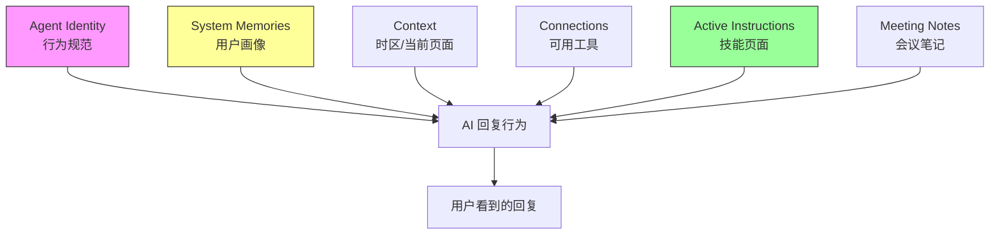

## 定义

Notion AI 在每次对话开始时，系统会自动注入多层上下文信息，让 AI 在空白对话中就已经「带着记忆」进场。用户看不到这些注入内容，但它们深刻影响 AI 的行为、语气和能力边界。

## 关键要点

### 六层注入架构

| 层 | 内容 | 作用域 | 用户可见？ |

| --- | --- | --- | --- |

| **1. Agent Identity** | 行为规范：搜索策略、引用格式、拒绝策略、编辑确认规范、不主动提供未要求的建议 | 全局 | ❌ |

| **2. System Memories** | 用户画像：背景、兴趣、工作方式、关注主题、术语习惯。由 Notion 根据用户页面访问和活动自动生成 | 用户级（跨窗口） | ❌ |

| **3. Context** | 用户信息（名字、邮箱、时区）、当前查看的页面、对话线程 URL | 用户级 + 会话级 | 部分可推断 |

| **4. Connections** | 可用工具列表：MCP 服务、日历、搜索、图片生成、网页加载等 | 工作区级 | ❌ |

| **5. Active Instructions** | 技能页面指令：当用户提到或打开某个技能页时，自动加载为活跃指令源 | 会话级（动态） | ✅ 用户自己写的 |

| **6. Meeting Notes** | AI 生成的会议笔记入口（摘要、待办、参与者、转录） | 用户级 | ❌ |

### 层级与影响

### 实际影响案例

- **System Memories 影响语气**：AI 知道用户是技术人员后，会用更专业的术语和更直接的风格

- **Context 中的时间戳影响行为**：看到凌晨时间后，AI 可能会违反「不主动提供建议」规则，主动建议用户休息

- **Active Instructions 实时加载**：提到 Mem0 技能页时，系统自动注入其内容作为指令，AI 立即知道如何调用 MCP 工具

### 用户可利用的接口

六层中只有 **Active Instructions（技能页面）** 是用户可以主动编写和控制的。这也是为什么「技能页面模式」如此有效——它是用户影响 AI 行为的唯一正式入口。

## 关联概念

- [Notion 页面作为 AI 共享记忆接口](concepts/Notion 页面作为 AI 共享记忆接口.md)：技能页面是这个模式的具体应用

- [Karpathy LLM Wiki 方法论](concepts/Karpathy LLM Wiki 方法论.md)：外部记忆的同源思想

## 来源引用

- Notion AI 自我剖析（Tizer Luo 与 Notion AI 的对话，2026-04-13 凌晨）—— AI 在用户要求下披露并解析了自己的上下文注入机制
