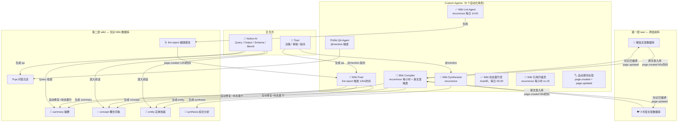

## 📖 概述

本页面记录知识 Wiki 系统的完整工作流程和各 Agent 的职责分工。

组织规则、页面模板和流程规范见 [Wiki Schema（规则文件）](index/Wiki Schema（规则文件）.md)。

最后更新：2026-04-18 中午（状态晋升员恢复 7 天阈值；Compiler 补强重复摘要防护；Lint 豁免系统元概念时效误报）

---

## 🏗️ 系统架构总览

---

## 🤖 Agent 职责清单（9 个角色）

### ✅ （Autofill Agent）

**角色**：状态把关人

**触发方式**：

- 行级按钮触发（通过数据库的 Autofill 按钮手动运行）

- Recurrence 每日 03:30（Asia/Shanghai）自动全表运行

**职责**：逐行检查 concept/entity 草稿，同时满足以下条件将「状态」改为「审核中」：

1. 类型是 concept / entity

1. 当前状态是草稿

1. 创建时间 ≥ 7 天

1. 内容完整度三件套（定义段 + 要点段 + 包含 ≥1 个 `<mention-page>` 的来源引用段，标题格式接受 H2 和粗体两种）

**权限**：只能修改知识 Wiki 的「状态」属性

**限制**：不改正文、不改其他属性、不做 「→ 已审核」或「→ 需更新」的晋升（这些由其他 Agent 或人工处理）

**豁免**：7 个系统元 Agent 页（Gap Agent / Wiki Lint / Wiki Fixer / Wiki Compiler / Wiki QA / Wiki Synthesizer / Notion AI协调者）永久跳过

---

### 🔌 （Custom Agent）

**角色**：引用链升级员

**触发方式**：

- Recurrence 每小时 xx:15（Asia/Shanghai）自动运行，每批 30 条

- @mention 手动触发（支持「测试 N 条」指令）

**职责**：扫描 concept/entity 页，将「来源引用」段的纯文本引用升级为 `<mention-page>` 结构化链接。按 createdTime 升序扫描，优先清理早期条目。

**批处理流程**：

A. SQL 查出 200 条候选（createdTime ASC）

B. 逐条 loadPage，定位「来源引用」段，从段内纯文本行提取标题（反幻觉约束：标题必须逐字出现在原行）

C. SQL 查找对应 summary（模糊匹配多条全部加入）

D. `updatePage` 改写有引用行 + 更新「最后编译时间」

**权限**：读写知识 Wiki

**限制**：权责只在「来源引用」段内；不改定义段/要点段/关联概念段；不改状态；不动 summary 页；零匹配的引用行保留原样

---

### 🏷️ （Autofill Agent）

**角色**：标签校正员

**触发方式**：

- page.created：新页面创建时自动运行

- page.updated：页面更新时自动运行

- 行级按钮触发（通过数据库的 Autofill 按钮手动运行）

**职责**：根据页面内容，按三维度标签体系（A=场景领域、B=技术方法、C=产品形态）为 Wiki 条目分配 2-3 个标签。同时校正已退休标签，确保标签全部来自新体系。

**权限**：读写知识 Wiki

**限制**：只改「标签」属性，不改正文、不改其他属性

---

### 📘  Agent

**角色**：编译器（建设者）

**触发方式**：

- 新文章入库触发（page.created，60s 防抖）

- 独立 recurrence 定时触发（每小时，检查存量未编译文章）

- @mention 触发

**职责**（详见 [Wiki Schema（规则文件）](index/Wiki Schema（规则文件）.md) Ingest 流程）：

1. 读取源文章完整内容和备注

1. **🔒 Summary 去重检查**：先用源文章 URL 查询；若未命中且原文链接存在，再用「标题候选 + 原文链接核验」做第二层去重；对导航/占位标题（如 `Learn more in the official documentation`）直接跳过

1. 创建 **summary** 页面（状态=**已审核**，置信度=high）

1. 从文章中提取核心概念（3-7 个），对每个概念：

  - **强制查重**：名称归一化（转小写、去空格、去标点），SQL 精确匹配 + 模糊匹配查询已有 concept/entity

  - 已有 → 只追加引用，不创建新页面

  - 没有 → **判断 concept vs entity**：有版本历史、GitHub Stars、融资信息等「档案属性」的创建为 **entity**，否则创建为 **concept**（状态=草稿）

1. 用 `<mention-page>` 将提取的概念回填到 summary 的「提取的概念」段

1. 按三维度标签体系（A=场景领域, B=技术方法, C=产品形态）为新页面分配标签（**禁止直接搬运源文章标签**，必须根据内容重新分类） + 置信度 + 最后编译时间

1. **来源标签透传**：从源文章的标签属性复制到 summary 的「来源标签」text 属性

1. 标记源文章 `已编译到Wiki = true`

**命名规范**：concept 用业界通用术语；entity 用官方名称（如 OpenClaw、Karpathy、Anthropic）；summary 标题前缀「摘要：」

**批量编译**：每次最多 30 篇，实测可达 60 篇/小时

**权限**：读写知识 Wiki + 读写微信文章数据库 + 读写X书签文章数据库

---

### ✅ 

**角色**：诊断师（只诊断不动手）

**触发方式**：

- 独立 recurrence 定时触发（每日 14:00 北京时间）

- @mention 触发

**检查范围**：所有 concept、entity、summary 条目

**报告命名**：「Lint Report YYYY-MM-DD HH:mm」（必须含时分，避免同名冲突）

Phase 1：快速检查（纯 SQL，全量覆盖）

不需要 loadPage，全部通过 `querySql` 完成，保证 100% 条目覆盖：

1. **全库统计** — 按类型×状态交叉统计，输出总览表格

1. **过期草稿检测** — 草稿超过 **7 天**：内容完整 → 建议晋升为审核中；内容不完整 → 报警

1. **时效性检查** — 最后编译时间超过 **30 天**或为 null（豁免 qa 类型和系统元概念）

1. **完全同名重复检测** — `GROUP BY "名称", "类型" HAVING COUNT(*) > 1`

1. **近似重复检测（归一化）** — 分两步：

  - Step A：SQL 查出所有 summary/concept/entity 的名称和 url

  - Step B：在推理层做归一化匹配（lowercase → 去标点/空格/句号 → 统一繁简体 → 去版本号后缀），输出疑似重复对

1. **状态异常** — 状态为空的页面

1. **标签异常** — 标签为空或使用已退休/废弃标签（含 11 个新退休大标签 + 早期废弃的 ~~AI Agent~~、~~MCP~~、~~Notion~~）+ 全量标签分布统计

1. **类型启发式筛查** — SQL 全量查出 concept 名称，在推理层用规则批量筛查「疑似应为 entity」：

  - 规则 A：名称含版本号（`2.0`/`v3`）或产品后缀（`Tool`、`SDK`、`Platform`、`Protocol`、`CLI`）

  - 规则 B：首字母大写英文专有名词、大写缩写+产品名组合

  - 输出疑似列表，标注「建议人工确认」，不自动判定

Phase 2：深度检查（需 loadPage，抽样覆盖）

从 Phase 1 发现的问题条目 + 随机抽样中执行：

1. **引用结构化检查** — 抽样 20 个草稿 concept/entity，检查来源引用是否使用 `<mention-page>` 结构化链接（纯文本引用导致知识图谱断链）

1. **标签分类合理性抽查** — 加载 Phase 1 筛查标记的条目 + 随机抽样，人工判断标签是否匹配内容

1. **状态晋升评估** — 综合 Phase 1 数据，判断哪些条目应晋升（草稿→审核中：7天+内容完整；草稿/审核中→已审核：≥2篇引用；审核中/已审核→需更新：>30天）

输出规范

lint-report 必须包含：

- 健康评分（0-100）+ 计分明细表格

- 全库统计表格（类型×状态交叉）

- 各检查项的发现（含具体页面链接）

- **Fixer 可执行的结构化修复清单**（每条标注：修复类型 + 目标页面 URL + 具体操作），分为两类：

  - 🤖 **自动修复项**：Fixer 可直接执行（重复合并、标签/类型修正、引用结构化升级）

  - 👤 **人工介入项**：需人类确认（Schema 变更、豁免规则、Compiler 调整）

- 报告末尾 @mention Wiki Fixer 触发自动修复

Fixer 协作协议

- Fixer 完成修复后，应在 Lint Report 页面追加「修复记录」区块，列出每项修复的操作和结果

- Lint Agent 在 Recheck 时，只需读取 Fixer 追加的修复记录 + 验证变更页面的属性，无需重新全量扫描

**权限**：读写知识 Wiki

**限制**：只创建报告，不修改任何已有页面

**SQL 规范**：不允许自连接、多条语句、动态 LIKE 拼接。必须分步查询（先查 concept/entity 列表，再查 summary 列表），在推理层做匹配

---

### 🔌  Agent

**角色**：治疗师（执行修复）

**触发方式**：

- Lint Agent 在报告正文中 @mention 触发 — 自动模式

- 用户或 Notion AI @mention 触发 — 指令模式

- ~~page.created 触发器已关闭~~

**自动模式（7 类自动修复）**：

- 检查触发页面是否为 lint-report，非 lint-report 立即停止

- **A. 状态修复**：补空状态、草稿→审核中（7天+内容完整）、草稿/审核中→已审核（≥2篇引用）、审核中/已审核→需更新（>30天）、summary晋升

- **B. 标签修复**：空标签补全（含 summary）、废弃标签重映射、标签分类校验

- **C. 类型分类修正**：按 Lint Report 建议执行 concept↔entity 迁移

- **D. 完全同名重复合并**：按策略自动合并（保留状态更高/类型更准/编辑更新的），修复断链引用

- **E. 引用链修复**：E1 孤岛条目修复（在 summary 中追加 `<mention-page>` 引用）+ E2 纯文本引用升级（批量将历史存量的纯文本引用升级为 `<mention-page>` 结构化链接，双向修复 concept↔summary）

- **F. 规范化近似重复合并**

- **G. 报告不自动处理的**：删除废弃条目、重写过时内容、无法确定主词条的近似重复

**指令模式（@mention 触发）**：

- 合并近似重复、删除条目、补充内容、类型迁移、批量状态更新

**权限**：读写知识 Wiki

**限制**：不创建 summary/concept/entity，不修改 Schema 页面

---

### 💡  Agent

**角色**：知识进化者

**触发方式**：

- 独立 recurrence 定时触发

- @mention 触发

**职责**：

- 扫描所有 concept 的标签分布，发现主题聚集（≥10 个 concept 共享同一标签，或跨标签交叉分析）

- **🔒 三级去重检查**（创建前必须执行）：精确标题匹配 → 模糊主题匹配 → 标签覆盖检查（同标签下不超过 3 篇）

- 排除已有 synthesis 覆盖的主题

- 读取相关 concept + entity + summary 的完整内容（按状态优先级：已审核 > 审核中 > 草稿 > 需更新）

- 生成 synthesis 综合分析页面（对比表 + 演进路径 + 跨来源洞察）

- 每次最多处理 2 个主题，深度优先

**权限**：读写知识 Wiki + Web Search（仅辅助验证和补充，禁止作为核心论据，引用网络信息必须标注「网络补充」）

**限制**：只创建 synthesis 页面，不修改其他页面；最少 10 个 concept 来源才写；支持跨标签交叉分析

---

### ❓ Wiki QA Agent

**角色**：知识库专属问答窗口

**触发方式**：@mention 触发

**职责**：

- 接收用户提问 → SQL 查询 Wiki → 读取相关页面 → 综合回答并标注来源

- 回答时根据来源条目状态差异化处理：**已审核**优先引用作为核心论据；**审核中**正常引用；**草稿**标注「仅供参考」；**需更新**标注「可能过时」

- 当回答综合了 ≥3 个 Wiki 页面时，自动创建 qa 页面沉淀知识

**权限**：读写知识 Wiki

**限制**：只做问答，不创建 concept/summary/entity，不修改已有页面

---

### 💬 Notion AI（交互式）

**角色**：协调者 + 系统管理员

**职责**：

- **Schema 设计**：调整数据库结构、Agent 指令、视图

- **Mem0 桥接**：跨 Agent 记忆共享（只有 Notion AI 连了 Mem0 MCP）

- **复杂协调**：兜底决策，指挥 Fixer 执行需要判断的操作

- **兜底 Query**：当 QA Agent 不在线时，Notion AI 同样可以检索 Wiki 并回答问题

**新对话入口**：新对话开始时，用户说「查一下 Mem0」或「看看知识 Wiki 的系统页面」，Notion AI 即可通过 Mem0 和 Wiki 系统页面快速恢复上下文，接手工作。

---

## 🤖 Agent 职责速查表

| Agent | 角色 | 核心职责 | 可修改范围 |

| --- | --- | --- | --- |

| **Wiki Compiler** | 编译器 | 文章 → summary（含去重检查）+ concept + entity。引用必须用 `<mention-page>` 结构化格式（禁用纯文本） | 创建新 summary/concept/entity，追加引用 |

| **Wiki 状态晋升员** 🆕 | 状态把关人（Autofill） | 每日 03:30 自动，内容完整度三件套 + 创建 ≥7 天的草稿 → 审核中 | 只改「状态」属性 |

| **Wiki 引用升级员** 🆕 | 引用链升级员 | 每小时 xx:15 自动，批量将来源引用纯文本升级为 `<mention-page>`，按 createdTime 升序，每批 30 条 | 仅改「来源引用」段正文 + 「最后编译时间」 |

| **Wiki Lint Agent** | 诊断师 | 每日 14:00 健康检查 → lint-report | 只创建报告，不修改任何页面 |

| **Wiki Fixer** | 治疗师 | 按 Lint Report 自动修复 7 类问题 + 引用链修复 + 指令模式 | 状态/标签/类型修复、同名重复合并、引用链修复（孤岛 + 纯文本升级）；近似重复/删除需人类指示 |

| **Wiki Synthesizer** | 知识进化者 | 发现主题聚集 → synthesis | 只创建 synthesis，不修改其他页面 |

| **Wiki QA Agent** | 知识问答窗口 | 接收提问 → 查 Wiki → 综合回答 → 创建 qa | 读取所有 Wiki 内容；创建 qa 页面 |

| **自动填充标签** 🆕 | 标签校正员（Autofill） | page.created + page.updated 自动按三维度体系分配标签，校正退休标签 | 只改「标签」属性 |

| **Notion AI** | 协调者 + 系统管理员 | Schema 设计、Mem0 桥接、复杂协调、兜底 Query | 全部（兜底角色） |

---

## 🔄 自动化运行机制

Compiler、Lint、Synthesizer 各自独立 recurrence 运行，不再依赖中央调度器：

```mermaid
graph TB
    subgraph "循环 ① Compiler"
        A1["📱 新文章入库"] -->|"page.created<br>60s防抖"| A2["Compiler 编译<br>~30篇/批"]
        A3["~~recurrence 已关闭~~"] -.->|"~~存量已清零~~"| A2
        A2 --> A4["summary + concept + entity 入库"]
    end

    subgraph "循环 ② Lint → Fixer"
        B1["recurrence 每小时"] --> B2["Lint Agent<br>健康诊断"]
        B2 --> B3["lint-report 入库"]
        B3 -->|"Lint @mention Fixer"| B4["Fixer 自动修复<br>重复/类型/标签"]
    end

    subgraph "循环 ③ Synthesizer"
        C1["recurrence"] --> C2["Synthesizer<br>主题聚集分析"]
        C2 --> C3["synthesis 入库"]
    end

    subgraph "循环 ④ 状态晋升员"
        D1["recurrence 每日 03:30"] --> D2["扫描草稿 + 三件套检查"]
        D2 --> D3["草稿 → 审核中"]
    end

    subgraph "循环 ⑤ 引用升级员"
        E1["recurrence 每小时 xx:15"] --> E2["扫描最早创建的 30 条"]
        E2 --> E3["纯文本引用 → mention-page"]
    end

    subgraph "循环 ⑥ 自动填充标签"
        F1["page.created / page.updated"] --> F2["读取页面内容 + 三维度分类"]
        F2 --> F3["标签分配/校正"]
    end
```

**设计变更**（2026-04-11）：原方案使用 Batch Scheduler 作为中央调度器，串联 Compiler → Lint → Synthesizer 的循环链条（因 recurrence 触发器当时不工作）。现已改为各 Agent 独立 recurrence，架构更简洁、故障隔离更好。同时退役了 Wiki Index Updater（Index 导航页已归档，导航和检索改用 Dashboard 视图 + SQL 查询）。

---

## 📊 存量消化进度

| 数据库 | 总量 | 已编译 | 待编译 | 消化策略 |

| --- | --- | --- | --- | --- |

| 微信文章数据库 | ~252 | ~104 | ~148 | 优先消化 |

| X书签文章数据库 | ~413 | 0 | ~413 | 微信库完成后开始 |

编译速度：~60 篇/小时（已验证）

预估剩余消化时间：561 篇 ÷ 60 篇/小时 ≈ **9.4 小时**

---

## 🔧 已知问题与设计决策

### ~~Batch Scheduler 中央调度~~ → 已退役（2026-04-11）

**原方案**：因 Notion recurrence 定时触发器在本工作区不工作，创建 Batch Scheduler Agent 用事件触发（page.updated）+ 防抖机制替代定时触发，实现全自动循环。

**退役原因**：recurrence 触发器恢复正常后，Compiler / Lint / Synthesizer 各自独立 recurrence 即可，中央调度器成为不必要的复杂度。所有触发器已关闭。

### ~~Index Updater~~ → 已退役（2026-04-11）

**原方案**：Wiki 数据库页面创建/更新时触发（600s 防抖），自动刷新 Index 导航页统计和索引内容。防抖从 120s 增到 600s 以避免 Compiler 批量写入时的并发冲突。

**退役原因**：Index 导航页已归档，Wiki 的导航和检索改用 Dashboard 视图 + SQL 查询实现，无需维护静态索引页。所有触发器已关闭。
