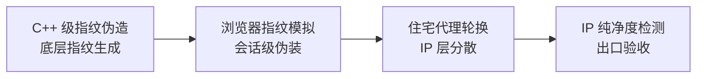

## 研究问题

**当 AI Agent 从「能跑通」走向「稳定运行」，需要哪些安全基础设施？这些工具之间存在怎样的分层关系和组合模式？**

本综合分析基于知识 Wiki 中 15 个同时横跨「开发工具」与「安全/隐私」标签的概念词条，梳理 Agent 开发者在实际部署中面临的安全基础设施选型问题，提炼跨概念的分层架构与组合策略。

## 综合分析

### 一、四层安全基础设施架构

从 15 个概念中涌现出清晰的四层结构，每层解决不同维度的安全问题：

| **层级** | **核心问题** | **代表概念** | **关键取舍** |

| --- | --- | --- | --- |

| **L1 执行隔离层** | Agent 代码运行时如何不伤害宿主？ | [Untitled](concepts/Docker 沙箱执行.md)、[Untitled](concepts/Daytona 沙箱.md)、[Untitled](concepts/V8 Isolate.md) | 隔离强度 vs 启动速度 vs 资源开销 |

| **L2 数据保护层** | 敏感数据落盘后如何防泄漏？ | [Untitled](concepts/SQLCipher 4.md) | 加密强度 vs 接入便利性 vs 合规成本 |

| **L3 网络身份层** | Agent 的网络画像如何接近真实用户？ | [Untitled](concepts/C++ 级指纹伪造.md)、[Untitled](concepts/浏览器指纹模拟.md)、[Untitled](concepts/住宅代理轮换.md)、[Untitled](concepts/IP 纯净度检测.md) | 仿真度 vs 成本 vs 合规风险 |

| **L4 安全通信层** | 跨地域通信如何稳定且不被识别？ | [Untitled](entities/WireGuard.md)、[Untitled](concepts/Exit Node.md)、[Untitled](entities/Hysteria 2.md)、[Untitled](concepts/QUIC 代理.md)、[Untitled](concepts/HTTP-3 流量伪装.md) | 性能 vs 抗干扰 vs 部署复杂度 |

另有 [Cloudflare Email Routing](concepts/Cloudflare Email Routing.md) 和 [Catch-All 邮件路由](concepts/Catch-All 邮件路由.md) 构成**身份管理辅助层**，服务于账号体系而非运行时安全。

### 二、执行隔离方案对比：从重量级到轻量级

三种隔离方案代表了从「完全隔离」到「极致轻量」的光谱：

| **方案** | **隔离机制** | **冷启动** | **适合场景** | **典型代价** |

| --- | --- | --- | --- | --- |

| **Docker 沙箱** | OS 级容器隔离 | 秒级 | 需要完整 OS 环境的代码执行 | 资源开销大，并发受限 |

| **Daytona 沙箱** | 云工作区隔离 | 秒级 | 异步编程 Agent，需安装依赖 | 依赖云服务，成本随用量增长 |

| **V8 Isolate** | 运行时进程内隔离 | 毫秒级 | 高并发短生命周期任务 | 能力受限，仅支持 JS/WASM |

**关键洞察**：隔离粒度从粗到细的趋势与 Agent 任务特性直接相关——长任务用 Docker，短任务用 V8 Isolate，中间地带用 Daytona。

### 三、网络身份伪装的技术栈纵深

网络身份层的 4 个概念形成了一条从底层到验证的完整链路：

这不是可选的四个独立工具，而是**串联的四道工序**——任何一环缺失都会导致整体方案失效。

### 四、安全通信协议的代际演进

| **协议/方案** | **传输层** | **核心优势** | **定位** |

| --- | --- | --- | --- |

| **WireGuard** | UDP | 简洁、高性能、易审计 | 组网底座协议 |

| **Exit Node** | 依赖底层 VPN | 统一公网出口身份 | 流量路由策略 |

| **QUIC 代理** | UDP + TLS 1.3 | 多路复用，抗丢包 | 高性能传输范式 |

| **Hysteria 2** | QUIC | 极限带宽利用 | QUIC 代理的极致实现 |

| **HTTP/3 流量伪装** | QUIC | 流量特征隐藏 | 代理的反识别外衣 |

**演进路径**：WireGuard（通用组网）→ Exit Node（出口控制）→ QUIC 代理 + Hysteria 2（性能极致化）→ HTTP/3 流量伪装（特征隐藏），体现了从「能连通」到「不被发现」的递进。

## 关键发现

1. **安全基础设施存在「四层蛋糕」结构**：执行隔离、数据保护、网络身份、安全通信四层相互独立又必须联动，跳过任何一层都会形成短板。这一结构在任何单独的概念页中都无法完整呈现。

1. **网络身份伪装是串联工序而非并行选项**：指纹伪造 → 代理轮换 → IP 验收构成的链路意味着，仅有好 IP 但没有指纹伪装（或反过来）都不够——这解释了为什么很多 Agent 采集方案单独用住宅代理仍被封禁。

1. **隔离方案正在「去容器化」**：V8 Isolate 的毫秒级启动和极低开销暗示，Agent 代码执行的未来方向是运行时隔离而非 OS 级容器隔离，这会重塑 Agent 平台的基础架构选型。

1. **安全通信已从 TCP 世界全面转向 UDP/QUIC**：WireGuard、Hysteria 2、QUIC 代理全部基于 UDP，HTTP/3 流量伪装也依赖 QUIC——TCP 代理正在被这一代技术全面替代。

1. **邮件路由构成隐性的「账号工厂」基础设施**：Cloudflare Email Routing + Catch-All 的组合让域名邮箱变成无限别名入口，这与传统安全工具的关注点完全不同，但在 Agent 大规模部署中同样关键。

## 来源列表

### 概念页

[SQLCipher 4](concepts/SQLCipher 4.md) · [C++ 级指纹伪造](concepts/C++ 级指纹伪造.md) · [IP 纯净度检测](concepts/IP 纯净度检测.md) · [Docker 沙箱执行](concepts/Docker 沙箱执行.md) · [浏览器指纹模拟](concepts/浏览器指纹模拟.md) · [住宅代理轮换](concepts/住宅代理轮换.md) · [Daytona 沙箱](concepts/Daytona 沙箱.md) · [Exit Node](concepts/Exit Node.md) · [WireGuard](entities/WireGuard.md) · [V8 Isolate](concepts/V8 Isolate.md) · [Cloudflare Email Routing](concepts/Cloudflare Email Routing.md) · [Hysteria 2](entities/Hysteria 2.md) · [HTTP/3 流量伪装](concepts/HTTP-3 流量伪装.md) · [QUIC 代理](concepts/QUIC 代理.md) · [Catch-All 邮件路由](concepts/Catch-All 邮件路由.md)

### 相关摘要页

[摘要：OpenClaw × SearxNG：零成本给你的 AI 助手装上「搜索外脑」](summaries/摘要：OpenClaw × SearxNG：零成本给你的 AI 助手装上「搜索外脑」.md) · 摘要：PinchTab：12MB 二进制文件，AI Agent 的极简浏览器控制层 · [摘要：ChromeAppHeroes：25K Star 的 Chrome 插件军火库，把浏览器变成生产力神器](summaries/摘要：ChromeAppHeroes：25K Star 的 Chrome 插件军火库，把浏览器变成生产力神器.md)

## 行动建议

1. **为 OpenClaw 的外部采集链路搭建「三件套」**：将 C++ 级指纹伪造（camoufox）+ 住宅代理轮换 + IP 纯净度检测组合成标准化的反检测模块，而非逐个工具单独接入。这能系统性解决 Agent web fetch 场景中的封禁问题。

1. **评估 V8 Isolate 作为 Agent 代码执行默认沙箱的可行性**：对于 OpenClaw 中不需要完整 OS 环境的短任务（如数据转换、格式处理），V8 Isolate 的毫秒级启动可以显著降低延迟和成本，值得在 Cloudflare Workers 等平台上试跑。

1. **将安全通信栈统一到 QUIC 体系**：考虑用 Hysteria 2 替换传统 TCP 代理作为自建节点主协议，配合 HTTP/3 流量伪装降低特征识别风险——尤其在跨境 Agent 服务场景下，这套组合的性价比远高于传统方案。
