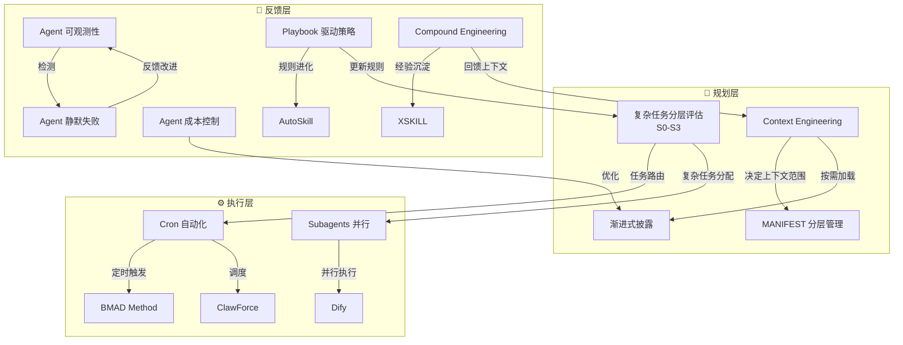

## 研究问题

**AI Agent 的工作流控制体系如何从「人工调度」演进到「自主进化」？16 个工作流相关概念之间存在怎样的架构层次关系，它们共同指向什么样的生产级 Agent 运行范式？**

---

## 综合分析

### 一、三层架构模型：规划层→执行层→反馈层

对 16 个 AI Agent + 工作流概念进行交叉分析后，可以清晰地识别出一个**三层控制架构**——这是任何单一概念页面都未明确描述的涌现结构：

| 架构层 | **规划层（Plan）** | **执行层（Execute）** | **反馈层（Feedback）** |

| --- | --- | --- | --- |

| 核心问题 | Agent 该「看到」什么？ | Agent 该「怎么做」？ | Agent 做得「好不好」？ |

| 对应概念 | [Untitled](concepts/Context Engineering.md)、[Untitled](concepts/MANIFEST 分层管理.md)、[Untitled](concepts/复杂任务分层评估.md)、[Untitled](concepts/渐进式披露.md) | [Untitled](concepts/Cron 自动化.md)、[Untitled](concepts/Subagents 并行.md)、[Untitled](entities/Dify.md)、[Untitled](concepts/BMAD Method.md)、[Untitled](entities/ClawForce.md) | [Untitled](concepts/Agent 可观测性.md)、[Untitled](concepts/Agent 静默失败.md)、[Untitled](concepts/Agent 成本控制.md)、[Untitled](concepts/Playbook 驱动策略.md)、[Untitled](concepts/AutoSkill.md)、[Untitled](concepts/XSKILL.md)、[Untitled](concepts/Compound Engineering.md) |

| 设计原则 | 最小化上下文、按需加载 | 自动调度、并行处理 | 验证输出、沉淀经验 |

| 失败模式 | 上下文溢出、无关信息污染 | 串行瓶颈、资源冲突 | 静默失败、经验丢失 |

### 二、从静态到动态：工作流进化的三阶段

交叉对比所有概念的演进方向，可以识别出一条清晰的**三阶段进化路径**：

| 维度 | **阶段 1：手动编排** | **阶段 2：结构化控制** | **阶段 3：自主进化** |

| --- | --- | --- | --- |

| 上下文管理 | 手写 Prompt | Context Engineering + MANIFEST 分层 | 渐进式披露 + 自动上下文路由 |

| 任务调度 | 人工触发 | Cron 自动化 + 复杂任务分层评估 | Subagents 并行 + DAG 调度 |

| 技能管理 | 固定 Prompt 模板 | BMAD / Dify 流程化 | AutoSkill / XSKILL 自进化 |

| 经验沉淀 | 无（每次重新开始） | Playbook 手动更新 | Compound Engineering 自动复利 |

| 质量保障 | 人工检查 | Agent 可观测性 + 告警 | S0-S3 纵深防御 + 静默失败检测 |

| 成本控制 | 无意识消耗 | 模型分级 + 超时控制 | 渐进式披露 + S0 零成本预筛 |

| 代表实践 | Vibe Coding | OpenClaw 单 Agent + Cron | 11 Agent 自进化体系 |

### 三、两种进化范式的对比

在反馈层中，存在两种本质不同的 Agent 进化范式：

| 对比维度 | **规则进化范式** | **经验沉淀范式** |

| --- | --- | --- |

| 代表概念 | Playbook 驱动策略、AutoSkill | Compound Engineering、XSKILL |

| 进化对象 | 可执行规则（what to do） | 经验知识（what happened） |

| 写入目标 | [Playbook.md](http://playbook.md/) / [skill.md](http://skill.md/) | experience-index / [MEMORY.md](http://memory.md/) |

| 触发方式 | 数据复盘后自动更新规则 | 任务完成后自动提取经验 |

| 优势 | 立即可执行、效果可量化 | 覆盖面广、上下文丰富 |

| 风险 | 规则膨胀、规则冲突 | 经验过时、召回噪音 |

| 最佳场景 | 重复性运营任务（内容发布、数据采集） | 探索性工程任务（开发、研究） |

### 四、「验证」是所有概念的共同薄弱环节

跨概念分析揭示了一个反复出现的模式：**Agent「以为自己做完了」但实际没有**，这一问题贯穿所有层级：

- **执行层**：[Agent 静默失败](concepts/Agent 静默失败.md) — Agent 显示 completed 但产出无效

- **规划层**：[复杂任务分层评估](concepts/复杂任务分层评估.md) — S3 需要三道防线（Audit → QA → Defect Rule）

- **反馈层**：[Compound Engineering](concepts/Compound Engineering.md) — 必须在执行后增加「审查」步骤才能有效沉淀

- **监控层**：[Agent 可观测性](concepts/Agent 可观测性.md) — 「没有问题不要发消息」避免告警疲劳，但必须检查输出内容本身

核心原则浮现：**检查输出内容本身，而非只看任务状态**。这是从个人玩具到生产级系统的分水岭。

### 五、概念关系图谱

---

## 关键发现

> **💡** **发现 1：存在一个未被命名的「上下文经济学」**

渐进式披露、MANIFEST 分层管理、复杂任务分层评估 S0 和 Agent 成本控制，这四个概念从不同角度解决同一个问题：**如何用最少的 token 传递最多的有效信息**。S0 用零 token 过滤 80% 消息，渐进式披露按需加载 skill，MANIFEST 三层分级文件，成本控制通过模型分级降耗。它们共同构成了一套隐含的「上下文经济学」——这在任何单一概念中都未被系统化表述。

> **💡** **发现 2：「规则进化」与「经验沉淀」需要协同，单用任一种都不够**

Playbook 驱动策略解决「怎么做」（规则），Compound Engineering 解决「发生过什么」（经验）。11 Agent 自进化体系的成功恰恰在于同时使用了两者：Playbook 管策略更新，[MEMORY.md](http://memory.md/) 管历史记录。只有规则没有经验，Agent 无法处理新情况；只有经验没有规则，Agent 无法高效执行重复任务。

> **💡** **发现 3：S0-S3 分层评估是连接规划层和执行层的「路由器」**

复杂任务分层评估不只是一个执行框架，它实际上扮演了**工作流路由器**的角色：S0 决定是否需要 Agent 介入，S1 决定用轻量还是重量级处理，S2 决定是否需要 Subagents 并行，S3 决定质控深度。它是唯一横跨三层架构的概念，也是将其他 15 个概念串联起来的枢纽。

> **💡** **发现 4：当前生态缺少「执行层→规划层」的自动反馈通路**

现有概念在「规划→执行」和「执行→反馈」方向都有成熟方案，但「反馈→规划」的闭环是断裂的。Compound Engineering 沉淀的经验需要人工决定如何影响 Context Engineering 的上下文配置；Playbook 更新的规则需要人工映射到 MANIFEST 分层。这意味着当前 Agent 工作流的自进化仍然是**半自动的**——最后一公里的闭环依赖人类判断。

> **💡** **发现 5：企业级与个人级的分水岭在「验证」而非「能力」**

ClawForce（企业级）与个人 OpenClaw 的差异不在于 Agent 能做什么，而在于如何验证 Agent 做了什么。Agent 静默失败、S3 三道防线、可观测性告警——这三个概念共同指向一个结论：**能力平等的前提下，验证机制的完备性决定了系统的可信度**。

---

## 来源列表

### Concept 页面（16 篇）

- [Agent 可观测性](concepts/Agent 可观测性.md)

- [Agent 成本控制](concepts/Agent 成本控制.md)

- [Agent 静默失败](concepts/Agent 静默失败.md)

- [AutoSkill](concepts/AutoSkill.md)

- [BMAD Method](concepts/BMAD Method.md)

- [ClawForce](entities/ClawForce.md)

- [Compound Engineering](concepts/Compound Engineering.md)

- [Context Engineering](concepts/Context Engineering.md)

- [Cron 自动化](concepts/Cron 自动化.md)

- [Dify](entities/Dify.md)

- [MANIFEST 分层管理](concepts/MANIFEST 分层管理.md)

- [Playbook 驱动策略](concepts/Playbook 驱动策略.md)

- [Subagents 并行](concepts/Subagents 并行.md)

- [XSKILL](concepts/XSKILL.md)

- [复杂任务分层评估](concepts/复杂任务分层评估.md)

- [渐进式披露](concepts/渐进式披露.md)

### Summary 页面（10 篇）

- [摘要：Anthropic 实战指南：如何构建真正有效的 AI Agent 系统](summaries/摘要：Anthropic 实战指南：如何构建真正有效的 AI Agent 系统.md)

- [摘要：Agent Skills 的设计哲学——为什么文件夹成了最强武器](summaries/摘要：Agent Skills 的设计哲学——为什么文件夹成了最强武器.md)

- [摘要：OpenClaw 复杂任务方法论（S0-S3 分层评估）](summaries/摘要：OpenClaw 复杂任务方法论（S0-S3 分层评估）.md)

- [摘要：我用OpenClaw搭了11个AI Agent，它们学会了自我进化](summaries/摘要：我用OpenClaw搭了11个AI Agent，它们学会了自我进化.md)

- [摘要：AI开发范式——Spec Kit、OpenSpec、BMAD 全解析](summaries/摘要：AI开发范式——Spec Kit、OpenSpec、BMAD 全解析.md)

- [摘要：Claude 的 5 层 Prompt 体系：从「会聊天」到「会指挥」](summaries/摘要：Claude 的 5 层 Prompt 体系：从「会聊天」到「会指挥」.md)

- [摘要：Superpowers——CC 资深工程素养 Skills 库](summaries/摘要：Superpowers——CC 资深工程素养 Skills 库.md)

- [摘要：OpenClaw 3周连续运行提炼的5条核心经验](summaries/摘要：OpenClaw 3周连续运行提炼的5条核心经验.md)

- [摘要：OpenClaw 多 Agents 部署策略实战](summaries/摘要：OpenClaw 多 Agents 部署策略实战.md)

- [摘要：我用 OpenClaw 让 11 个 Agent 在群里开会，复盘自己就变强了](summaries/摘要：我用 OpenClaw 让 11 个 Agent 在群里开会，复盘自己就变强了.md)

---

## 行动建议

> **🎯** **建议 1：为 OpenClaw 工作流引入 S0-S3 路由层**

当前 Tizer 的 HITL 工作流缺少任务复杂度预判机制。建议在现有 Cron 自动化基础上，叠加 S0-S3 分层评估作为任务路由器：简单任务（S0/S1）直接自动执行，复杂任务（S2/S3）触发 Subagents 并行 + 人工审核。这能立即降低 token 消耗（S0 零成本过滤 80% 消息），同时提升复杂任务的执行质量。

> **🎯** **建议 2：建立「Playbook + Experience Index」双轨进化机制**

参考 11 Agent 自进化体系的成功模式，为每个核心 Agent 同时配置 Playbook（规则进化）和 experience-index（经验沉淀）。Playbook 管「下次怎么做」，experience-index 管「上次发生了什么」。每次 Cron 复盘时，Agent 同时更新两个文件，并在下次执行时同时读取。

> **🎯** **建议 3：优先部署静默失败检测，补上验证短板**

在所有关键 Cron job 末尾增加心跳文件写入 + 输出内容校验（而非仅检查任务状态），配置一个独立的监控 Agent 每日检查。这是从「Agent 能跑」到「Agent 可信赖」的最小投入最大回报改进。
