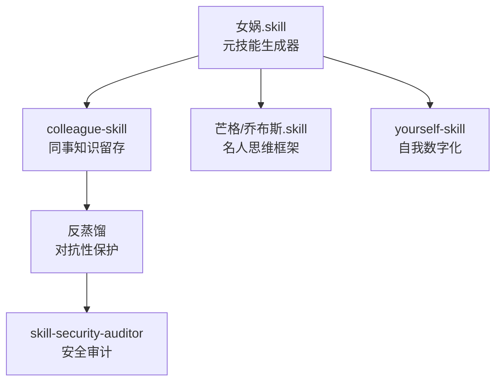

## 研究问题

Agent 技能（Skill）正在从「高级提示词」演化为独立的能力资产。**当前技能生态呈现怎样的分层结构？不同类型的技能在获取、进化和安全维度上有何差异？对 Tizer 的 OpenClaw 技能体系建设有什么启示？**

## 综合分析

### 一、技能的三层分类体系

从 22 个概念的交叉分析中，Agent 技能可归为三个层次：

| **层次** | **定义** | **代表概念** | **特征** | **生命周期** |

| --- | --- | --- | --- | --- |

| **工具型技能** | 封装外部能力为可调用接口 | MCP Server、Browser Use、x-tweet-fetcher、Gate MCP Skills、Binance Skills Hub | 确定性强、面向特定 API/平台 | 随 API 变更需维护 |

| **认知型技能** | 编码思维模式和工作方法 | andrej-karpathy-skills、人格蒸馏、女娲.skill、colleague-skill、self-improving-agent | 非确定性、面向决策质量 | 随使用反馈持续进化 |

| **元技能** | 生成或优化其他技能的技能 | AutoSkill、XSKILL、Agent Skill 蒸馏、女娲.skill（作为生成器）、skill-security-auditor | 作用于技能本身 | 随生态成熟价值递增 |

**关键洞察**：三层之间存在明确的价值递增关系——工具型技能解决「能不能做」，认知型技能解决「怎么做好」，元技能解决「怎么持续变强」。当前生态中工具型技能数量最多，但认知型和元技能的爆发式增长（colleague-skill 12681 Stars）表明，市场正在从「连接能力」转向「编码智慧」。

### 二、技能获取路径对比

Agent 获取技能的方式正在快速分化：

| **获取路径** | **机制** | **代表** | **优势** | **局限** |

| --- | --- | --- | --- | --- |

| **市场安装** | 从 Marketplace 一键安装 | Cursor Skills 生态、SkillHub、ClawHub | 零门槛、即装即用 | 通用性强但个性化弱 |

| **蒸馏提炼** | 从优秀实现中提取设计模式 | Agent Skill 蒸馏、人格蒸馏、女娲.skill | 高度定制、深度知识 | 需要优质源码/语料 |

| **自主进化** | Agent 通过反馈自动优化 | AutoSkill、XSKILL、self-improving-agent | 持续变强、无需人工 | 进化方向需要约束 |

| **垂直定制** | 面向特定行业深度开发 | OpenClaw-Medical-Skills、ClawBio、xiaohongshu-skills | 专业度高、场景适配 | 迁移性差、维护成本高 |

### 三、技能进化机制：从静态到动态

技能进化是本次分析中最具前瞻性的主题。三个概念形成了一条清晰的进化路径：

**静态技能** → **AutoSkill（双循环进化）** → **XSKILL（技能×经验协同进化）**

- **静态技能**（如 andrej-karpathy-skills）：一次编写、长期使用，本质是「高级提示词」

- **AutoSkill**：外循环求解任务，内循环优化技能本身，通过用户反馈驱动版本迭代

- **XSKILL**：技能与经验协同进化，在多模态环境中自适应

核心观点：*「静态技能只是高级提示词，能进化的才是真正的数字资产。」*

self-improving-agent 进一步将这一理念具体化——让 Agent 自动总结使用模式、提炼新技能并持续优化工作流，从「执行工具」走向「持续学习系统」。

### 四、人格蒸馏：技能的社会化转向

人格蒸馏生态是本次分析中最出人意料的发现。以 colleague-skill（12681 Stars）为鼻祖，一个完整的社会化技能链条已经形成：

**反蒸馏的出现标志着技能生态的成熟**：当技能包含的不仅是代码而是人的核心知识产权时，保护机制就成为刚需。`anti-distill` 项目（1700 Stars）允许用户生成「看起来完整但核心知识被清洗」的 skill 文件。

### 五、技能安全与治理

随着技能生态规模化，安全问题日益突出：

| **安全维度** | **风险** | **应对机制** |

| --- | --- | --- |

| 供应链安全 | 恶意代码注入、提示注入 | skill-security-auditor（安装前审计） |

| 知识产权 | 核心知识被蒸馏提取 | 反蒸馏（噪声注入 + 表层保留） |

| 权限边界 | 技能越权操作 | MCP Server 的权限边界设计 |

| 执行可靠性 | 技能描述不准确导致误触发 | 渐进式披露（先读目录再加载全文） |

### 六、垂直领域技能的落地格局

技能生态正在向特定垂直领域快速扩展：

- **Crypto/DeFi**：Gate MCP Skills（交易所全链路）、Binance Skills Hub（7 个首批技能），从行情发现到交易执行一体化

- **医疗科研**：OpenClaw-Medical-Skills（869 个技能）、ClawBio（生信工作流），覆盖临床、组学、药物发现

- **内容创作**：xiaohongshu-skills（小红书 CDP 自动化）、geo-content-writer（GEO 内容生产流水线）

- **社交媒体**：x-tweet-fetcher（三层降级抓取推文）、Browser Use（通用浏览器操控）

## 关键发现

1. **技能正在从「代码」变成「知识」**：colleague-skill 的 12681 Stars 超过了绝大多数工具型技能项目。当技能编码的不只是 API 调用而是人的思维模式时，它的价值和传播力会发生质的跃迁——但也引发了全新的知识产权和伦理问题。

1. **元技能是技能生态的杠杆点**：女娲.skill 能从任意人物语料生成 .skill 文件，AutoSkill 能让技能自我进化，skill-security-auditor 能审计技能安全性。**投资一个好的元技能，比手动维护 100 个普通技能更有效。**

1. **「渐进式披露」解决了技能规模化的核心矛盾**：技能越多，上下文越拥挤。渐进式披露（先读简介判断相关性，再加载完整指令）与 Schema Bloat 问题的解法本质相同——按需加载而非全量注入。这是技能生态从「几十个」跨越到「几百个」的关键基础设施。

1. **安全治理已有雏形但远未完善**：skill-security-auditor 做安装前检查，反蒸馏做知识保护，MCP Server 做权限边界——但这些还是点状防御。缺乏的是一个端到端的技能信任框架（类似软件包管理的签名验证 + 权限声明 + 沙箱执行）。

1. **垂直领域技能的商业价值远超通用技能**：Binance Skills Hub 上线不到一周就收到 97 个 PR，OpenClaw-Medical-Skills 覆盖 869 个医学能力。通用技能容易被替代，而深耕特定领域的技能包正在形成真正的壁垒。

## 来源列表

### 核心概念页

- [AutoSkill](concepts/AutoSkill.md)

- [XSKILL](concepts/XSKILL.md)

- Agent Skill蒸馏

- [MCP Server](concepts/MCP Server.md)

- [SkillHub](entities/SkillHub.md)

- [Cursor Skills 生态](concepts/Cursor Skills 生态.md)

- [Browser Use](entities/Browser Use.md)

- [女娲.skill](concepts/女娲.skill.md)

- [人格蒸馏](concepts/人格蒸馏.md)

- [反蒸馏](concepts/反蒸馏.md)

- [self-improving-agent](concepts/self-improving-agent.md)

- [skill-security-auditor](concepts/skill-security-auditor.md)

- [xiaohongshu-skills](concepts/xiaohongshu-skills.md)

- [geo-content-writer](concepts/geo-content-writer.md)

- Gate MCP Skills

- [x-tweet-fetcher](concepts/x-tweet-fetcher.md)

- [andrej-karpathy-skills](concepts/andrej-karpathy-skills.md)

- [Binance Skills Hub](concepts/Binance Skills Hub.md)

- [colleague-skill](concepts/colleague-skill.md)

- [Coordinator 技能](concepts/Coordinator 技能.md)

- OpenClaw-Medical-Skills

- [ClawBio](concepts/ClawBio.md)

### 相关摘要页

- [摘要：xiaohongshu-skills：让 AI Agent 真正「操控」小红书的 CDP 自动化方案](summaries/摘要：xiaohongshu-skills：让 AI Agent 真正「操控」小红书的 CDP 自动化方案.md)

- [摘要：OpenClaw-Medical-Skills：869个技能让你的AI助手变身专业医学科研伙伴](summaries/摘要：OpenClaw-Medical-Skills：869个技能让你的AI助手变身专业医学科研伙伴.md)

- 摘要：OKX OnchainOS Signal：让 AI Agent 替你盯住聪明钱、KOL 和巨鲸的每一笔买入

- [摘要：Gate MCP Skills：让 AI Agent 直接操盘加密交易的新基础设施](summaries/摘要：Gate MCP Skills：让 AI Agent 直接操盘加密交易的新基础设施.md)

## 行动建议

1. **优先投资元技能而非堆积工具型技能**：为 OpenClaw 工作流引入 AutoSkill 的双循环进化机制——让内容管线的核心技能（如推文抓取、文章摘要、标签分类）具备自我优化能力。具体路径：为每个关键技能建立版本历史和效果评估指标，让 Agent 在复盘时自动更新技能定义。

1. **建立技能安全审计流程**：在安装任何第三方技能前，使用 skill-security-auditor 类工具做基础检查。同时为自研技能实施渐进式披露架构（目录 → 指令 → 资源三层加载），既控制上下文成本又提升安全边界。

1. **探索人格蒸馏在知识管线中的应用**：利用女娲.skill 的方法论，将 Tizer 常用的分析框架和内容风格蒸馏为专属 .skill 文件，使内容创作 Agent 能以更一致的风格和视角工作。这是将个人知识系统化的最短路径，且与 mem0 记忆系统形成互补——mem0 存储「发生过什么」，蒸馏 skill 编码「怎么思考」。
