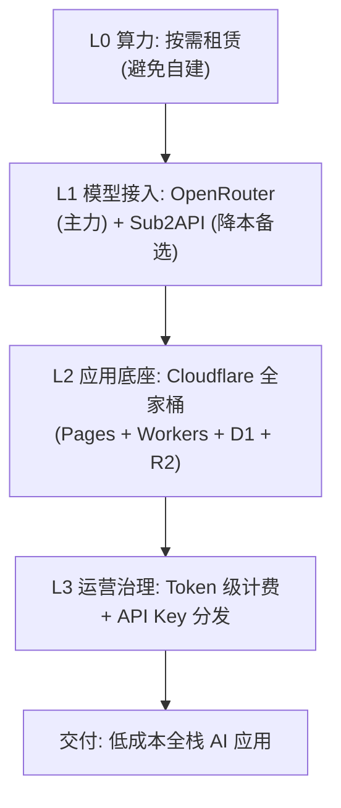

## 研究问题

**AI 时代的开发工具如何从技术基础设施转变为商业变现载体？** 从模型聚合 API 到 GPU 算力租赁，从开源许可博弈到 Token 级精确计费，开发工具链中哪些环节正在成为独立的商业节点？这些变现路径之间存在怎样的竞合关系？对于独立开发者和小团队，应如何选择最优的基础设施组合？

本综合分析聚焦 18 个「商业/生态 × 开发工具」交叉概念（6 个审核中 + 12 个草稿），提炼出开发工具商业化的四条主线与关键决策框架。

---

## 综合分析

### 一、开发工具商业化的四层拓扑

AI 开发工具的商业化并非铁板一块，而是沿基础设施栈自底向上分化出四个清晰的变现层级：

| **层级** | **核心资产** | **变现模式** | **代表实体** | **护城河类型** |

| --- | --- | --- | --- | --- |

| **L0 算力层** | GPU/TPU 硬件 | 算力租赁、算力期货 | TPU (Google)、xAI GPU 出租 | 资本壁垒 + 供应链锁定 |

| **L1 模型接入层** | 统一 API 网关 | 按量中转、价差套利 | OpenRouter、APIMart、Sub2API | 网络效应 + 模型覆盖广度 |

| **L2 应用底座层** | 全栈部署基础设施 | 免费额度引流 → 付费扩容 | Cloudflare 全家桶 | 生态粘性 + 迁移成本 |

| **L3 治理与分发层** | 计费、密钥、许可 | 运营 SaaS、合规服务 | Token 级计费、API Key 分发、Apache 2.0 商标边界 | 标准制定权 + 合规刚需 |

**关键洞察**：每一层都在争夺「AI 应用到达用户」这条价值链上的控制点。L0 控制生产资料，L1 控制模型分发，L2 控制交付渠道，L3 控制运营规则。四层之间既有互补（开发者需要全栈），也有替代（OpenRouter 自建推理 vs 纯中转）。

### 二、模型中转：AI 时代的「流量入口」之争

模型聚合 API 平台是当前最活跃的商业化战场。三个代表性实体展示了不同的定位策略：

| **维度** | **OpenRouter** | **Sub2API** | **APIMart** |

| --- | --- | --- | --- |

| **定位** | 全球最大模型聚合平台 | 开源自建中转站 | 统一 AI API 聚合 |

| **模型覆盖** | 多家 LLM + 视频生成 | GPT/Claude/Gemini 等 | 文本/图像/视频多模态 |

| **核心卖点** | 开发者社区 + 排行榜数据 | 自建低成本 + 账号池轮询 | 单 Key 多模型 + 折扣价 |

| **收费模式** | 加价中转 | 自运营（成本自负） | 按量计费、无月费 |

| **风控策略** | 合规运营 | WARP 代理 + Tunnel 隐藏 | 标准 REST API |

| **生态位** | 平台型（两端网络效应） | 工具型（开源自托管） | 平台型（新兴挑战者） |

**竞合动态分析**：

- **OpenRouter 的双重身份**：既是中转平台，也是模型评测基础设施（Fastest 榜、Trending 榜）。排行榜数据反映真实开发者偏好，使其从纯中转升级为「模型发现平台」——这正是其护城河所在。

- **Sub2API 的灰色地带**：通过将 ChatGPT Business 账号池转为标准 API，本质上是在官方定价与开发者需求之间做套利。配合 Cloudflare WARP/Tunnel 的部署方案暴露了一个行业痛点：**官方 API 定价仍然高于很多开发者的承受能力**。

- **APIMart 的挑战者困境**：单 Key 多模型 + 折扣价的定位与 OpenRouter 高度重叠，但缺乏后者的社区和数据积累。从用户反馈看，平台稳定性和支付流程仍在打磨期——这是新平台的经典冷启动问题。

### 三、算力商业化：从成本中心到可销售资产

算力层的商业化呈现出两种截然不同的路径：

**路径 A：算力即产品（Google TPU）**

- 自研芯片 + 云服务捆绑，形成端到端控制

- Anthropic、OpenAI 等主要客户的采用验证了需求

- 即使在应用层（Agent Harness）暂时落后，算力供给侧的优势确保了长期收入流

- 核心逻辑：「不管谁赢了 AI 应用之战，都要用我的算力」

**路径 B：算力套利（GPU 租赁）**

- xAI 向 Cursor 出租闲置 GPU 算力

- 将短期闲置算力变现，同时建立与下游应用开发者的绑定关系

- 核心逻辑：「算力的时间价值——今天闲置的 GPU 今天不用就浪费了」

两种路径的共同点是：**算力正在从固定资产变成流动性资产**。无论是 Google 的长期服务合约还是 xAI 的短期租赁，都在把算力推向「按需、按量、可交易」的方向。

### 四、开源许可与品牌：被低估的商业边界

Anti-996 倡议和 Apache 2.0 商标边界共同指向一个被多数开发者忽视的问题：**开源代码的商业使用边界远比想象复杂**。

- **Apache 2.0 的隐性陷阱**：代码可自由修改和分发，但项目名称与品牌标识的商标权并不随之转移。在 AI 时代高速 fork 与重写的节奏下，这一边界频繁成为争议焦点（如 opencli vs autocli 的公开信事件）。

- **Anti-996 的价值声明**：开源许可开始介入工作伦理议题，反映出技术社区对「代码应该为谁服务」的价值观分歧。

- **GitHub 假 Star 与 fork-to-Star 比例**：开源项目的社区指标正在被「刷量」污染，导致真实的技术影响力与表面数据脱节——这直接影响基于开源声誉的商业化路径（融资、招聘、合作）。

**合在一起看**：开源生态的商业化不仅是技术问题，更是品牌、许可、社区信誉的综合博弈。

### 五、独立开发者的最优基础设施组合

综合 18 个概念的分析，可以为独立开发者/小团队勾勒出一个「最小可行基础设施栈」：

这套组合的关键优势是：**每一层都可独立替换**。OpenRouter 可换 APIMart，Cloudflare 可换 Vercel，Sub2API 可升级为官方 API——模块化架构让开发者在成本与合规之间灵活调整。

---

## 关键发现

1. **模型中转平台正在从「管道」进化为「发现引擎」**：OpenRouter 的排行榜数据成为开发者选择模型的核心依据，使其从纯粹的 API 代理升级为模型评测基础设施。这个位置一旦确立，后来者（如 APIMart）很难仅靠价格战撼动。

1. **Sub2API 类自建中转的存在暴露了定价失灵**：当开发者宁愿搭建复杂的账号池+代理+隧道架构来绕过官方定价时，说明 AI 模型的官方 API 定价与中小开发者的支付意愿之间存在结构性鸿沟。这个缺口要么被官方降价填补，要么持续催生灰色中转产业。

1. **算力层的「铲子商」逻辑在 AI 时代依然成立，但形态变了**：Google TPU 和 xAI GPU 租赁证明，算力提供者不需要赢得应用层竞争就能持续获利。但与传统云计算不同，AI 算力的时间价值更强——闲置 GPU 的折旧速度远快于通用服务器，这催生了更灵活的短期租赁市场。

1. **开源品牌资产正在成为独立的商业变量**：Apache 2.0 商标边界和 GitHub 假 Star 现象共同说明，开源项目的商业价值不仅取决于代码质量，更取决于品牌信誉和社区指标的可信度。当 Star 数可以被刷量、品牌可以被 fork 后滥用，开源商业化的信任基础正在被侵蚀。

1. **Cloudflare 全家桶代表了「AI 辅助开发后的默认交付底座」**：当 AI 能快速生成应用代码后，瓶颈从「怎么写」转向「怎么部署和运营」。Cloudflare 的免费额度+全球边缘网络+低运维成本组合，恰好填补了这个新瓶颈——这是开发工具商业化的一个结构性机会。

---

## 来源列表

### 概念/实体页面

- [Anti-996](concepts/Anti-996.md)

- [Apache 2.0 商标边界](concepts/Apache 2.0 商标边界.md)

- [Cloudflare 全家桶](concepts/Cloudflare 全家桶.md)

- [OpenRouter](entities/OpenRouter.md)

- [Sub2API](entities/Sub2API.md)

- [TPU](entities/TPU.md)

- [API Key 分发](concepts/API Key 分发.md)

- [APIMart](entities/APIMart.md)

- [Token 级精确计费](concepts/Token 级精确计费.md)

- [GPU 租赁](concepts/GPU 租赁.md)

- [fork-to-Star 比例](concepts/fork-to-Star 比例.md)

- [GitHub 假 Star](concepts/GitHub 假 Star.md)

- [GEO Optimizer](entities/GEO Optimizer.md)

- [OpenAI for Science](entities/OpenAI for Science.md)

- [Prism](entities/Prism.md)

- [Xesim](entities/Xesim.md)

- [第三方推理](concepts/第三方推理.md)

- [账号农场](concepts/账号农场.md)

### 关联 synthesis

- [AI Agent 开发工具链全景：从协议标准到技能市场的能力获取路径演进](syntheses/AI Agent 开发工具链全景：从协议标准到技能市场的能力获取路径演进.md)

- [AI Agent 商业化路径全景：从内容变现到链上经济体的三条演进主线](syntheses/AI Agent 商业化路径全景：从内容变现到链上经济体的三条演进主线.md)

- [大语言模型商业化分层图谱：从算力竞赛到效率经营的价值捕获路径分化](syntheses/大语言模型商业化分层图谱：从算力竞赛到效率经营的价值捕获路径分化.md)

---

## 行动建议

1. **为 Tizer 的 AI 工具链建立「成本归因仪表盘」**：综合 OpenRouter 用量、Cloudflare 账单和 Token 消耗数据，按项目/Agent 维度追踪基础设施成本。Token 级精确计费不仅是运营工具，更是评估每条内容管线 ROI 的基础。

1. **评估 Sub2API 作为降本备选方案的风险收益**：对于非生产环境（如开发测试、知识编译实验），Sub2API 的成本优势显著。但需要建立「灰色中转 → 官方 API」的平滑迁移路径，避免生产环境对非合规渠道的依赖。

1. **关注 OpenRouter 的视频生成 API 接入**：OpenRouter 已上线视频生成能力，这可能成为 Tizer 内容管线中视频素材自动化的新渠道。建议在知识 Wiki 中跟踪其视频模型的质量和定价演进。
