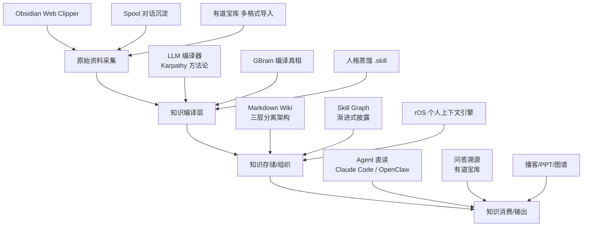

## 研究问题

**当知识库的第一读者从人类变为 Agent，知识管理的架构、表示方式和工作流需要发生怎样的根本性重构？**

本综合分析横跨 13 个 concept 词条和 30+ 篇摘要，梳理 2026 年上半年在 AI 知识管理领域涌现的方法论、工具和产品，揭示从「人写人读」到「人写 Agent 读」再到「Agent 写 Agent 读」的三阶段范式迁移。

---

## 综合分析

### 一、知识架构模式对比

当前 AI 知识管理领域出现了三种主流架构模式，各自解决不同规模和场景下的知识组织问题：

| **架构模式** | **代表方案** | **核心理念** | **适用规模** | **Agent 友好度** |

| --- | --- | --- | --- | --- |

| 三层分离架构 | Karpathy LLM Wiki / 三层知识架构 | raw → wiki → schema，数据/产物/规则解耦 | 100~1000 篇 | ⭐⭐⭐⭐ |

| 编译真相+时间线 | GBrain | 结论持续改写 + 证据只增不改 | 10,000+ 文件 | ⭐⭐⭐⭐⭐ |

| 渐进式披露图谱 | Skill Graph / arscontexta | wikilinks + frontmatter + MOC，按需导航 | 无上限 | ⭐⭐⭐⭐⭐ |

| 本地搜索引擎 | Spool | SQLite FTS5 全文搜索，对话沉淀为资产 | 中小规模 | ⭐⭐⭐ |

| 产品化封装 | 有道宝库 / NotebookLM | 多格式导入 + 引用溯源 + 多模态输出 | 不限 | ⭐⭐ |

**关键发现**：三种开发者导向的架构（Karpathy、GBrain、Skill Graph）虽然独立提出，但共享一个底层信念——**纯 Markdown + 文件系统是 Agent 时代最优的知识载体**。它们放弃了数据库、向量索引等重基础设施，转而依靠 LLM 的上下文理解能力直接读取文本。

### 二、「编译」取代「检索」的范式转移

Karpathy 提出的核心洞察——**LLM 是编译器而非搜索引擎**——正在重塑整个知识管理链路：

| **维度** | **传统 RAG 检索范式** | **LLM 知识编译范式** |

| --- | --- | --- |

| 数据流向 | 查询时从向量库检索片段 | 预编译为结构化 Wiki，查询时直接读取 |

| 知识质量 | 取决于 embedding + 检索算法 | 取决于 schema 规则 + LLM 编译质量 |

| 可溯源性 | 片段级，难以追溯完整上下文 | 页面级，每条结论对应原始来源 |

| 维护成本 | 向量索引重建 + 数据漂移 | 增量编译 + Lint 健康检查 |

| 适用边界 | 大规模（1000+ 文档） | 中小规模（40 万词以内直读） |

GBrain 将这一范式推向极致：通过「编译真相 + 时间线」双区模式，Agent 每次处理新信息后**重写**结论段而非追加，使 10,000+ 文件的知识库始终保持简洁准确。这与传统笔记的「只增不删」形成根本对立。

### 三、知识表示的 Agent 原生化

从各 concept 的演进可以清晰看到知识表示正在经历三个阶段：

**阶段 1：人写人读** → Obsidian / Notion 等传统笔记工具

- 知识组织依赖人的认知结构

- GUI 是主要交互界面

**阶段 2：人写 Agent 读** → Karpathy Wiki、Obsidian Skills、Skill Graph

- 知识仍由人策划，但格式优化为 Agent 可消费

- Obsidian Skills 的三层加载机制（元数据→指令→资源）就是为 Agent 设计的渐进式上下文管理

- Skill Graph 让 10 万字知识库的实际读取量压缩到 3,000 字

**阶段 3：Agent 写 Agent 读** → GBrain、rOS、LLM 知识编译

- Agent 自动编译并维护知识库，人只负责审核

- rOS 将这一理念系统化——软件的第一服务对象从人变为 Agent

- 人格蒸馏将「人的思维方式」编码为可调用的 skill 文件

### 四、知识蒸馏的新边疆

人格蒸馏和数字永生代表了知识管理的激进延伸——不再局限于客观知识，而是将**主观认知模式**也纳入管理范畴：

| **蒸馏类型** | **输入** | **输出** | **代表项目** |

| --- | --- | --- | --- |

| 知识编译 | 文章、论文、代码 | 结构化 Wiki 条目 | Karpathy Wiki、GBrain |

| 技能蒸馏 | 操作流程、最佳实践 | .skill 文件 | Obsidian Skills、colleague-skill |

| 人格蒸馏 | 聊天记录、语录、行为模式 | 七维数字分身 | immortal-skill (488 Stars) |

值得注意的是，反蒸馏 skill 的出现暗示了「知识主权」将成为 Agent 时代的核心议题——当任何人的认知模式都可以被编码为 skill 时，隐性知识的保护机制变得至关重要。

### 五、工具生态版图

---

## 关键发现

1. **「编译优于检索」正在成为共识**：Karpathy、GBrain、LLM 知识编译三个独立来源不约而同地选择了预编译结构化 Markdown 而非实时 RAG，说明在中小规模个人知识库场景下，编译范式的优势已被多方验证。

1. **知识架构正在借鉴软件工程**：三层分离架构（raw/wiki/schema）直接映射为源码/编译产物/构建配置；编译真相+时间线模式类似 Git 的快照+日志；Lint 健康检查源自代码质量工具。知识管理正在被「工程化」。

1. **Agent 的上下文窗口成为新的架构约束**：Skill Graph 的渐进式披露（10 万字→3000 字）、Obsidian Skills 的三层加载机制、GBrain 的编译真相压缩，本质上都是在解决同一个问题——如何在有限 token 预算内最大化知识密度。这意味着未来知识架构的核心指标不是存储量，而是**信息密度/token 比**。

1. **「知识 OS」层正在浮现**：rOS 的出现标志着知识管理从工具层上升到操作系统层。当 Agent 成为软件的第一用户，知识库不再是「笔记应用」的功能，而是 Agent 运行的基础设施。这与 OpenClaw 的框架定位形成互补（rOS = iPhone 开箱即用，OpenClaw = Linux 自建）。

1. **知识管理的边界正在从「What I know」扩展到「Who I am」**：人格蒸馏和数字永生将知识管理的对象从客观事实延伸到主观认知模式，这是一个根本性的范畴扩展，同时也引发了前所未有的伦理挑战。

---

## 来源列表

### Concept 页面

- [GBrain](entities/GBrain.md)

- [Karpathy LLM Wiki 方法论](concepts/Karpathy LLM Wiki 方法论.md)

- [LLM 知识编译](concepts/LLM 知识编译.md)

- [LLM+Markdown+Wiki 知识库](concepts/LLM+Markdown+Wiki 知识库.md)

- [Obsidian Skills](concepts/Obsidian Skills.md)

- [rOS](concepts/rOS.md)

- [Skill Graph](concepts/Skill Graph.md)

- [Spool](concepts/Spool.md)

- [三层知识架构](concepts/三层知识架构.md)

- [人格蒸馏](concepts/人格蒸馏.md)

- [数字永生](concepts/数字永生.md)

- [有道宝库](concepts/有道宝库.md)

- [编译真相+时间线模式](concepts/编译真相+时间线模式.md)

### 关键 Summary 页面

- [摘要：Karpathy LLM Wiki 个人知识库方法论](summaries/摘要：Karpathy LLM Wiki 个人知识库方法论.md)

- [摘要：10,000+ markdown files（GBrain 开源发布）](summaries/摘要：10,000+ markdown files（GBrain 开源发布）.md)

- [摘要：Skill Graph > SKILL.md 渐进式披露典范](summaries/摘要：Skill Graph  SKILL.md 渐进式披露典范.md)

- [摘要：Obsidian Skills 如何重塑知识工作流](summaries/摘要：Obsidian Skills 如何重塑知识工作流.md)

- [摘要：OpenClaw+Obsidian+CC｜才是AI时代知识管理的神](summaries/摘要：OpenClaw+Obsidian+CC｜才是AI时代知识管理的神.md)

- [摘要：从知识库到 Agent 原生 OS，汪源想为 Agent 造一个操作系统](summaries/摘要：从知识库到 Agent 原生 OS，汪源想为 Agent 造一个操作系统.md)

- [摘要：Obsidian+OpenClaw 组合技重构AI知识管理体系](summaries/摘要：Obsidian+OpenClaw 组合技重构AI知识管理体系.md)

- [摘要：OpenClaw Memory Web UI——AI知识库的人侧管理层](summaries/摘要：OpenClaw Memory Web UI——AI知识库的人侧管理层.md)

---

## 行动建议

1. **将当前 Notion Wiki 的 Ingest 流程向「编译范式」迁移**：参考 GBrain 的编译真相+时间线模式，为每个 concept 页面增加「编译真相」区（当前最优理解，可被 Agent 改写）和「时间线」区（原始来源追加）。这将使 Wiki 从「只增不删」转变为「持续精炼」，直接提升 Agent 读取效率。

1. **为知识 Wiki 引入渐进式披露机制**：借鉴 Skill Graph 的 MOC + frontmatter + wikilinks 模式，为现有 index 页面增加 YAML 摘要元数据，使 Agent 在查询时无需读取全部 concept 页面，将平均 token 消耗压缩 80%+。这与当前 Wiki Compiler 的 index 生成流程可以无缝衔接。

1. **探索 OpenClaw + Obsidian Skills 的双轨知识管道**：将 Obsidian 作为原始资料采集和本地编辑的前端，Notion Wiki 作为编译产物和协作审核的中心，OpenClaw 作为 Agent 消费知识的运行时。三者通过 Markdown 格式统一衔接，形成完整的「采集→编译→消费」闭环。
