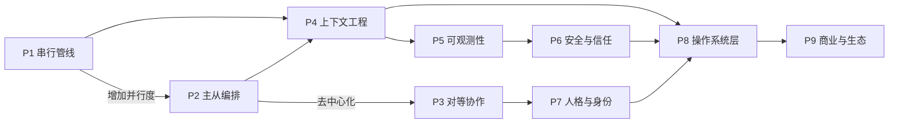

## 研究问题

Agent 协作模式是当前知识 Wiki 中规模最大的活跃标签之一（193 个 concept/entity），但此前从未有一篇专门的单标签全景 synthesis。已有多篇多标签 synthesis 涉及了 Agent 协作模式的局部面向（如商业化、工具链、内容创作），但缺乏对这 193 个概念的**全局性结构梳理**。本文试图回答：**Agent 协作模式内部存在哪些架构范式的分化？这些范式之间的演进关系是什么？从中能提取出怎样的设计决策框架？**

**标签规模**：193 个 concept/entity，来源广泛，涵盖多 Agent 编排、运行时治理、商业平台、安全机制等多个子领域。

## 综合分析

### 一、九种架构范式的识别与分类

对 193 个 concept/entity 的全局分析揭示了 Agent 协作模式内部存在九种可辨认的架构范式，可归为三大层级：

| **层级** | **范式** | **核心特征** | **代表 concept/entity** |

| --- | --- | --- | --- |

| **编排拓扑层** | **P1 串行管线** | 任务按顺序流转，每个环节一个 Agent | [Untitled](concepts/Pipeline 模式.md)、[Untitled](concepts/Cascade Flows.md)、[Untitled](concepts/Skills Pipeline.md) |

| **P2 主从编排** | 一个中央 Orchestrator 分配任务给下属 Agent | [Untitled](concepts/Orchestrator 模式.md)、[Untitled](entities/Claude Managed Agents.md)、[Untitled](entities/SuperHQ.md)、[Untitled](concepts/Subagents 并行.md) | ≈35 |

| **P3 对等协作** | Agent 之间无中心权威，通过消息/投票达成共识 | [Untitled](concepts/Agent Swarm Intelligence.md)、[Untitled](concepts/Borda count.md)、[Untitled](concepts/Multi-Agent 群聊.md)、[Untitled](concepts/InboxSystem.md) | ≈20 |

| **运行时治理层** | **P4 上下文工程** | 管理 Agent 的输入/输出上下文窗口和信息流 | [Untitled](concepts/Agent Hooks.md)、[Untitled](concepts/Tool Wrapper 模式.md)、[Untitled](concepts/Ralph Loop.md)、[Untitled](concepts/PCEC 引擎.md) |

| **P5 可观测性与审计** | 监控、记录和分析 Agent 行为 | [Untitled](concepts/Agent 可观测性.md)、[Untitled](concepts/Semantic Observability.md)、[Untitled](concepts/Evals.md)、[Untitled](concepts/单变量实验循环.md) | ≈15 |

| **P6 安全与信任** | 权限隔离、操作确认、攻防机制 | [Untitled](concepts/Hands 机制.md)、[Untitled](concepts/Sandbox 抽象.md)、[Untitled](concepts/Polling 抢消息.md) | ≈12 |

| **身份与平台层** | **P7 人格与身份** | 定义 Agent 的语气、风格、判断偏好 | [Untitled](concepts/Agent 人格层.md)、[Untitled](concepts/Agent 人设.md)、[Untitled](concepts/Persona Pattern.md) |

| **P8 操作系统层** | Agent 的长期运行环境：调度、持久化、心跳 | [Untitled](concepts/Agent 操作系统层.md)、[Untitled](entities/TinyAgentOS.md)、[Untitled](concepts/个人 AI 操作系统.md)、[Untitled](concepts/主动式 Agent.md) | ≈18 |

| **P9 商业与生态** | Agent 的发现、交易、分发市场 | [Untitled](concepts/Agent 交易市场.md)、[Untitled](concepts/Agent 经济闭环.md)、[Untitled](entities/Awesome OpenClaw Agents.md)、[Untitled](concepts/AI 公司操作系统.md) | ≈20 |

### 二、九种范式的演进关系

这九种范式不是平行的分类，而是存在明确的演进关系：

**演进关键节点**：

- **P1→P2→P3** 是编排拓扑的复杂度梯度：从线性流水线到层级调度到无中心协作

- **P4+P5+P6** 是运行时治理的三层防线，雏形于编排层但独立演化

- **P8 操作系统层**是上述所有范式的收敛点——它需要同时集成编排、治理和身份

### 三、三大结构性张力

遍历这 193 个 concept/entity，可以识别出贯穿所有范式的三大结构性张力：

张力 1：集中式控制 vs 自主性

| **维度** | **集中式极端** | **自主性极端** | **代表解决方案** |

| --- | --- | --- | --- |

| **任务分配** | Orchestrator 单点分配 | Agent 自主抢单（Polling 抢消息） | [Untitled](concepts/任务 DAG 调度.md)——结构化依赖但允许并行 |

| **决策权** | 主 Agent 全权决定 | 每个 Agent 独立判断 | [Untitled](concepts/Builder-Reviewer 模式.md)——分离执行与审核 |

| **状态管理** | 全局单一状态树 | 每个 Agent 维护本地状态 | [Untitled](concepts/Single Source of Truth.md)——共享状态但允许本地缓存 |

> **💡** **核心洞察**：当前多数生产系统选择了 P2（主从编排）作为默认模式，因为 P3（对等协作）的调试难度远高于开发难度。[Claude Code 四层配置架构](concepts/Claude Code 四层配置架构.md)和[Orchestrator 模式](concepts/Orchestrator 模式.md)的流行恰恰证明了这一点——开发者在实践中偏好「可预测」而非「最优」。

张力 2：透明度 vs 效率

可观测性（P5）和效率之间存在根本性矛盾：

- **完全透明**：每个工具调用都被记录和审计 → 开销大、延迟高

- **完全黑箱**：Agent 自主执行无监控 → 快速但失控风险高

[Semantic Observability](concepts/Semantic Observability.md) 代表的解决方案是「语义级采样」——不记录每个原子操作，而是在语义层面评估 Agent 行为是否符合预期。这是一个重要的工程折衷——用「意图理解」替代「完整日志」。

张力 3：专业化 vs 通用性

193 个 concept 中有大量垂直场景的 Agent 协作方案：

- **量化交易**：[TradingAgents-CN](entities/TradingAgents-CN.md)、[多 Agent 投研框架](concepts/多 Agent 投研框架.md)

- **视频创作**：[UniVA](entities/UniVA.md)、[Director](entities/Director.md)

- **代码开发**：[Claude Code](entities/Claude Code.md)、[SuperConductor](entities/SuperConductor.md)、[gstack](entities/gstack.md)

- **知识管理**：[AutoResearchClaw](entities/AutoResearchClaw.md)、[agency-agents](entities/agency-agents.md)、[团子](entities/团子.md)

- **内容自动化**：[automation-workflows](entities/automation-workflows.md)、[Cron 自动化](concepts/Cron 自动化.md)

这些垂直方案都在通用范式（P1-P3）之上添加了场景特有的约束。但有趣的是，这些场景往往独立重发明了相似的编排模式——TradingAgents-CN 的多角色投研与 ViMax 的多角色视频制作本质上是同一个 Orchestrator 模式的不同实例化。

### 四、OpenClaw 生态作为 Agent 协作模式的实验场

在 193 个 concept 中，OpenClaw 相关的占比显著（Agent 协作模式 ∩ OpenClaw = 32）。OpenClaw 生态实质上成为了 Agent 协作模式的最大实验场：

- **编排拓扑**：[Orchestrator 模式](concepts/Orchestrator 模式.md)、[Subagents 并行](concepts/Subagents 并行.md)、[TaskBoard](concepts/TaskBoard.md)、[多智能体编排](concepts/多智能体编排.md)

- **上下文工程**：[OpenClaw Context Engine](entities/OpenClaw Context Engine.md)、[Next-State Signal](concepts/Next-State Signal.md)

- **操作系统**：[Agent 操作系统层](concepts/Agent 操作系统层.md)、[Proactive Agents](concepts/Proactive Agents.md)

- **安全**：[Agent 可观测性](concepts/Agent 可观测性.md)、[Driftwatch](entities/Driftwatch.md)

OpenClaw 的文件化架构（[CLAUDE.md/SOUL.md](http://claude.md/SOUL.md) 等）本质上是将协作模式「声明式化」——用配置文件而非代码来定义 Agent 之间的协作关系。这是 Agent 协作模式演进的一个重要方向。

### 五、设计决策框架：四个关键问题

基于全局分析，可以提取出选择 Agent 协作模式时的四个关键决策问题：

| **决策问题** | **选项 A** | **选项 B** | **选择指南** |

| --- | --- | --- | --- |

| **Q1: 编排拓扑？** | Pipeline / Orchestrator（可预测） | Swarm / 对等（灵活） | 任务结构确定→A；任务动态变化→B |

| **Q2: 状态共享方式？** | 全局状态树（一致性优先） | 本地状态+消息传递（解耦优先） | 强一致性需求→A；可扩展性需求→B |

| **Q3: 可观测性深度？** | 全量日志（审计友好） | 语义级采样（效率友好） | 安全敏感场景→A；成本敏感场景→B |

| **Q4: 人格层是否显式配置？** | 显式配置（[SOUL.md](http://soul.md/) 类） | 隐式默认（依赖模型默认行为） | 长期协作场景→A；短期任务场景→B |

## 关键发现

> **💡** **发现 1：Agent 协作模式内部存在九种可辨认的架构范式，归为三大层级（编排拓扑→运行时治理→身份与平台）。** 这三层不是互斥的选项而是必须同时存在的叠加层——任何生产级 Agent 系统都需要在每个层级做出明确选择。当前多数开发者只关注编排拓扑层（P1-P3），忽视了运行时治理和身份层的设计决策。

> **💡** **发现 2：当前生产系统压倒性地选择了主从编排（P2）而非对等协作（P3），因为 P3 的调试难度远高于开发难度。** Claude Managed Agents、Orchestrator 模式的流行证明开发者在实践中偏好「可预测」而非「最优」。对等协作（Swarm、Borda count）仍然主要停留在实验和仿真阶段。

> **💡** **发现 3：不同垂直场景（量化交易、视频创作、代码开发、知识管理）独立地重发明了相同的编排模式，这表明协作模式的抽象分层尚未充分完成。** TradingAgents-CN 的多角色投研与 ViMax 的多角色视频制作本质上是同一个 Orchestrator 模式。如果协作模式能更好地抽象和标准化，这些场景就不需要从头建设。

> **💡** **发现 4：OpenClaw 生态的文件化架构（**[**CLAUDE.md/SOUL.md）代表了协作模式「声明式化」的重要演进方向——用配置文件而非代码定义协作关系。**](http://claude.md/SOUL.md）代表了协作模式「声明式化」的重要演进方向——用配置文件而非代码定义协作关系。) 这降低了协作模式的使用门槛，但也带来了新的攻击面（AgentShield 的 1282 项测试正是针对这些配置文件的安全审计）。

> **💡** **发现 5：操作系统层（P8）是所有协作模式的收敛点——它需要同时集成编排、治理和身份，这解释了为什么「Agent OS」成为行业的焦点叙事。** Agent 操作系统层、TinyAgentOS、个人 AI 操作系统等概念的密集出现，表明行业正在尝试将多种协作模式统一到一个可管理的运行时中。但当前还没有一个「Agent OS」真正完成了三层集成。

## 来源列表

### 编排拓扑层

- [Pipeline 模式](concepts/Pipeline 模式.md)、[Cascade Flows](concepts/Cascade Flows.md)、[Orchestrator 模式](concepts/Orchestrator 模式.md)、[Claude Managed Agents](entities/Claude Managed Agents.md)、[Subagents 并行](concepts/Subagents 并行.md)、[SuperHQ](entities/SuperHQ.md)、[Agent Swarm Intelligence](concepts/Agent Swarm Intelligence.md)、[Borda count](concepts/Borda count.md)、[Multi-Agent 群聊](concepts/Multi-Agent 群聊.md)、[InboxSystem](concepts/InboxSystem.md)、[任务 DAG 调度](concepts/任务 DAG 调度.md)、[BMAD Method](concepts/BMAD Method.md)、[Builder-Reviewer 模式](concepts/Builder-Reviewer 模式.md)、[TaskBoard](concepts/TaskBoard.md)、[多智能体编排](concepts/多智能体编排.md)

### 运行时治理层

- [Agent Hooks](concepts/Agent Hooks.md)、[Tool Wrapper 模式](concepts/Tool Wrapper 模式.md)、[Ralph Loop](concepts/Ralph Loop.md)、[PCEC 引擎](concepts/PCEC 引擎.md)、[Agent 可观测性](concepts/Agent 可观测性.md)、[Semantic Observability](concepts/Semantic Observability.md)、[Evals](concepts/Evals.md)、[单变量实验循环](concepts/单变量实验循环.md)、[Hands 机制](concepts/Hands 机制.md)、[Sandbox 抽象](concepts/Sandbox 抽象.md)、[Polling 抢消息](concepts/Polling 抢消息.md)、[OpenClaw Context Engine](entities/OpenClaw Context Engine.md)

### 身份与平台层

- [Agent 人格层](concepts/Agent 人格层.md)、[Agent 人设](concepts/Agent 人设.md)、[Persona Pattern](concepts/Persona Pattern.md)、[Agent 操作系统层](concepts/Agent 操作系统层.md)、[TinyAgentOS](entities/TinyAgentOS.md)、[个人 AI 操作系统](concepts/个人 AI 操作系统.md)、[主动式 Agent](concepts/主动式 Agent.md)、[Proactive Agents](concepts/Proactive Agents.md)、[Agent 交易市场](concepts/Agent 交易市场.md)、[Agent 经济闭环](concepts/Agent 经济闭环.md)、[Awesome OpenClaw Agents](entities/Awesome OpenClaw Agents.md)、[AI 公司操作系统](concepts/AI 公司操作系统.md)

### 垂直场景实例

- [TradingAgents-CN](entities/TradingAgents-CN.md)、[多 Agent 投研框架](concepts/多 Agent 投研框架.md)、[UniVA](entities/UniVA.md)、[Claude Code](entities/Claude Code.md)、[AutoResearchClaw](entities/AutoResearchClaw.md)、[Claude Code 四层配置架构](concepts/Claude Code 四层配置架构.md)、[automation-workflows](entities/automation-workflows.md)、[Cron 自动化](concepts/Cron 自动化.md)、[agency-agents](entities/agency-agents.md)、[团子](entities/团子.md)

### 已有相关 synthesis 参考

- [Agent 技能的商业化拓扑：从免费能力模块到可计价服务单元的价值捕获路径与生态博弈](syntheses/Agent 技能的商业化拓扑：从免费能力模块到可计价服务单元的价值捕获路径与生态博弈.md)（商业/生态 × Agent 协作模式）

- [Agent 框架的内容创作专精化分化：从通用底座到领域原生创作系统的九种架构范式与收敛路径](syntheses/Agent 框架的内容创作专精化分化：从通用底座到领域原生创作系统的九种架构范式与收敛路径.md)（Agent 协作模式 × 多Agent协作 × 视频/3D × 内容自动化）

- [Agent 编排的开发工具化路径：从消息分发基础设施到远程 Agent 操控面板的工程落地图谱](syntheses/Agent 编排的开发工具化路径：从消息分发基础设施到远程 Agent 操控面板的工程落地图谱.md)（多Agent协作 × Agent 协作模式 × Harness 工程 × IDE 集成 × OpenClaw）

- [Agent 能力交付的全栈管线：开发工具基座、技能原子封装与工作流自编织的三重边界消融](syntheses/Agent 能力交付的全栈管线：开发工具基座、技能原子封装与工作流自编织的三重边界消融.md)（CLI 工具 × 浏览器自动化 × MCP 协议 × 多Agent协作 × Agent 协作模式 × Harness 工程）

## 行动建议

1. **在 OpenClaw 项目中建立协作模式选型模板**：基于本文的四个关键决策问题（编排拓扑、状态共享、可观测性、人格层），为每个新 Agent 项目创建一个强制性的「协作模式决策文档」。这可以避免很多项目在后期才发现编排模式不匹配场景需求。

1. **优先投资运行时治理层（P4-P6）而非更复杂的编排拓扑**：多数开发者把时间花在设计更精巧的编排模式上，但生产璯境的主要稳定性问题来自运行时治理不足。建议对 Tizer 的所有 Agent 项目强制配置可观测性（至少达到 Semantic Observability 级别）和安全护栏（Hands 机制用于高危操作）。

1. **将垂直场景的编排模式抽象为可复用模板**：TradingAgents-CN 和 ViMax 等项目证明，不同场景往往重发明相同的编排模式。建议在知识 Wiki 中创建一个「协作模式模板库」，将已验证的编排模式（Orchestrator、Pipeline、Builder-Reviewer 等）包装为可直接套用的配置模板。
