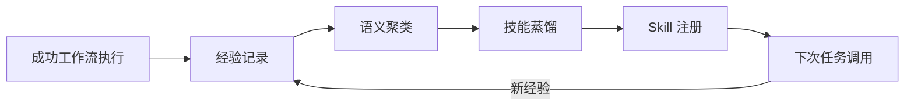

## 研究问题

Agent 框架如何集成记忆系统？从外接 RAG 插件到原生记忆优先底座，不同的集成深度对 Agent 的长期行为、状态持久化和跨任务学习能力有何根本影响？框架选型时应如何评估记忆架构的成熟度？

## 综合分析

### 一、记忆集成深度光谱：从插件到底座

从 13 个横跨「Agent 框架 × 记忆系统」的 concept/entity 中，可以识别出四种截然不同的记忆集成模式，按深度递增排列：

| **集成深度** | **模式** | **代表方案** | **记忆持久性** | **跨任务学习** | **运行成本** |

| --- | --- | --- | --- | --- | --- |

| L1 无记忆 | 每次对话从零开始 | 基础 API 调用 | 无 | 无 | 最低 |

| L2 外接插件 | 向量检索 + RAG | Google ADK + 插件 | 被动检索 | 弱：依赖检索命中 | 低 |

| L3 文件记忆 | 结构化文档体系 | Hermes Agent（[USER.md/MEMORY.md/SOUL.md）](http://user.md/MEMORY.md/SOUL.md）) | 显式持久化 | 中：人工或半自动维护 | 中 |

| L4 记忆优先底座 | 记忆融入 Harness 核心 | Letta Code、EverOS、Always-On Memory Agent | 原生持久化 + 自动整合 | 强：自动蒸馏与进化 | 较高 |

### 二、两大设计哲学的对峙

在 L3 和 L4 之间，存在一个关键的设计哲学分野：

哲学 A：显式文件记忆（Hermes 路线）

Hermes Agent 通过一组结构化 Markdown 文件实现记忆分层：

- [**USER.md**](http://user.md/) — 用户画像：角色、偏好、沟通风格

- [**SOUL.md**](http://soul.md/) — Agent 身份：人格、价值观、行为准则

- [**MEMORY.md**](http://memory.md/) — 动态经验：学到的教训、偏好变化

- [**SKILL.md**](http://skill.md/) — 能力清单：可执行的技能定义

**优势**：透明可审计、人类可直接编辑、版本可追溯（Git 友好）

**劣势**：依赖人工或半自动维护，规模化后文件管理复杂度上升

哲学 B：记忆优先底座（Letta 路线）

Letta Code 将记忆直接融入 Harness 核心，把记忆不是作为外接模块而是作为执行底座的一等公民：

- 记忆投影到 Git 支撑的文件系统，具备可读写、可追踪、可并发维护能力

- 后台记忆子 Agent 持续执行 prompt rewriting 和 active memory management

- 上下文装载、状态持久化、压缩保留与工具执行在同一 Harness 内统一设计

**优势**：自动化程度高、无需人工维护、记忆与执行紧密耦合

**劣势**：黑盒程度高、调试困难、对底座依赖强

| **对比维度** | **显式文件记忆（Hermes）** | **记忆优先底座（Letta）** |

| --- | --- | --- |

| 透明度 | ⭐⭐⭐⭐⭐ 人类可直接阅读编辑 | ⭐⭐ 需要专用工具查看 |

| 自动化 | ⭐⭐ 依赖手动或半自动 | ⭐⭐⭐⭐⭐ 全自动整合蒸馏 |

| 可迁移性 | ⭐⭐⭐⭐⭐ Markdown 文件通用 | ⭐⭐⭐ 依赖特定存储后端 |

| 规模上限 | ⭐⭐⭐ 文件数量增长后管理复杂 | ⭐⭐⭐⭐⭐ 自动压缩与索引 |

| 冷启动速度 | ⭐⭐⭐⭐ 文件即刻加载 | ⭐⭐⭐ 需要记忆预热 |

| 适用场景 | 个人助手、小团队、注重控制权 | 企业级、高频交互、需要自动学习 |

### 三、自我进化 Skills 系统：记忆与能力的融合点

自我进化 Skills 系统代表了记忆系统与框架能力的最深层融合——Agent 不仅「记住」经验，还能将经验**蒸馏为可复用的技能**：

这个闭环在 Hermes Agent 和 EverOS 中都有实现，但路径不同：

- **Hermes**：通过显式的 [SKILL.md](http://skill.md/) 维护技能清单，蒸馏依赖半自动化

- **EverOS**：从 Agent Case 到语义聚类再到技能蒸馏的全自动持续进化闭环

### 四、记忆架构对框架选型的影响

记忆集成深度直接影响三个框架选型维度：

**1. 状态管理复杂度**

- L2 插件模式：无状态，每次检索即用

- L3 文件模式：文件状态，Git 可管理

- L4 底座模式：复杂内部状态，需要专用监控

**2. 多 Agent 协作能力**

- L2：Agent 之间无共享记忆

- L3：通过共享文件实现记忆协作（如 [MEMORY.md](http://memory.md/) 被多个 Agent 读写）

- L4：原生支持记忆共享与隔离

**3. 长期运行可靠性**

- L2：无退化风险，但也无积累

- L3：人工维护可防止记忆污染，但维护成本线性增长

- L4：自动整合降低维护成本，但存在记忆漂移风险

### 五、开放记忆标准的商业意义

Deep Agents（LangChain）提出的 Open Memory 标准正在尝试解决一个跨框架问题：**记忆的可移植性**。这对框架生态的影响是深远的：

- 如果记忆可以跨框架迁移，L3 锁定和 L4 锁定都会被显著削弱

- 框架竞争的焦点将从「谁的记忆更好」转向「谁的执行更好」

- 用户可以在不同框架间保持 Agent 的「人格连续性」

但 Open Memory 标准面临的现实挑战是：**记忆格式的标准化与记忆能力的差异化天然矛盾**。Letta Code 的记忆优势恰恰来自其非标准的深度集成。

## 关键发现

1. **记忆集成深度是 Agent 框架最被低估的选型维度**：当前框架选型讨论集中在模型支持、生态丰富度和性能指标上，但记忆架构对 Agent 的长期行为和用户体验的影响远大于这些表面指标。L2 框架和 L4 框架的 Agent 在使用一个月后的行为差异将远大于使用第一天。

1. **显式文件记忆与记忆优先底座不是替代关系，而是互补关系**：Hermes 的 [USER.md/SOUL.md/MEMORY.md](http://user.md/SOUL.md/MEMORY.md) 体系为 Agent 提供了人类可审计的「宪法层」记忆，而 Letta Code 的自动记忆管理处理高频、细粒度的「经验层」记忆。最优架构可能是两者的分层组合。

1. **自我进化 Skills 系统是记忆与框架融合的极致形态**：当 Agent 能将经验自动蒸馏为可复用技能时，记忆不再只是「回忆」，而是「能力」。这个转化是 Agent 从工具进化为助手的分水岭。

1. **开放记忆标准与深度集成存在根本张力**：Deep Agents 的 Open Memory 标准追求可迁移性，Letta Code 的记忆优先设计追求性能深度。标准化会削弱深度集成的差异化优势，但没有标准化，用户就被锁定在单一框架中。这个张力短期内无解。

1. **记忆架构决定了多 Agent 协作的上限**：在 L2 模式下，Agent 之间只能通过显式消息传递协作；在 L4 模式下，Agent 可以共享记忆空间实现隐式协调。框架的记忆架构不只影响单 Agent 表现，更决定了多 Agent 系统的协作天花板。

## 来源列表

### 概念/实体页面

- [Always-On Memory Agent](entities/Always-On Memory Agent.md)

- [Claudebot-vibe](entities/Claudebot-vibe.md)

- [自我进化 Skills 系统](concepts/自我进化 Skills 系统.md)

- [Deep Agents](entities/Deep Agents.md)

- [EverCore](concepts/EverCore.md)

- [EverMe](entities/EverMe.md)

- [EverOS](entities/EverOS.md)

- [Google ADK](entities/Google ADK.md)

- [Letta Code](entities/Letta Code.md)

- [Pal](entities/Pal.md)

- [PaperClaw](entities/PaperClaw.md)

- [USER.md](concepts/USER.md.md)

- [VialOS Runtime](entities/VialOS Runtime.md)

### 相关 Synthesis

- [Agent 框架的可组合扩展性设计：从技能注入到记忆集成的架构模式对比与选型指南](syntheses/Agent 框架的可组合扩展性设计：从技能注入到记忆集成的架构模式对比与选型指南.md)

- [AI Agent 记忆系统工程化全景：从分层存储到智能遗忘的设计模式与实现路径](syntheses/AI Agent 记忆系统工程化全景：从分层存储到智能遗忘的设计模式与实现路径.md)

- [OpenClaw 记忆系统方案分化与选型决策：从文件记忆到自主记忆操作系统的架构光谱](syntheses/OpenClaw 记忆系统方案分化与选型决策：从文件记忆到自主记忆操作系统的架构光谱.md)

## 行动建议

1. **为 OpenClaw 设计分层记忆架构**：采用「宪法层 + 经验层」的双层设计——用 Hermes 式的 Markdown 文件（[USER.md/SOUL.md）管理稳定的身份与偏好，用轻量级自动记忆系统处理高频经验积累。这样既保持透明可控，又获得自动化收益。](http://user.md/SOUL.md）管理稳定的身份与偏好，用轻量级自动记忆系统处理高频经验积累。这样既保持透明可控，又获得自动化收益。)

1. **在 OpenClaw 框架中实验「技能蒸馏」闭环**：参考 EverOS 的从 Agent Case 到语义聚类再到技能蒸馏的流程，选择一个高频工作流（如内容采集管线），让 Agent 从重复执行中自动提炼可复用技能。从单个工作流验证后再推广。

1. **关注 Open Memory 标准的进展并评估兼容性**：Deep Agents 和 LangChain 正在推动的开放记忆标准可能成为行业方向。在 OpenClaw 的记忆系统设计中预留标准化接口，未来可以低成本接入跨框架记忆迁移能力。
