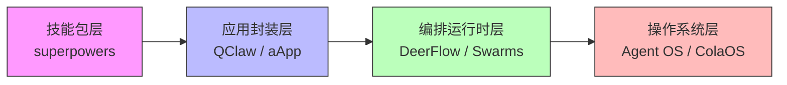

## 研究问题

**在 Agent 框架快速分化的当下，开发者和创业者应如何基于安全边界、扩展机制、部署模式与商业可行性等维度，做出框架选型决策？**

已有综合分析「AI Agent 框架分化全景」从架构哲学维度梳理了框架的类型光谱（应用层胶水 → 操作系统级基础设施），但尚未回答一个更实际的问题：**面对具体业务场景，选型时到底该看什么？** 本篇从 11 个概念词条和 10 篇已审核摘要中提取跨概念的决策维度，形成可操作的选型框架。

## 综合分析

### 一、Agent 框架的四层定位光谱

从已有概念和摘要材料中，可以识别出 Agent 框架正沿四个层级分化：

| **层级** | **代表** | **核心特征** | **典型用户** |

| --- | --- | --- | --- |

| **技能包层** | superpowers 框架 | 不提供运行时，只给 Agent 加方法论约束（TDD、Plan→Implement 流水线） | 已有 Claude Code / Cursor 的开发者 |

| **应用封装层** | QClaw、aApp | 在已有框架之上做产品化封装，降门槛、接入日常入口（微信/QQ） | 普通用户、非技术创作者 |

| **编排运行时层** | SuperAgent Harness (DeerFlow 2.0)、Swarms、Paperclip | 提供沙箱、调度、子智能体编排和任务闭环 | 企业级任务自动化、长流程执行 |

| **操作系统层** | Agent OS、ColaOS | 内核级进程管理、资源计量、隔离和安全机制 | 平台方、需要多租户治理的服务商 |

> **跨概念发现**：层级越高，框架对用户的「锁定力」越强。技能包层几乎零锁定（换 Agent 只需拷贝 Markdown 文件），操作系统层则可能锁定记忆、上下文和工具链。

### 二、五大选型决策维度

维度 1：安全隔离边界

| **框架** | **隔离机制** | **权限模型** | **适用场景** |

| --- | --- | --- | --- |

| NanoClaw | 容器化 + 收敛执行边界 | 强隔离，团队可控 | 敏感科研/企业数据 |

| DeerFlow 2.0 | Docker 沙箱 | 独立计算环境 | 长流程任务执行 |

| Agent OS | 进程级沙箱 | 系统级资源计量与终止 | 多 Agent 并行运行 |

| superpowers | Git worktree 隔离 | 代码级隔离 | 并行编码任务 |

| 桌面 Agent | 本机执行，审批机制 | 依赖操作系统权限 | 文件/终端操控 |

**关键洞察**：安全隔离正从「可选配置」变成「框架核心竞争力」。NanoClaw 的定位说明——在某些场景下，**能力更少但边界更清晰的框架，反而比全能型框架更容易获得信任**。

维度 2：扩展机制与技能生态

框架的可扩展性出现了两条分化路径：

- **Markdown 声明式**：superpowers 和 OpenClaw 系的技能文件（[SKILL.md](http://skill.md/)）、aApp 的自然语言配置——扩展门槛极低，但能力边界受限于 Agent 的理解能力

- **代码编程式**：Swarms 的 Python API、ARC/Rig 的 Rust SDK——能力上限高，但对非开发者不友好

自我进化 Skills 系统代表了第三条路径：**Agent 从成功经验中自动提炼技能**，让扩展从「人工维护」走向「运行中学习」。这意味着未来选型时需要评估：框架是否支持技能的自动沉淀与跨会话复用？

维度 3：部署模式与迁移成本

| **部署模式** | **代表** | **优势** | **风险** |

| --- | --- | --- | --- |

| **本地部署** | OpenClaw、桌面 Agent | 数据主权、离线运行 | 维护成本高、升级复杂 |

| **托管服务** | 托管 Agent、QClaw | 零运维、开箱即用 | 记忆锁定、迁移成本高 |

| **多租户平台** | 多租户托管（ClawHost） | 组织级分发与运营 | 实例隔离、资源配额复杂 |

**核心权衡**：托管 Agent 的便利性与锁定风险是选型中最容易被低估的维度。当模型、价格或权限策略变化时，迁移成本会迅速上升。评估清单应包括：记忆导出、版本回滚、跨模型迁移支持。

维度 4：商业模式适配性

- **开源社区驱动**：OpenClaw（本地部署 + 技能市场）、Swarms（Apache-2.0）——适合生态构建但变现路径长

- **平台封装分发**：QClaw（SkillHub + 日常入口）、aApp（内置付费体系）——直接面向终端用户变现

- **企业级服务**：多租户托管——面向组织级付费

aApp 的「开发者零运营成本 + 平台统一结算 Token」模式尤其值得关注：它解决了传统 Skill 无法变现的痛点，但代价是深度依赖平台生态。

维度 5：入口竞争与用户触达

QClaw 的案例揭示了一个重要趋势：**Agent 竞争正从「谁更强」转向「谁更接近日常入口」**。框架选型不仅要看技术能力，还要评估能否嵌入用户已有工作流（微信、终端、IDE、浏览器）。

### 三、框架演化趋势

三个并行演化方向：

1. **向上整合**：从技能包 → 编排运行时 → OS，每一层都在吸收下层能力

1. **向外分发**：从开发者工具 → 日常入口（QClaw 微信、桌面 Agent 本机）

1. **向内进化**：从手动配置技能 → Agent 自我进化 Skills 系统

## 关键发现

1. **「能力越少越安全」的反直觉定位正在被市场验证**：NanoClaw 的存在说明，在高敏感度场景中，收敛执行边界比丰富功能更重要——这打破了「框架越全能越好」的线性思维

1. **框架锁定的真正风险不在技术，而在记忆资产**：托管 Agent 的分析揭示，当 Agent 积累了长期上下文和工作记忆后，迁移成本主要来自记忆资产的不可移植性，而非代码层的切换成本

1. **入口优势正在重新定义「框架竞争力」**：QClaw 几乎没有技术新原语，但微信/QQ 原生接入让它可能比技术更先进的框架更快触达用户——这意味着选型时「入口可达性」应与「技术能力」并列评估

1. **Markdown 声明式扩展正在成为技能生态的公约数**：从 superpowers 的 [SKILL.md](http://skill.md/) 到 OpenClaw 的技能文件再到 aApp 的 [SOUL.md](http://soul.md/)，结构化 Markdown 正取代代码 API 成为 Agent 能力定义的主流方式

1. **「组织化 Agent」是框架演进的下一个台阶**：Paperclip 把岗位、预算和审计当成系统原语，ColaOS 用三大灵魂系统构建人格化 Agent——框架竞争正从「单 Agent 更强」转向「Agent 组织更完整」

## 来源列表

### 概念词条

[NanoClaw](concepts/NanoClaw.md) · [Agent OS](concepts/Agent OS.md) · [SuperAgent Harness](concepts/SuperAgent Harness.md) · [QClaw](concepts/QClaw.md) · [superpowers 框架](concepts/superpowers 框架.md) · [aApp](concepts/aApp.md) · [桌面 Agent](concepts/桌面 Agent.md) · [Agent 模板库](concepts/Agent 模板库.md) · [多租户托管](concepts/多租户托管.md) · [托管 Agent](concepts/托管 Agent.md) · [自我进化 Skills 系统](concepts/自我进化 Skills 系统.md)

### 摘要来源

[摘要：Paperclip：一行命令，用 AI 智能体跑一家「无人公司」](summaries/摘要：Paperclip：一行命令，用 AI 智能体跑一家「无人公司」.md) · [摘要：ColaOS——想跟你谈恋爱的 Agent](summaries/摘要：ColaOS——想跟你谈恋爱的 Agent.md) · [摘要：Swarms：目前最复杂的多 Agent 框架，究竟创新在哪里？](summaries/摘要：Swarms：目前最复杂的多 Agent 框架，究竟创新在哪里？.md) · [摘要：2025 年初 AI Agent 框架全景：Swarms、ELIZA、ARC、ZerePy、Dolos 谁是真正的基础设施？](summaries/摘要：2025 年初 AI Agent 框架全景：Swarms、ELIZA、ARC、ZerePy、Dolos 谁是真正的基础设施？.md) · [摘要：DeerFlow 2.0：字节跳动开源的 SuperAgent 框架，给 AI 一台真正的电脑](summaries/摘要：DeerFlow 2.0：字节跳动开源的 SuperAgent 框架，给 AI 一台真正的电脑.md) · [摘要：OpenClaw 橙皮书：60天超越 React，这只「龙虾」究竟是什么来头？](summaries/摘要：OpenClaw 橙皮书：60天超越 React，这只「龙虾」究竟是什么来头？.md) · [摘要：QClaw：腾讯把 AI Agent 装进微信，12 亿人的入口之争](summaries/摘要：QClaw：腾讯把 AI Agent 装进微信，12 亿人的入口之争.md) · [摘要：Always-On Memory Agent：Google 开源的「会思考的大脑」，让你的 AI 助手不再失忆](summaries/摘要：Always-On Memory Agent：Google 开源的「会思考的大脑」，让你的 AI 助手不再失忆.md)

## 行动建议

1. **为 OpenClaw 工作流建立「迁移就绪检查清单」**：在当前 OpenClaw 使用深度持续增加的情况下，定期评估记忆导出能力、技能文件的跨框架兼容性和关键工作流的平台依赖度，确保不会被单一框架锁定

1. **在 HITL 工作流中引入 NanoClaw 式的收敛边界设计**：对于涉及敏感数据的 Agent 任务（如知识 Wiki 编译、研究数据处理），考虑用更小的权限边界替代全能权限，以安全隔离换取治理可控性

1. **关注自我进化 Skills 系统的实际落地方案**：将 EverOS 的「从 Agent Case 到语义聚类再到技能蒸馏」闭环作为参考，评估在当前内容管线中加入自动技能沉淀机制的可行性，减少重复配置工作
