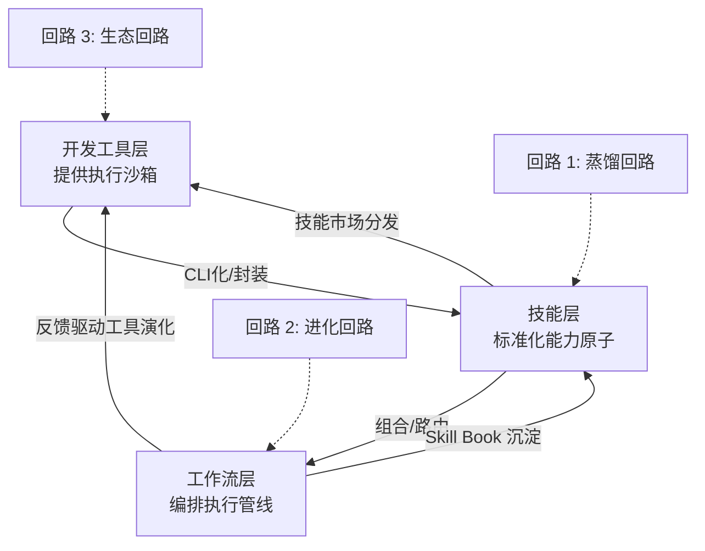

## 研究问题

**当开发工具、Agent 技能和工作流三个领域同时交叉时，会涌现出哪些仅凭两两分析无法捕捉的架构模式？** 已有的三篇双标签 synthesis 分别揭示了：技能如何成为工作流原子（Agent 技能×工作流）、开发工具如何封装技能（开发工具×Agent 技能）、开发工具如何成为工作流底座（开发工具×工作流）。但三条边同时在场时，一个更深层的结构正在浮现——**三者之间的边界正在系统性消融，形成一条「基础设施→能力原子→执行管线」的全栈交付管线，且管线自身具备递归自生产能力。**

本综合分析基于 3 篇双标签 synthesis、1 个三标签交叉概念（Cursor Skills 生态）及 60+ 个跨边概念，试图回答：这条全栈管线的架构是什么？它如何实现自我扩张？对 Tizer 意味着什么？

## 综合分析

### 一、三重边界消融：从分层到融合的架构演化

传统理解中，开发工具、技能和工作流是三个独立层：

- **开发工具**提供基础设施（部署、数据接入、沙箱）

- **技能**提供能力单元（封装、发现、调用）

- **工作流**提供编排逻辑（调度、组合、反馈）

但跨三条边的概念分析揭示了一个系统性趋势：**每一层都在「入侵」相邻层的职责**。

| **消融方向** | **具体表现** | **代表概念** | **涌现机制** |

| --- | --- | --- | --- |

| 开发工具 → 技能 | 工具自身成为可调用的 Skill | OpenCLI 插件系统、Bash 浏览器自动化、bb-browser | CLI 化把工具封装为 Agent 可消费的能力原子 |

| 技能 → 工作流 | Skill 自带编排逻辑和触发条件 | Skill Book、达尔文.skill、六阶段蒸馏 SOP、self-improving-agent | 技能从被动调用升级为自主触发的工作流片段 |

| 工作流 → 开发工具 | 工作流执行环境成为新的开发基础设施 | Cloudflare Dynamic Workers、Git Worktree、n8n | 运行时反馈改变了工具链的部署和隔离方式 |

| 开发工具 → 工作流 | 部署和数据接入工具内化为工作流节点 | Cloudflare 全家桶、WSS 实时推送、Railway 一键部署 | 基础设施即服务退化为工作流的可插拔组件 |

| 工作流 → 技能 | 成功的工作流自动沉淀为可复用 Skill | Skill Book、提示词工作流化、Capability Evolver | 执行经验的自动编码形成技能生成回路 |

| 技能 → 开发工具 | 技能市场成为新的包管理器 | Cursor Skills 生态、Agent Package Manager、OpenCLI 插件系统 | 技能分发复用了 npm/pip 的生态模式 |

**关键洞察**：六个方向的消融并非偶然，而是由同一个底层驱动力推动——**Agent 需要以最低 Token 成本获取最大能力覆盖**。当三层分离时，每次跨层调用都产生认知和 Token 开销；当三层融合时，能力交付变成单层内的函数调用。

### 二、全栈能力管线的四级架构

综合三条边的分析，可以提炼出一个四级全栈管线模型：

| **管线层级** | **职责** | **开发工具视角** | **技能视角** | **工作流视角** |

| --- | --- | --- | --- | --- |

| L0 连通层 | 让 Agent 触达外部世界 | CDP 直连、Session 复用 | MCP 协议、浏览器控制层 | WSS 实时推送、六层兜底抓取 |

| L1 封装层 | 把原始能力标准化为可调用单元 | 网站 CLI 化、TypeScript RPC | [SKILL.md](http://skill.md/)、Agent Skills | Seeded Fallback、增量更新 |

| L2 编排层 | 组合能力单元为执行管线 | Cloudflare Workers、Git Worktree | 能力图谱、Skill 路由 | 工作流自动化代理、Slash 命令 |

| L3 进化层 | 管线自我优化与扩张 | Dynamic Workers 热更新 | 达尔文.skill、AutoSkill | Skill Book 自动沉淀 |

**仅在三标签视角下才可见的涌现特征**：

- L0-L1 的转化（从连通到封装）在双标签分析中表现为开发工具到技能的线性路径；但加入工作流维度后，发现 **封装的标准不是由工具决定的，而是由工作流的调用模式倒推的**——高频工作流要求 CLI 封装（低 Token），低频工作流可以容忍 MCP 封装（高协议开销）。

- L2-L3 的转化（从编排到进化）在双标签分析中表现为工作流到技能的反馈循环；但加入开发工具维度后，发现 **进化的速度受制于部署基础设施的热更新能力**——Cloudflare Dynamic Workers 的毫秒级冷启动让技能变异可以「实时上线评估」，而传统容器部署则把这个循环拉长到分钟级。

### 三、递归自生产：管线生产管线的三重回路

三条边同时在场时，最深层的涌现是**递归自生产能力**——管线不仅执行任务，还生产新的管线组件：

**回路 1 — 蒸馏回路**（技能×工作流）：六阶段蒸馏 SOP 本身是一个工作流，它的产出是新的 Skill 集合。女娲.skill 蒸馏人格生成 .skill，仓颉.skill 蒸馏书籍生成 Skill 集合——**工作流生产技能，技能又被编入新工作流**。

**回路 2 — 进化回路**（技能×开发工具）：达尔文.skill 通过变异-评估-淘汰机制自动优化 Skill；Capability Evolver 观察用户习惯自动调整行为。当这些运行在 Cloudflare Dynamic Workers 上时，变异的上线周期从「手动部署」压缩到「毫秒级热更新」——**开发工具的执行速度决定了技能进化的代际间隔**。

**回路 3 — 生态回路**（开发工具×工作流）：OpenCLI 插件系统把一次性的网站适配工作转化为社区共享资产。Cursor Marketplace 把个人 Skill 变成可下载的生态组件。当一个适配器被足够多的工作流使用后，它从「工具」变成「基础设施」——**工作流的使用密度决定了工具的生态地位**。

### 四、Token 经济学的三角约束

三个领域交叉时，Token 成本成为贯穿三层的统一约束：

| **约束维度** | **来自哪条边** | **具体表现** | **应对策略** |

| --- | --- | --- | --- |

| 封装开销 | 开发工具×技能 | MCP schema bloat（单工具 4000+ tokens） | CLI 化降低 17 倍、TypeScript RPC 类型安全 |

| 编排开销 | 技能×工作流 | 多 Skill 组合的上下文膨胀 | 能力图谱路由、动态工具发现按需加载 |

| 运行开销 | 开发工具×工作流 | 基础设施的冷启动和常驻成本 | V8 isolate 替代容器、边缘计算零成本 |

**三角约束的涌现效应**：单独优化任何一条边都会把瓶颈推到另外两条边。例如，CLI 化大幅降低了封装开销（开发工具×技能），但当 CLI Skill 数量膨胀时，工作流的编排开销（技能×工作流）反而上升。只有三层协同优化——轻量封装 + 按需路由 + 边缘执行——才能实现全局最优。

### 五、Cursor Skills 生态：三重融合的活体标本

[Cursor Skills 生态](concepts/Cursor Skills 生态.md) 是唯一同时横跨 Agent 技能、开发工具、工作流三个标签的概念，是三重融合的最佳观察窗口：

- **作为开发工具**：Skills 以 `.md` 文件存储在 `.cursor/skills/` 目录，与代码库深度集成

- **作为技能**：每个 Skill 有独立的 description 字段，Agent 自动判断何时调用

- **作为工作流**：Capability Evolver 和 Self-Improving Agent 赋予 Skills 自我进化能力

Cursor Marketplace（2026 年 2 月上线）更进一步——它同时是技能市场（发现和安装 Skills）、开发工具生态（类 npm 的分发机制）和工作流模板库（安装即可用的自动化配方）。**三个领域在 Cursor 身上完成了一次完整的边界消融**。

## 关键发现

> **💡** **发现 1：全栈管线的瓶颈不在任何单层，而在层间接缝**

三篇双标签 synthesis 各自识别了本边的核心矛盾（CLI vs MCP、蒸馏递归性、运行时迁移），但三边同时在场时发现：真正制约管线效率的不是单层能力，而是层与层之间的**转化摩擦**。从开发工具到技能的封装摩擦（多少行代码才能让一个工具变成 Skill？），从技能到工作流的编排摩擦（多少 Token 才能让编排器理解一个 Skill 的适用场景？），从工作流到开发工具的反馈摩擦（工作流的执行结果多快能驱动工具更新？）。降低接缝摩擦的方案——如 [SKILL.md](http://skill.md/) 统一格式、能力图谱标准化元数据、Dynamic Workers 热更新——比提升单层性能更有全局价值。

> **💡** **发现 2：CLI 化不仅是成本优化，它是三层融合的结构性推力**

从单边看，CLI 化只是降低 Token 成本的技术选型；但从三边看，CLI 化同时完成了三件事：(a) 把开发工具的功能封装为标准化 Skill 接口，(b) 让 Skill 可以通过 pipe/重定向天然组合为工作流，(c) 把工作流的执行结果以结构化文本返回给开发环境。**CLI 是三层融合的最小公分母**——它之所以在钉钉、飞书、OpenCLI 中同时被选中，不仅因为便宜，更因为它天然兼容三层的接口范式。

> **💡** **发现 3：技能市场正在复刻包管理器的生态动力学，但多了一个「工作流验证」维度**

npm 用下载量衡量包的价值，但 Cursor Marketplace 和 OpenCLI 的 Skill 生态多了一个关键维度：**Skill 在真实工作流中的成功率**。8 维度评估体系和达尔文.skill 的 keep/revert 机制意味着，未来的技能市场排序不仅看安装量，更看「在多少个工作流中被保留下来了」。这是 npm 没有的——从 Skill 视角看是质量治理，从工作流视角看是路由信号，从开发工具视角看是生态健康指标。三层在评估维度上的融合创造了比纯下载量更有价值的排序标准。

> **💡** **发现 4：递归自生产能力使管线具备了「复利」特征**

蒸馏回路、进化回路和生态回路三者叠加后，管线的能力扩张不是线性的，而是复利式的：每一个新 Skill 被编入工作流后，可能被蒸馏为新的 Skill 模板，模板又被生态回路分发给更多用户，更多用户的使用数据又驱动进化回路优化 Skill 质量。**这是单独分析任何两条边都无法看到的系统级涌现**——双标签分析只能看到线性反馈，三标签同时在场才能看到三重回路叠加的指数效应。

> **💡** **发现 5：「工作流决定封装标准」倒转了传统的因果链**

传统逻辑是「工具决定能做什么 → 技能封装能力 → 工作流使用技能」，因果链是自下而上的。但三标签分析揭示了一条反向因果链：**工作流的调用频率和 Token 预算倒推了技能的封装形式，技能的封装需求倒推了开发工具的接口设计**。高频工作流逼出 CLI 封装，CLI 封装逼出轻量运行时（V8 isolate），轻量运行时又使得更多工作流变得经济可行。这是一条自上而下的正反馈链，与传统自下而上的因果链形成双向驱动。

## 来源列表

### 输入的双标签 synthesis

- [Agent 技能从静态封装到工作流原子的演进路径：能力获取、蒸馏复用与质量治理的三重架构分层](syntheses/Agent 技能从静态封装到工作流原子的演进路径：能力获取、蒸馏复用与质量治理的三重架构分层.md)（Agent 技能×工作流，已审核）

- [Agent 能力获取的工具化路径：从浏览器接管到 CLI 生态的「开发工具 × 技能」融合演进](syntheses/Agent 能力获取的工具化路径：从浏览器接管到 CLI 生态的「开发工具 × 技能」融合演进.md)（开发工具×Agent 技能，已审核）

- [开发工具如何重塑 Agent 时代的工作流：从部署底座到远程操控的工具化路径演进](syntheses/开发工具如何重塑 Agent 时代的工作流：从部署底座到远程操控的工具化路径演进.md)（开发工具×工作流，已审核）

### 三标签交叉概念

- [Cursor Skills 生态](concepts/Cursor Skills 生态.md)（审核中）

### Agent 技能×开发工具 边概念

- [agency-agents](entities/agency-agents.md)、[Agent Package Manager](entities/Agent Package Manager.md)、[AutoCLI.ai](entities/AutoCLI.ai.md)、[Bash 浏览器自动化](concepts/Bash 浏览器自动化.md)、[bb-browser](entities/bb-browser.md)、[CDP 直连](concepts/CDP 直连.md)、[CodePilot](entities/CodePilot.md)、[Codex](entities/Codex.md)、[Daemon + Chrome Extension 架构](concepts/Daemon + Chrome Extension 架构.md)、[HyperAgent](entities/HyperAgent.md)、[Jina Reader](entities/Jina Reader.md)、[OpenCLI](entities/OpenCLI.md)、[结构化网页抓取](concepts/结构化网页抓取.md)、[浏览器登录态复用](concepts/浏览器登录态复用.md)

### Agent 技能×工作流 边概念

- [8维度评估体系](concepts/8维度评估体系.md)、[Agent Skills](concepts/Agent Skills.md)、[awesome-niuma-skills](entities/awesome-niuma-skills.md)、[Skill Book](concepts/Skill Book.md)、[Skill 蒸馏](concepts/Skill 蒸馏.md)、[Slash 命令工作流](concepts/Slash 命令工作流.md)、[六阶段蒸馏 SOP](concepts/六阶段蒸馏 SOP.md)、[提示词工作流化](concepts/提示词工作流化.md)、[能力图谱](concepts/能力图谱.md)、[self-improving-agent](concepts/self-improving-agent.md)

### 开发工具×工作流 边概念

- [Cloudflare Dynamic Workers](entities/Cloudflare Dynamic Workers.md)、[Cloudflare Workers](entities/Cloudflare Workers.md)、[Cloudflare 全家桶](concepts/Cloudflare 全家桶.md)、[Git Worktree](concepts/Git Worktree.md)、[n8n](entities/n8n.md)、[SSH 直连工作流](concepts/SSH 直连工作流.md)、[零同步远程工作流](concepts/零同步远程工作流.md)、[WSS 实时推送](concepts/WSS 实时推送.md)

## 行动建议

> **🎯** **建议 1：构建 OpenClaw 的「CLI-first 全栈 Skill 管线」**

基于三角约束分析，Tizer 应将 OpenClaw 的核心内容管线技能统一为 CLI 接口，不仅因为成本低 17 倍，更因为 CLI 天然支持三层融合——pipe 组合实现工作流编排，结构化输出实现技能评估，命令行参数实现能力发现。具体步骤：(1) 为每个高频 Skill 创建 CLI wrapper；(2) 用 OpenCLI 插件系统标准化封装格式；(3) 部署在 Cloudflare Workers 上实现零成本边缘执行。

> **🎯** **建议 2：在 HITL 工作流中嵌入「Skill Book + 8维度评估」的双回路**

当前 Tizer 的工作流执行后缺少系统化的经验沉淀和质量反馈。建议在每次工作流执行结束后：(a) 用 Skill Book 机制自动提炼可复用模板，(b) 用 8 维度评估体系对新模板打分，(c) 分数达标的模板自动进入正式 Skill 库。这实现了蒸馏回路和进化回路的联动——每次执行都可能产生新 Skill，每个新 Skill 都经过质量门禁。

> **🎯** **建议 3：关注 Cursor Marketplace 的 Skill 分发模式，评估将 OpenClaw Skills 上架的可行性**

Cursor Marketplace 作为三重融合的活体标本，其生态飞轮（安装→使用→反馈→优化）正在为 Skill 分发建立新标准。Tizer 可以将 OpenClaw 中通用性强的 Skills（如内容管线、信息采集）封装为 Cursor 兼容格式上架，借助 Cursor 的用户基数验证 Skill 质量，同时获取用户反馈驱动进化回路。这是生态回路的低成本启动方式。
