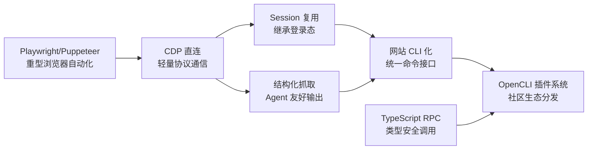

## 研究问题

**Agent 的「能力」究竟是怎样从开发工具层面被构建、封装和交付的？浏览器自动化、CLI 化、RPC 调用等不同技术路线之间存在怎样的演进逻辑和架构权衡？**

本综合分析聚焦「开发工具 × Agent 技能」交叉地带的 8 个概念，试图还原一条从底层协议到生态平台的能力获取路径。

## 综合分析

### 一、技术路线光谱：四种 Agent 能力封装范式

| **封装范式** | **代表概念** | **核心机制** | **适用场景** | **局限性** |

| --- | --- | --- | --- | --- |

| **协议直连** | CDP 直连 | 通过 Chrome DevTools Protocol 直接与浏览器会话通信 | 需要接管现有浏览器、轻量启动 | 仅限 Chromium 系；协议变更风险 |

| **守护进程 + 扩展桥接** | Daemon + Chrome Extension 架构 | 后台守护进程调度 + 浏览器扩展建立轻量桥接 | 降低安装门槛、减少运行开销 | 扩展审核与分发受平台约束 |

| **CLI 命令化** | 网站 CLI 化、Bash 浏览器自动化、OpenCLI 插件系统 | 把网页/应用封装为命令行接口，统一调用范式 | Agent 串联多平台、无 API 站点接入 | 适配器维护成本；动态页面兼容性 |

| **类型安全 RPC** | TypeScript RPC | 工具能力暴露为 TypeScript 函数调用 | 高频结构化调用、降低格式出错率 | 需要运行时支撑（如 V8 隔离沙箱） |

### 二、能力获取的分层架构

从 8 个概念的关系中可以提炼出一个三层架构：

> **🏗️** **Layer 1 — 协议与连接层**：CDP 直连、浏览器 Session 复用

  解决的是「怎么连上去」的问题。CDP 提供底层通信通道，Session 复用让 Agent 继承已有登录态，免去单独管理认证的复杂度。

> **⚙️** **Layer 2 — 封装与标准化层**：网站 CLI 化、Bash 浏览器自动化、结构化网页抓取、TypeScript RPC

  解决的是「怎么让 Agent 用得上」的问题。将原始的浏览器操作或网页数据转化为 Agent 可消费的标准化接口——CLI 命令、结构化 JSON/Markdown、类型安全的函数签名。

> **🌐** **Layer 3 — 生态与分发层**：OpenCLI 插件系统、Daemon + Chrome Extension 架构

  解决的是「怎么规模化」的问题。通过插件机制和社区共享，把单个适配器的一次性劳动转化为可分发、可组合的生态资产。

### 三、演进路径：从重型框架到轻量生态

核心趋势是 **从「为人设计的自动化」到「为 Agent 设计的能力层」**。Playwright 等工具解决的是"模拟人操作浏览器"，而 CDP 直连 → 网站 CLI 化 → OpenCLI 插件系统这条演进链，解决的是"让 Agent 以最低成本获取和调用任意网站能力"。

### 四、关键对比：两条浏览器自动化路线

| **维度** | **截图 + 视觉理解路线**（如 Computer Use） | **结构化接管路线**（CDP/CLI/RPC） |

| --- | --- | --- |

| 输入形式 | 屏幕截图 → 多模态模型理解 | 结构化数据 → 命令/函数调用 |

| Token 成本 | 高（每帧截图消耗大量 token） | 低（仅传输结构化指令和结果） |

| 准确度 | 依赖模型视觉理解能力 | 确定性操作，出错率低 |

| 适配成本 | 零适配（通用） | 需要每站点/应用写适配器 |

| 长链路可靠性 | 累积误差大 | 可靠性高，适合多步工作流 |

这两条路线并非互斥，而是互补。**结构化路线适合高频、稳定的核心工作流**（如 Tizer 的内容管线），**视觉路线适合低频、长尾的临时任务**。

## 关键发现

> **💡** **发现 1：「无 API 站点」正在被系统性地纳入 Agent 工具链。** 网站 CLI 化 + 浏览器 Session 复用的组合，意味着过去因为没有开放 API 而无法自动化的站点（尤其是中文互联网），正在被逐一攻破。这是 Agent 能力边界的一次重大扩展。

> **💡** **发现 2：「适配器即资产」的生态飞轮正在形成。** OpenCLI 的插件系统把一次性的网站适配工作转化为可分发的社区资产。当适配器覆盖度足够高时，Agent 的能力获取成本将呈指数级下降——类似 npm 之于 Node 生态的作用。

> **💡** **发现 3：能力封装层的竞争焦点不在「能做什么」，而在「Agent 用起来多简单」。** CDP 直连、TypeScript RPC、结构化网页抓取看似解决不同问题，但共同指向同一个目标——降低 Agent 消费外部能力时的认知和 token 开销。最终胜出的方案不是功能最强的，而是 Agent 调用摩擦最低的。

> **💡** **发现 4：浏览器 Session 复用暗含重大安全权衡。** 继承用户登录态虽然大幅降低了接入门槛，但同时把用户的全部权限暴露给了 Agent。这一便利性背后需要配套的权限边界和会话隔离设计，否则风险远大于收益。

## 来源列表

### 概念页面

- [Daemon + Chrome Extension 架构](concepts/Daemon + Chrome Extension 架构.md)

- [CDP 直连](concepts/CDP 直连.md)

- [Bash 浏览器自动化](concepts/Bash 浏览器自动化.md)

- [TypeScript RPC](concepts/TypeScript RPC.md)

- [浏览器 Session 复用](concepts/浏览器 Session 复用.md)

- [网站 CLI 化](concepts/网站 CLI 化.md)

- [OpenCLI 插件系统](entities/OpenCLI 插件系统.md)

- [结构化网页抓取](concepts/结构化网页抓取.md)

### 摘要页面

- [摘要：OpenCLI 1.0：告别 Playwright，国人开发的全平台浏览器自动化 CLI 正式起航](summaries/摘要：OpenCLI 1.0：告别 Playwright，国人开发的全平台浏览器自动化 CLI 正式起航.md)

- [摘要：opencli-rs：用 Rust 重写的网站抓取神器，AI Agent 时代的万能信息接口](summaries/摘要：opencli-rs：用 Rust 重写的网站抓取神器，AI Agent 时代的万能信息接口.md)

- [摘要：Browser Use × Hermes Agent：每个开源 Agent 现在都有了免费的云端浏览器](summaries/摘要：Browser Use × Hermes Agent：每个开源 Agent 现在都有了免费的云端浏览器.md)

- [摘要：Cloudflare Dynamic Workers：用 V8 隔离沙箱让 AI Agent 代码执行快 100 倍](summaries/摘要：Cloudflare Dynamic Workers：用 V8 隔离沙箱让 AI Agent 代码执行快 100 倍.md)

- [摘要：Chrome DevTools MCP：让 AI 助手直接操控你正在用的浏览器](summaries/摘要：Chrome DevTools MCP：让 AI 助手直接操控你正在用的浏览器.md)

## 行动建议

> **🎯** **建议 1：在 OpenClaw 的内容管线中优先集成结构化路线（CLI/CDP），而非视觉路线。** Tizer 的内容工作流是高频、稳定的重复链路，结构化接管在 token 成本和可靠性上都远优于截图理解。具体可以从 OpenCLI 的插件生态入手，为常用信息源（X、微信公众号等）构建专用适配器。

> **🎯** **建议 2：为浏览器 Session 复用功能设计 HITL 审核节点。** 在 Agent 继承用户登录态执行操作前，增加一层权限确认和操作预览机制，避免 Agent 在高权限上下文中执行未经授权的操作。这与 Tizer 现有的 HITL 工作流天然契合。

> **🎯** **建议 3：关注 OpenCLI 插件系统的适配器覆盖进展，评估是否值得为 Tizer 的核心信息源贡献适配器。** 如果 OpenCLI 的社区飞轮转起来，早期贡献者既能定义适配标准，也能优先获得最适合自身工作流的适配器。
