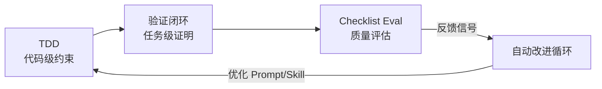

## 研究问题

**当 AI Coding Agent 接管编码执行后，开发者的工作流应如何重新设计，才能在保证质量的同时最大化 Agent 的产出效率？**

传统软件工程方法论（TDD、PRD、Code Review）在 Agent 时代并未消失，而是发生了深层变形。本综合分析从 10 个交叉于「Coding Agent × 工作流」的概念出发，梳理出一条从**输入规范化 → 执行约束 → 输出验证 → 自动迭代**的完整方法论光谱。

---

## 综合分析

### 一、方法论分层：道法术器的四层框架

道法术器框架为理解 Coding Agent 工作流提供了最高层的组织视角：

| **层次** | **关注点** | **对应概念** | **核心动作** |

| --- | --- | --- | --- |

| **道**（目标） | 问题定义与方向 | Model Sense, 模型受阻 Backlog | 判断什么该做、什么暂缓 |

| **法**（架构） | 规格与结构设计 | PRD 驱动 Vibe Coding, Idea File, 原型即规格 | 把意图转化为可执行规格 |

| **术**（技巧） | 执行约束与验证 | 测试驱动开发, 验证闭环, Checklist Eval | 确保 Agent 产出可交付 |

| **器**（工具） | 提示与自动化 | Prompt Engineering | 优化 Agent 交互界面 |

这个分层揭示了一个关键规律：**Agent 时代的工作流重心从「术」和「器」上移到了「道」和「法」——开发者的核心价值不再是怎么写代码，而是该写什么以及如何定义完成。**

### 二、输入端的三种规格范式对比

在 Agent 执行之前，「如何把需求传达给 Agent」是工作流的第一个关键分岔点：

| **规格范式** | **核心载体** | **适用场景** | **Agent 友好度** | **迭代效率** |

| --- | --- | --- | --- | --- |

| **PRD 驱动** | 结构化需求文档 | 多轮迭代、多人协作、质检链路 | ⭐⭐⭐⭐ 边界清晰 | 中等 — 文档维护成本 |

| **Idea File** | 自然语言意图描述 | 早期探索、跨环境传播 | ⭐⭐⭐ 灵活但模糊 | 高 — 轻量快速 |

| **原型即规格** | 可运行 Demo | 快速变化的产品环境 | ⭐⭐⭐⭐⭐ 零翻译损耗 | 最高 — 展示即验证 |

三者并非互斥，而是构成一个**从重到轻的规格光谱**。在实践中，它们往往组合使用：先用 Idea File 快速对齐方向，用原型验证可行性，最后用 PRD 固化为可复用流程。

### 三、执行验证的三层闭环

Agent 的执行质量保障由三个递进的验证机制组成：

1. **测试驱动开发（TDD）** — 最细粒度的约束：先写失败测试，再让 Agent 实现。在 AI 编码场景中，TDD 不仅是质量保证，更是**防止 Agent 幻觉式完成**的结构性约束。当 TDD 被写进技能框架，它从个人习惯升级为系统约束。

1. **验证闭环** — 任务级的完成证明：Agent 宣称完成前，必须通过退出码、测试、截图、监控等多层验证。这是把「会写」变成「可交付」的关键卡口。

1. **Checklist Eval** — 质量评估的标准化：用 3-6 个二元是/否问题评估 Agent 输出，避免主观打分漂移。接入 autoresearch 后，它能驱动 Agent 自动改进循环。

### 四、Model Sense 与模型受阻 Backlog：动态能力边界管理

这两个概念合在一起，构成了一个**动态的能力边界管理系统**：

- **Model Sense** 提供实时判断力 — 知道当前模型擅长什么、不擅长什么

- **模型受阻 Backlog** 提供时间维度 — 把「现在做不了」和「永远不做」区分开来

这意味着 Coding Agent 工作流不是一成不变的：**随着模型能力升级，之前被搁置的工作流模式可能被解锁。** 定期重新评估 Backlog 是一个高 ROI 的机制。

### 五、Prompt Engineering 的角色升级

Prompt Engineering 在 Coding Agent 工作流中已经从「聊天技巧」演变为**工作流设计能力**。高质量 Prompt 以模板、规范和知识库的形式被复用，本质上是在定义 Agent 的行为空间。它与 PRD 驱动方法互为补充：PRD 定义「做什么」，Prompt 定义「怎么做」。

---

## 关键发现

1. **方法论的「倒置」现象**：传统开发中，测试和验证是编码完成后的补充步骤。在 Agent 时代，验证约束必须在编码开始前就嵌入工作流——TDD 和 Checklist 不是后验手段，而是 Agent 的**执行护栏**。这是一个根本性的流程倒置。

1. **规格的三态演化**：PRD → Idea File → 原型即规格，并非简单的「从重到轻」，而是反映了信息载体从文本到代码的迁移。当 Agent 能直接消费可运行原型时，传统文档的翻译损耗被彻底消除，这暗示未来规格文档可能被「可执行规格」完全替代。

1. **自进化管线已经成型**：Checklist Eval + autoresearch 构成了一个 Agent 自动改进闭环，而验证闭环提供了安全门控。这三者组合意味着开发者可以设定评估标准后「离开」，让 Agent 自主迭代——这是 Coding Agent 工作流从辅助工具走向**自主系统**的标志。

1. **Model Sense 是被低估的元能力**：所有其他工作流方法都假设开发者知道 Agent 的能力边界。Model Sense 是这些方法能否正确选择和组合的前提条件——没有它，开发者可能在不必要的场景强推 PRD，或在需要严格验证时放松了闭环。

1. **道法术器框架暴露了当前实践的不均衡**：10 个概念中，7 个集中在「法」和「术」层，说明社区对执行层方法论已有丰富探索，但在「道」（能力判断与战略规划）和「器」（工具链自动化）层仍有大量空白。

---

## 来源列表

### 概念页面

- [道法术器框架](concepts/道法术器框架.md)

- [PRD 驱动 Vibe Coding](concepts/PRD 驱动 Vibe Coding.md)

- [Idea File](concepts/Idea File.md)

- [原型即规格](concepts/原型即规格.md)

- [测试驱动开发](concepts/测试驱动开发.md)

- [验证闭环](concepts/验证闭环.md)

- [Checklist Eval](concepts/Checklist Eval.md)

- [Model Sense](concepts/Model Sense.md)

- [模型受阻 Backlog](concepts/模型受阻 Backlog.md)

- [Prompt Engineering](concepts/Prompt Engineering.md)

### 摘要页面

- [摘要：用 Karpathy 的 autoresearch 方法，让你的 Claude Skill 自动进化](summaries/摘要：用 Karpathy 的 autoresearch 方法，让你的 Claude Skill 自动进化.md)

- [摘要：用半年 Claude Code 踩坑，我验证了 OpenAI/Cursor/Anthropic 三篇 Harness Engineering 的每一条](summaries/摘要：用半年 Claude Code 踩坑，我验证了 OpenAI-Cursor-Anthropic 三篇 Harness Engineering 的每一条.md)

- [摘要：一个人，三个月，十几个项目：idoubicc 的 Vibe Coding 实验全记录](summaries/摘要：一个人，三个月，十几个项目：idoubicc 的 Vibe Coding 实验全记录.md)

---

## 行动建议

1. **建立 Tizer 专属的 Coding Agent 工作流模板**：基于道法术器框架，为 OpenClaw 的不同任务类型（功能开发、Bug 修复、探索性原型）各设一套 PRD 模板 + Checklist Eval 标准。这能把分散的方法论概念固化为可复用的执行管线。

1. **启动「模型受阻 Backlog」实践**：在知识 Wiki 或项目管理中增设一个专门的 Backlog 视图，记录当前因模型能力限制暂缓的功能想法。每次主要模型升级后（如 Claude 新版本发布），系统性重新评估这些条目——这是一个低投入、高回报的习惯。

1. **试验 Checklist Eval + 自动改进闭环**：挑选一个 OpenClaw Skill 或 HITL 工作流节点，为其编写 3-5 条 Checklist Eval 标准，接入 autoresearch 式的自动迭代。如果效果好，可以推广到内容管线的其他环节。
