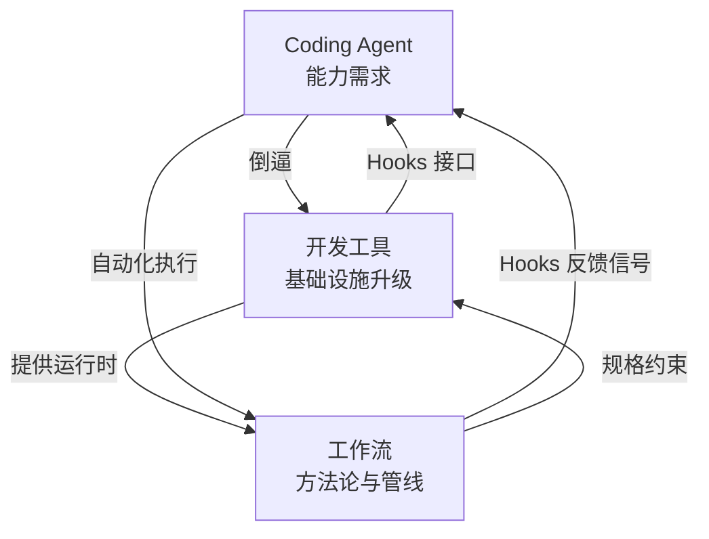

## 研究问题

Coding Agent、开发工具与工作流三个领域各自拥有丰富的双标签 synthesis（[Coding Agent 开发工具链深度融合：从终端交互到上下文治理的基础设施协同演进](syntheses/Coding Agent 开发工具链深度融合：从终端交互到上下文治理的基础设施协同演进.md)、[Coding Agent 工作流方法论光谱：从验证闭环到自进化开发管线的十种设计模式](syntheses/Coding Agent 工作流方法论光谱：从验证闭环到自进化开发管线的十种设计模式.md)、[开发工具如何重塑 Agent 时代的工作流：从部署底座到远程操控的工具化路径演进](syntheses/开发工具如何重塑 Agent 时代的工作流：从部署底座到远程操控的工具化路径演进.md)），但三者正在以何种机制**同时耦合**、形成只有同时观察三条边才能发现的涌现结构？具体而言：工具链何时不再是工作流的「外部支撑」而是直接成为工作流的运行时？工作流方法论何时反过来规定了工具的接口契约？Hooks 机制在这个三角中扮演了什么角色？

---

## 综合分析

### 一、三角共演模型：三条边如何同时耦合

三个双标签视角各自看到了一条边，但它们在实践中并非独立运作——存在一个**三角共演回路**，其核心驱动力是 Hooks 机制：

| **边** | **双标签视角** | **三角涌现视角** |

| --- | --- | --- |

| Coding Agent × 开发工具 | 工具适配 Agent 需求（终端渲染、上下文治理） | 工具不只适配 Agent——它通过 Hooks 接口**成为** Agent 的可编程执行层 |

| Coding Agent × 工作流 | 工作流围绕 Agent 重构（TDD、验证闭环、Spec 驱动） | 工作流方法论通过 Hooks 实现为**可执行代码**，工具链自动执行这些方法论 |

| 开发工具 × 工作流 | 工具成为工作流基础设施（部署、数据接入） | 工具 + 工作流的融合体被 Agent Hooks 编排为**自主运行的开发管线** |

**核心涌现洞察**：三者融合后，「开发」不再是「人用工具写代码」，而是「人设计管线规格，Agent 通过 Hooks 编排工具链自主执行工作流」。这个转变只有在三条边同时观察时才能看见。

### 二、Hooks：缝合三角的关键机制

Claude Code 的三层 Hooks 体系（[Prompt Hooks](concepts/Prompt Hooks.md)、[HTTP Hooks](concepts/HTTP Hooks.md)、[Agent Hooks](concepts/Agent Hooks.md)）不只是 Coding Agent 的功能特性——它们是三维共演的**接缝层**：

| **Hook 类型** | **工具维度** | **工作流维度** | **Agent 维度** | **三维交汇效果** |

| --- | --- | --- | --- | --- |

| Prompt Hooks | 向 Agent 注入工具配置信息 | 将工作流规范（命名约定、架构原则）编码为 prompt | Agent 获得项目感知上下文 | 工作流规范通过工具接口自动注入 Agent 行为 |

| HTTP Hooks | 连接外部开发工具（CI/CD、监控） | 实现工作流节点间的事件驱动编排 | Agent 操作触发外部系统联动 | 开发工具链成为 Agent 工作流的分布式运行时 |

| Agent Hooks | 启动子 Agent 读取代码库、检查约定 | 实现「审查 → 决策 → 执行」的多层验证闭环 | Agent 获得自我审计能力 | 工作流验证逻辑由另一个 Agent 通过工具自主完成 |

关键在于：Hooks 让工作流方法论（如「命名规范校验」「代码审查」）不再是文档或人工流程，而是**可编程、可工具化、可 Agent 执行的代码**。这创造了一个自洽闭环：

> 工作流设计者定义规格 → Hooks 将规格编码为工具接口 → Agent 通过工具链自主执行规格 → 执行结果反馈回工作流（Checklist Eval）→ 规格自动迭代

### 三、从「Spec 即文档」到「Spec 即运行时」

[Spec Kit](concepts/Spec Kit.md) 的「宪法」机制和 [OpenSpec](concepts/OpenSpec.md) 的规格驱动方法，在双标签视角下只是工作流方法论。但在三维视角下，它们揭示了一个更深的趋势：**规格文档正在从「人读」走向「机器执行」**。

| **演进阶段** | **规格载体** | **工具角色** | **Agent 行为** | **代表概念** |

| --- | --- | --- | --- | --- |

| 1.0 文档驱动 | PRD、设计文档 | 编辑器（被动展示） | Agent 解读文档后编码 | [Untitled](concepts/PRD 驱动 Vibe Coding.md) |

| 2.0 规格驱动 | 结构化 Spec + 宪法 | 门禁系统（主动校验） | Agent 在宪法约束下执行 | [Untitled](concepts/Spec Kit.md)、[Untitled](concepts/Spec-driven 开发.md) |

| 3.0 Hooks 驱动 | 可执行 Hooks + 规格代码 | 运行时引擎（自主执行） | Agent 通过 Hooks 自动遵守并验证规格 | [Untitled](concepts/Agent Hooks.md)、[Untitled](concepts/Checklist Eval.md) |

**3.0 阶段的根本不同**在于：规格、工具和 Agent 之间的边界消失了。规格就是 Hook 代码，Hook 代码就是工具的一部分，工具通过 Agent 自主运行——三者融为一体。这解释了为什么 [codex-plugin-cc](entities/codex-plugin-cc.md)（把 Codex 作为插件嵌入 Claude Code）的意义不只是「多用一个模型」，而是**把竞品工具变成自己工作流的可编排节点**——工具边界被工作流编排能力消解了。

### 四、管线自进化：三角回路的终极形态

当三维共演达到成熟状态，开发管线将具备自进化能力：

1. **Agent 执行开发任务**（Coding Agent 维度）

1. **工具链记录执行轨迹**（开发工具维度）：终端输出、Git 历史、Prompt Cache 命中率

1. **工作流方法论自动评估**（工作流维度）：[Checklist Eval](concepts/Checklist Eval.md) 自动打分

1. **评估结果驱动 Hooks 更新**（三维交汇）：调整 Prompt Hooks 注入内容、修改 Agent Hooks 审查策略

1. **更新后的管线执行下一任务**（回路闭合）

这个回路中，[Model Sense](concepts/Model Sense.md) 和 [模型受阻 Backlog](concepts/模型受阻 Backlog.md) 扮演了**回路调速器**的角色——它们决定哪些任务进入自动管线、哪些暂缓等待模型升级。而 [道法术器框架](concepts/道法术器框架.md) 则提供了分层治理视角：「道」（Model Sense 判断方向）→「法」（Spec 定义规格）→「术」（Hooks 实现验证）→「器」（工具链自动执行）。

### 五、远程运行时与管线常驻化

三维融合的物理基础是**远程运行时的成熟**。[SSH 直连工作流](concepts/SSH 直连工作流.md)和[零同步远程工作流](concepts/零同步远程工作流.md)解决了「开发环境在哪里」的问题；[Cloudflare 全家桶](concepts/Cloudflare 全家桶.md)和[Railway 一键部署](concepts/Railway 一键部署.md)解决了「管线部署在哪里」的问题。当 Agent 常驻云端、工具链在云端、工作流规格在代码库中——整个开发管线变成了一个**7×24 自主运行的系统**，人类只需要在关键节点介入审查。

[Git Worktree](concepts/Git Worktree.md) 在这个场景下的价值被放大：不只是隔离多个人类开发者的工作，而是为多个 Agent 实例提供并行执行槽位，每个槽位运行独立的 Hooks 配置和工作流规格。

---

## 关键发现

1. **Hooks 是三维共演的缝合层，不只是 Coding Agent 的功能特性**——Prompt Hooks 将工作流规范注入工具接口，HTTP Hooks 将工具链连成分布式运行时，Agent Hooks 让验证逻辑由 Agent 自主执行。三种 Hook 同时运作时，工具、工作流和 Agent 之间的边界消失，融合为统一的可编程管线。这个洞察在任何单一双标签视角中都不可见。

1. **规格演进正在经历「文档 → 宪法 → 可执行代码」三阶段跃迁**——Spec Kit 的「宪法」概念本身是革命性的，但它仍然是人类执行的文档。Hooks 驱动阶段把宪法变成了 Agent 自动遵守的代码约束，规格与运行时合一。这意味着工作流设计者的产出不再是文档，而是 Hooks 代码。

1. **codex-plugin-cc 的战略意义远超「多模型调用」**——它证明了竞争对手的工具可以被编排为自己工作流的节点。当工作流编排能力足够强时，工具的品牌边界被消解，真正的护城河从「最好的 Agent」转向「最可编排的管线」。

1. **管线自进化回路已经具备全部零件**——Checklist Eval 提供评估信号，Agent Hooks 提供自动调优能力，Model Sense 提供方向判断，Git Worktree 提供并行执行槽位。缺少的不是零件，而是把它们串联为闭环的系统集成工作。

1. **远程运行时是三维融合的物理前提**——只有当 Agent、工具链和工作流规格都在同一个远程环境中运行时，Hooks 才能实现低延迟的三方联动。这解释了为什么 SSH 直连和零同步工作流不只是效率优化，而是 Agent 原生开发管线的基础设施必要条件。

---

## 来源列表

### 已有双标签 synthesis（本文核心输入）

- [Coding Agent 开发工具链深度融合：从终端交互到上下文治理的基础设施协同演进](syntheses/Coding Agent 开发工具链深度融合：从终端交互到上下文治理的基础设施协同演进.md)

- [Coding Agent 工作流方法论光谱：从验证闭环到自进化开发管线的十种设计模式](syntheses/Coding Agent 工作流方法论光谱：从验证闭环到自进化开发管线的十种设计模式.md)

- [开发工具如何重塑 Agent 时代的工作流：从部署底座到远程操控的工具化路径演进](syntheses/开发工具如何重塑 Agent 时代的工作流：从部署底座到远程操控的工具化路径演进.md)

### 关键概念页

- [Agent Hooks](concepts/Agent Hooks.md)、[Prompt Hooks](concepts/Prompt Hooks.md)、[HTTP Hooks](concepts/HTTP Hooks.md)

- [codex-plugin-cc](entities/codex-plugin-cc.md)

- [Spec Kit](concepts/Spec Kit.md)、[OpenSpec](concepts/OpenSpec.md)、[Spec-driven 开发](concepts/Spec-driven 开发.md)

- [Checklist Eval](concepts/Checklist Eval.md)、[Model Sense](concepts/Model Sense.md)、[模型受阻 Backlog](concepts/模型受阻 Backlog.md)

- [道法术器框架](concepts/道法术器框架.md)、[PRD 驱动 Vibe Coding](concepts/PRD 驱动 Vibe Coding.md)

- [Git Worktree](concepts/Git Worktree.md)、[堆叠分支](concepts/堆叠分支.md)、[虚拟分支](concepts/虚拟分支.md)

- [SSH 直连工作流](concepts/SSH 直连工作流.md)、[零同步远程工作流](concepts/零同步远程工作流.md)

- [Cloudflare 全家桶](concepts/Cloudflare 全家桶.md)、[Railway 一键部署](concepts/Railway 一键部署.md)

- [终端输出净化](concepts/终端输出净化.md)、[Fullscreen rendering](concepts/Fullscreen rendering.md)、[transcript 模式](concepts/transcript 模式.md)

---

## 行动建议

1. **构建 OpenClaw 的 Hooks 驱动管线原型**——选择一个重复性高的开发任务（如 Skill 开发），编写完整的 Prompt Hooks（注入项目宪法）+ Agent Hooks（代码审查）+ HTTP Hooks（触发 CI/CD）组合。关键目标不是自动化单个任务，而是验证三层 Hooks 的端到端协同效果，为后续扩展到所有开发任务建立范式。

1. **将 Checklist Eval 接入 Hooks 反馈回路**——为现有的 Coding Agent 工作流编写 3-5 条 Checklist Eval 标准，并通过 Agent Hooks 在每次任务完成后自动评估。评估结果写入日志，定期分析失败模式并更新 Prompt Hooks 注入内容。这将启动管线自进化回路的最小可行版本。

1. **在远程开发环境中统一 Agent 运行时与人类操作入口**——参考 SSH 直连 + Git Worktree 模式，搭建一个远程主机同时承载 Agent 的自动化管线和 Tizer 的手动操作。为每个 Agent 实例分配独立的 Worktree，通过 tmux 会话隔离。目标是让管线具备 7×24 运行的物理条件，人类在需要时通过 SSH 介入审查。
