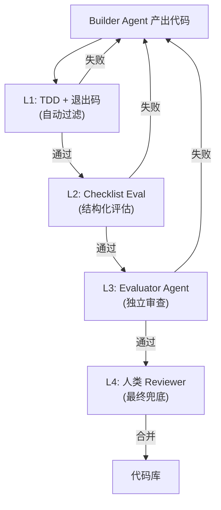

## 研究问题

当 Coding Agent 的编排模式、工作流方法论和执行控制三个维度同时作用时，会涌现出哪些单独看任意两个维度都无法捕捉的架构洞察？从多智能体协调到验证闭环再到持续运营调度，三者如何形成一个自洽的工程化开发系统？

## 综合分析

### 一、三维融合视角：为什么需要同时看三条边？

已有三篇双标签 synthesis 分别覆盖了这个三角形的三条边：

| **双标签 Synthesis** | **核心关注** | **盲区** |

| --- | --- | --- |

| [Untitled](syntheses/Coding Agent 多智能体编排：从单体循环到虚拟工程团队的协作范式与架构权衡.md) | 从单体循环到虚拟工程团队的协作范式 | 未深入探讨工作流方法论如何约束编排选型 |

| [Untitled](syntheses/Coding Agent 工作流方法论光谱：从验证闭环到自进化开发管线的十种设计模式.md) | 从验证闭环到自进化开发管线的十种设计模式 | 未讨论多 Agent 编排如何改变工作流的执行拓扑 |

| [Untitled](syntheses/多智能体工作流控制范式演进：从被动调度到自主运营的编排 × 工作流融合路径.md) | 从被动调度到自主运营的控制范式演进 | 未聚焦 Coding 场景特有的验证、上下文与工具链约束 |

**三维视角的独特价值**：只有同时看三条边，才能理解「编排拓扑如何决定验证闭环的形态」「工作流纪律如何约束多 Agent 的规模上限」以及「持续运营模式如何倒逼编排架构从任务级走向组织级」。

### 二、涌现结构一：编排拓扑 × 验证闭环的耦合矩阵

不同编排模式对验证闭环的需求截然不同。这是单看任意两条边都看不到的关键耦合：

| **编排层级** | **验证粒度** | **工作流控制点** | **Token 成本倍数** | **失败模式** |

| --- | --- | --- | --- | --- |

| L1 单体 Agent | TDD + 退出码 | Checklist Eval 自闭环 | 1× | 幻觉式完成 |

| L2 Slash 命令 | 阶段门控 | PRD 驱动 + 人工切换 | 1-1.5× | 阶段跳跃 |

| L3 Leader-Worker | 任务级 + 聚合验证 | 上下文压缩 + 结果合并 | 2-3× | 子任务冲突 |

| L4 虚拟团队 | 角色交接审计 | Handoff 文档 + Builder-Reviewer | 5-10× | 目标漂移 |

> **💡** **涌现洞察**：编排层级每上升一级，验证闭环的粒度就必须从「代码级」上移到「任务级」再到「组织级」。但当前社区实践中，大多数团队的验证工具停留在 L1-L2（TDD、Checklist），而编排野心已经到了 L3-L4。**验证能力与编排复杂度的错配**是当前 Coding Agent 实践中最被低估的系统性风险。

### 三、涌现结构二：审查瓶颈的三维解法

「编程 Agent 审查瓶颈」在 Agent编排×工作流 synthesis 中被识别为核心矛盾：Agent 产出速度远超人类审查带宽。但单看那条边，解法只能到 Builder-Reviewer 分工。

加入 Coding Agent 维度后，解法空间展开为三层：

1. **工具层（工作流）**：TDD + Checklist Eval 提供自动化预筛，把明显不合格的产出在进入人工审查前过滤掉

1. **架构层（编排）**：独立 Evaluator Agent 作为审查级联的一环，用专门的验证 Agent 审查 Builder Agent 的产出

1. **方法论层（Coding Agent）**：规范驱动开发（SDD）和原型即规格从源头减少需要审查的歧义空间

这个四层审查级联只有在三维视角下才能完整构建——工作流提供前两层自动化，编排提供第三层 Agent 审查，Coding Agent 的规范驱动方法论则从源头压缩审查负载。

### 四、涌现结构三：持续运营开发管线的控制论模型

当 Coding Agent 从「完成一个任务」走向「持续维护一个项目」，三维融合催生出一个完整的控制论开发管线：

| **控制论层** | **Coding Agent 实现** | **编排机制** | **工作流方法论** |

| --- | --- | --- | --- |

| 感知（Sensor） | Model Sense — 感知模型能力边界 | 心跳调度 — 定期唤醒检查 | 模型受阻 Backlog — 记录暂缓项 |

| 比较（Comparator） | Checklist Eval — 评估产出质量 | 目标对齐 — 检查方向偏离 | 道法术器 — 分层评估优先级 |

| 行动（Actuator） | 验证闭环 — 确保可交付 | Leader-Worker — 并行执行 | PRD / 原型即规格 — 规格驱动 |

| 反馈（Feedback） | 自进化管线 — autoresearch 闭环 | Builder-Reviewer — 级联审查 | Handoff 文档 — 跨 Session 传递 |

> **⚡** **涌现洞察**：控制论的四阶段闭环（感知-比较-行动-反馈）在三维融合下被完整实例化。单看 Coding Agent×工作流，只能看到「行动-反馈」循环；单看 Agent编排×工作流，只能看到「感知-比较」的调度层；三维视角将它们连接为一个**完整的自主开发控制系统**。

### 五、「复杂度需要被赚到」的三维验证

来自 Coding Agent×编排 synthesis 的核心原则——「复杂度需要被赚到」——在三维视角下获得了更精确的操作化定义：

**升级到更高编排层级的前提条件**：

1. **工作流纪律已就位**：在当前层级的验证闭环已稳定运行，而非「还在调试 TDD」就急于引入 Subagents

1. **上下文压缩可控**：当前层级的 Token 成本在预算内，且上下文压缩不会导致关键信息丢失

1. **审查带宽匹配产出速度**：人类审查或 Agent 级联审查能消化当前层级的产出量

不满足这三个前提就升级编排层级，等于在地基不稳时加盖楼层。

## 关键发现

1. **验证能力与编排复杂度的错配是当前最大系统性风险**：社区对 L3-L4 编排的热情远超对匹配验证基础设施的投入。大多数失败的多 Agent 编程项目不是因为编排设计有问题，而是因为验证闭环停留在 L1 水平。

1. **审查瓶颈的完整解法是三层级联，而非单一机制**：工作流自动化（TDD+Checklist）→ Agent 级联审查（独立 Evaluator）→ 人类兜底审查，三层缺一不可。只有这个完整级联才能让 Agent 产出速度与审查带宽解耦。

1. **上下文压缩是三维融合的隐形瓶颈**：编排层级越高，跨 Agent 的上下文传递越频繁；工作流越复杂，跨 Session 的状态保持越关键。上下文压缩不只是成本优化工具，而是决定编排上限的基础设施——没有高质量的上下文压缩，L3 以上的编排在长任务中必然退化。

1. **持续运营开发管线需要控制论的完整四阶段闭环**：当前实践集中在「行动」和「反馈」两个阶段，缺少系统性的「感知」（Model Sense + 心跳调度）和「比较」（目标对齐 + 分层评估）。补全这两个阶段是从「辅助工具」进化为「自主开发系统」的关键。

1. **「复杂度需要被赚到」可操作化为三个前置检查**：工作流纪律、上下文成本、审查带宽——这三个维度的健康度决定了是否应该升级到更高的编排层级。这比抽象的「按需复杂化」提供了更具体的决策框架。

## 来源列表

### 双标签 Synthesis（三条边）

- [Coding Agent 多智能体编排：从单体循环到虚拟工程团队的协作范式与架构权衡](syntheses/Coding Agent 多智能体编排：从单体循环到虚拟工程团队的协作范式与架构权衡.md)

- [Coding Agent 工作流方法论光谱：从验证闭环到自进化开发管线的十种设计模式](syntheses/Coding Agent 工作流方法论光谱：从验证闭环到自进化开发管线的十种设计模式.md)

- [多智能体工作流控制范式演进：从被动调度到自主运营的编排 × 工作流融合路径](syntheses/多智能体工作流控制范式演进：从被动调度到自主运营的编排 × 工作流融合路径.md)

### 核心概念页面

- [Claude Code 多 Agent 协调](concepts/Claude Code 多 Agent 协调.md)

- [编排式上下文](concepts/编排式上下文.md)

- [上下文压缩](concepts/上下文压缩.md)

- [编程 Agent 审查瓶颈](concepts/编程 Agent 审查瓶颈.md)

- [Builder-Reviewer 模式](concepts/Builder-Reviewer 模式.md)

- [控制论](concepts/控制论.md)

- [心跳调度](concepts/心跳调度.md)

- [多 Agent 公司运营](concepts/多 Agent 公司运营.md)

- [目标对齐](concepts/目标对齐.md)

- [道法术器框架](concepts/道法术器框架.md)

- [Model Sense](concepts/Model Sense.md)

- [模型受阻 Backlog](concepts/模型受阻 Backlog.md)

- [Checklist Eval](concepts/Checklist Eval.md)

- [原型即规格](concepts/原型即规格.md)

- [Hermes Agent Self-Evolution](entities/Hermes Agent Self-Evolution.md)

## 行动建议

1. **建立「编排层级-验证就绪度」评估清单**：在 OpenClaw 或内容管线中引入新的多 Agent 编排前，先用三个前置检查（工作流纪律、上下文成本、审查带宽）评估当前层级是否已稳定。防止在 L1 验证都没跑通的情况下就跳到 L3 编排。

1. **实验四层审查级联原型**：选择一个 OpenClaw 的 Coding 工作流，依次搭建 TDD 自动过滤 → Checklist Eval 结构化评估 → Evaluator Agent 独立审查 → 人类最终兜底的完整级联。测量每层的过滤率和误判率，找到最优的级联配置。

1. **将控制论四阶段模型应用到内容管线的持续运营**：知识 Wiki 的 Compiler Agent 和 Synthesizer Agent 已经具备「行动-反馈」闭环，下一步是补全「感知」（定期检查源文章更新、模型能力变化）和「比较」（对齐生成质量与 Wiki 整体标准），使内容管线从被动触发走向自主运营。
