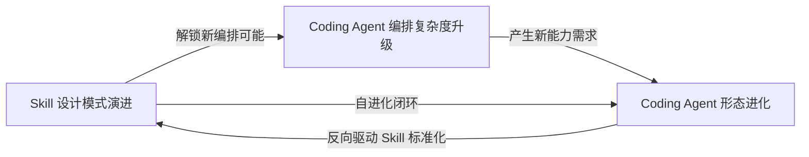

## 研究问题

在 Coding Agent 生态中，技能封装（Agent 技能）、多智能体编排（Agent 编排）和代码智能体本身（Coding Agent）三者之间存在怎样的结构性张力与协同演化关系？当技能从静态工具列表演进为可进化的能力单元，编排从单体循环演进为虚拟工程团队，代码智能体从代码生成器演进为自主研究者时，三条边如何相互塑造？

本文以三篇已有双标签 synthesis 为输入键，综合 20+ 个横跨三条边的 concept/entity 条目，试图回答：**只有同时看技能、编排和 Coding Agent 三条边才能浮现的涌现架构是什么。**

## 输入键：三篇双标签 synthesis 的核心发现

| **双标签边** | **synthesis 页面** | **核心发现** |

| --- | --- | --- |

| Agent 技能 × Agent 编排 | [Untitled](syntheses/Agent 技能与编排的耦合设计：从静态工具列表到运行时能力自组织的架构演进.md) | 编排正在被技能「吞噬」；Coordinator 技能让编排逻辑变成可插拔能力；Tool Registry 是解耦关键 |

| Agent 技能 × Coding Agent | [Untitled](syntheses/Coding Agent 技能设计模式：从文件协议到结构化能力封装的五种 Skill 架构范式.md) | 五种 Skill 设计模式→完整工程纪律链；[SKILL.md](http://skill.md/) 成为能力发现的元协议；Agent-native 工具设计是独立领域 |

| Coding Agent × Agent 编排 | [Untitled](syntheses/Coding Agent 多智能体编排：从单体循环到虚拟工程团队的协作范式与架构权衡.md) | 四阶段演化光谱（L1-L4）；Handoff 机制是多 Session 编排的隐形基础设施；复杂度需要被「挣得」 |

## 综合分析

### 一、三角涌现：「技能即编排」在 Coding Agent 场景的实体化

双标签 synthesis 分别发现了：

- 技能×编排边：「编排正在被技能吞噬」——Coordinator 技能让编排逻辑变成可插拔技能

- 技能×Coding Agent 边：「Pipeline 模式」本质是用技能文件定义流程编排

- Coding Agent×编排边：Slash 命令工作流用类似技能的方式封装阶段切换

当三条边同时看时，涌现了一个任何单边都无法发现的模式：

> **🔻** **三角涌现模式：Coding Agent 场景正在实现「技能-编排-智能体」的三位一体融合。** Skill 文件同时定义能力边界（技能）、执行流程（编排）和行为约束（Coding Agent 治理）。这种融合在非编码场景中尚未出现，因为编码场景拥有独特的「代码即反馈」闭环。

### 二、技能进化如何重塑编排范式的选择空间

从三角视角看，技能的演化正在重新定义 Coding Agent 的编排阶梯：

| **技能演化阶段** | **对应的编排模式** | **Coding Agent 形态** | **代表概念** |

| --- | --- | --- | --- |

| 静态工具列表 | L1 单体循环 | 代码生成器 | Claude Code 基础模式 |

| [SKILL.md](http://skill.md/) 路由发现 | L2 Slash 命令工作流 | 纪律化编程助手 | gstack、Generator/Reviewer 模式 |

| Coordinator 技能 + Tool Registry | L3 Leader-Worker 并行 | 任务分解器 | Claude Code Subagents + 动态工具发现 |

| 自进化技能系统 | L4 虚拟工程团队 | 自主研究者 | Hermes Self-Evolution + autoresearch + agency-agents |

关键洞察：每次技能层的质变，都同时解锁了新的编排可能性和新的 Coding Agent 能力。三者不是独立演进的，而是“共演”的——**技能升级驱动编排升级，编排升级解锁 Coding Agent 新形态，新形态反过来产生新的技能需求。**

### 三、三角张力的核心矛盾：治理开销 vs 能力天花板

三边各自发现的矛盾，在三角视角下发生了碰撞：

| **矛盾维度** | **技能边视角** | **编排边视角** | **Coding Agent 视角** | **三角解法** |

| --- | --- | --- | --- | --- |

| 复杂度管控 | 5 种 Skill 模式组合增加认知负担 | 多 Agent 协调税开销巨大 | Agent 上下文窗口有限 | **技能分层加载**：按任务复杂度动态选择技能层级，避免一次性加载全部 |

| Token 经济性 | Tool Wrapper 按需加载节省上下文 | 多 Agent 并行耗开销 5-10× | Prompt Caching 决定经济可行性 | **Skill 级缓存策略**：技能描述作为可缓存前缀，工具知识按需加载 |

| 质量保障 | Reviewer 模式提供检查清单 | 验证闭环确保交付质量 | Coding Agent 需要「代码即反馈」 | **三层质量门**：Skill Reviewer（技能层）→ Handoff 验证（编排层）→ 测试执行（Agent 层） |

| 技能信任 | 群体技能共享需信任评估 | 编排器需评估外部技能可靠性 | Coding Agent 依赖第三方工具 | **沙箱化技能测试**：在隔离环境中运行新技能，通过后再纳入编排图 |

### 四、自进化闭环：只在三角中存在的架构模式

**Hermes Agent Self-Evolution** 和 **autoresearch** 揭示了一种只有在三角视角下才能理解的架构模式——**技能自进化闭环**：

1. **Coding Agent** 执行任务，产生绩效数据

1. **编排层**通过 autoresearch 循环编排多次实验迭代

1. **技能层**使用 DSPy + GEPA 对 Skill 文件进行演化式优化

1. 优化后的技能反馈回 Coding Agent，形成新一轮循环

这个闭环为什么只能在三角中存在？

- 只看技能×编排：看不到「代码即反馈」的自动评估能力（这是 Coding Agent 特有的）

- 只看技能×Coding Agent：看不到多次实验的编排机制（autoresearch 的「每小时 12 次实验」）

- 只看 Coding Agent×编排：看不到技能文件本身被演化优化的机制

autoresearch 的数据证明了这个闭环的威力：Skill 成功率从 56% 提升至 92%，页面加载时间从 1100ms 降至 67ms。这种增益只有在三者协同工作时才能实现。

### 五、从「技能市场」到「编排市场」：生态演进的三角视角

当前 Coding Agent 生态的发展路径可以从三角视角重新理解：

| **生态阶段** | **技能层状态** | **编排层状态** | **Coding Agent 状态** | **当前代表** |

| --- | --- | --- | --- | --- |

| 工具封装期 | 单点 Skill 手工编写 | 无编排/单体 | Claude Code 基础模式 | Google 5 种 Skill 模式 |

| 技能市场期 | Skill 商店 + 版本管理 | Skill 驱动的动态编排 | 多技能协调体 | Claude Skills 11万 Star 仓库、awesome-niuma-skills |

| 自进化期 | Skill 自动演化优化 | 自主实验编排闭环 | 自主研究者 | Hermes Self-Evolution + autoresearch |

| 编排市场期（未来） | 技能 + 编排策略捆绑分发 | 编排模板作为可交易单元 | 可配置的工程团队 | agency-agents 147 角色 = 编排模板市场的雏形 |

agency-agents 的 147 个 Markdown 角色文件本质上是「编排模板 + 技能配置」的捆绑包，它预示了下一个生态阶段：不仅交易单个技能，而是交易「技能 + 编排策略」的完整工作流模板。

### 六、三角中的共演回路

三篇双标签 synthesis 分别描述了线性进化，但三角视角揭示了一个**循环强化的共演回路**：

具体例证：

- [SKILL.md](http://skill.md/) 标准化（技能层质变）→ 解锁了动态工具发现（编排层质变）→ 使 Coding Agent 可以在运行时自主发现并加载新技能

- Claude Code Subagents（编排层质变）→ 需要结构化 Handoff 文档（反向驱动技能层的 Handoff-as-Skill）→ 产生了 Coding Agent 的多 Session 协作形态

- autoresearch 的自主实验循环（Coding Agent 形态进化）→ 产生了对 Skill 文件自动优化的需求（反向驱动技能层的 Self-Evolution）

## 关键发现

> **💡** **发现 1：Coding Agent 场景正在实现「技能-编排-智能体」的三位一体融合，这在非编码场景中尚未发生。** 一个 [SKILL.md](http://skill.md/) 文件同时定义能力范围、执行流程和行为约束——技能、编排、治理三合一。这种融合之所以先在编码场景出现，是因为代码执行提供了自然的自动化反馈闭环（测试通过/失败），而其他领域缺乏这种天然的二元评估信号。

> **💡** **发现 2：三角共演回路是 Coding Agent 生态快速演进的核心动力。** 技能演化解锁编排可能，编排升级解锁 Agent 新形态，新形态反向驱动技能标准化。这个自强化循环解释了为什么 Coding Agent 领域的创新速度远超其他 Agent 场景——代码执行提供的即时反馈闭环让每一步进化都能被快速验证。

> **💡** **发现 3：「编排市场」是技能市场的必然演化方向。** agency-agents 的 147 个 Markdown 角色文件已经是「编排模板市场」的雏形。当单个 Skill 的价值被充分挖掘后，下一个价值捕获层是「技能 + 编排策略」的捆绑分发——不是卖单个工具，而是卖完整的工作方式。

> **💡** **发现 4：自进化闭环是三角独有的架构模式，且只在 Coding Agent 场景中成立。** Hermes Self-Evolution + autoresearch 实现了「执行→评估→技能优化→重新执行」的自动化闭环。这个闭环同时依赖三个边的能力：技能的可编辑性（技能边）、多次实验的编排（编排边）、代码执行的自动评估（Coding Agent 边）。在非编码场景中，评估环节缺乏自动化的二元信号，因此闭环难以成立。

> **💡** **发现 5：Handoff 机制是三角的隐藏基础设施，其质量决定了整个三角的上限。** Handoff 同时在三条边上发挥作用：作为技能间的接口协议（技能边）、作为多 Agent 状态传递机制（编排边）、作为跨 Session 上下文保持方案（Coding Agent 边）。结构化 Handoff 文档的设计质量，是衡量一个 Coding Agent 系统成熟度的最佳单一指标。

## 来源列表

### 输入 synthesis 页面（三条双标签边）

- [Agent 技能与编排的耦合设计：从静态工具列表到运行时能力自组织的架构演进](syntheses/Agent 技能与编排的耦合设计：从静态工具列表到运行时能力自组织的架构演进.md)

- [Coding Agent 技能设计模式：从文件协议到结构化能力封装的五种 Skill 架构范式](syntheses/Coding Agent 技能设计模式：从文件协议到结构化能力封装的五种 Skill 架构范式.md)

- [Coding Agent 多智能体编排：从单体循环到虚拟工程团队的协作范式与架构权衡](syntheses/Coding Agent 多智能体编排：从单体循环到虚拟工程团队的协作范式与架构权衡.md)

### 概念/实体页面

- [autoresearch](entities/autoresearch.md)

- [Hermes Agent Self-Evolution](entities/Hermes Agent Self-Evolution.md)

- [SKILL.md](concepts/SKILL.md.md)

- [Coordinator 技能](concepts/Coordinator 技能.md)

- [Claude Code 多 Agent 协调](concepts/Claude Code 多 Agent 协调.md)

- [agency-agents](entities/agency-agents.md)

- [Agentic 浏览器](concepts/Agentic 浏览器.md)

- [动态工具发现](concepts/动态工具发现.md)

- [编排式上下文](concepts/编排式上下文.md)

- [chrome-cdp-skill](entities/chrome-cdp-skill.md)

- [Claude Skills](entities/Claude Skills.md)

- [MMX-CLI](entities/MMX-CLI.md)

- [CodePilot](entities/CodePilot.md)

- [Codex](entities/Codex.md)

- [gstack](entities/gstack.md)

- [Webhook 幂等性](concepts/Webhook 幂等性.md)

- [插件化架构](concepts/插件化架构.md)

- [多步骤研究规划](concepts/多步骤研究规划.md)

- [X导师.skill](entities/X导师.skill.md)

- [AI 自修改代码](concepts/AI 自修改代码.md)

## 行动建议

1. **为知识 Wiki 内容管线构建「伪代码反馈闭环」以复制三角共演效应**：Coding Agent 场景的核心优势是「代码即反馈」。在内容场景中，可以通过设计结构化评估指标（如「每个 synthesis 必须包含≥ 3 个跨源发现」）来模拟二元反馈信号，从而在内容领域解锁 autoresearch 式的自进化闭环。

1. **将 agency-agents 的 147 角色模式迁移到 OpenClaw 的 Skill 分发体系中**：把「技能 + 编排策略」的捆绑分发作为 OpenClaw 技能市场的新品类。不仅发布单个 Skill 文件，而是发布「工作流包」（如「全栈开发团队包」= PM Agent + 架构师 Agent + 开发者 Agent + QA Agent 的角色定义 + 编排策略）。

1. **优先在 OpenClaw 中实现 Skill 自进化闭环的最小可行版本**：参考 Hermes Self-Evolution 的 DSPy + GEPA 架构，为 OpenClaw 的核心 Skill（如内容编译、知识检索）建立自动化演化优化管线。单次优化成本约 2-10 美元，但效果累计（成功率提升 36 个百分点）——这是当前 ROI 最高的技术投资之一。
