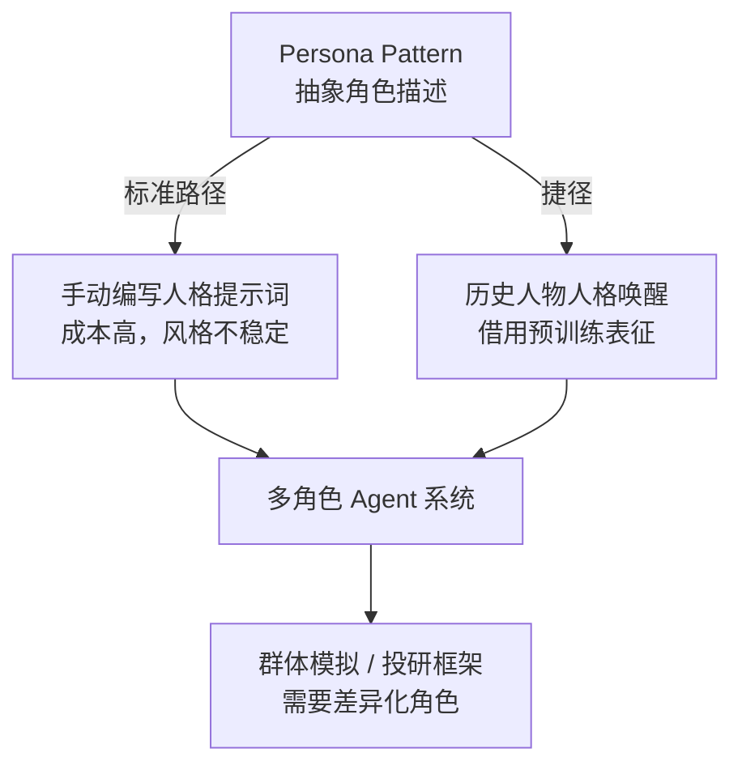

## 研究问题

**当编排系统不再只是调度工具，而开始深度利用 LLM 的能力特性时，会涌现出哪些新的协作范式？这些范式之间存在怎样的演进关系和设计权衡？**

本综合分析基于知识 Wiki 中 11 个同时标记「Agent 编排」与「LLM」的概念词条（含去重后 10 个独立概念），揭示 LLM 能力如何重塑 Agent 编排的设计空间，以及从中涌现的关键模式与反模式。

## 综合分析

### 一、三条演进主线

从 10 个概念中可以提炼出三条清晰的技术演进轴：

| **演进主线** | **核心问题** | **包含概念** | **趋势方向** |

| --- | --- | --- | --- |

| **A. 模型调度优化** | 如何用对的模型做对的事？ | [Untitled](concepts/模型路由.md)、[Untitled](concepts/LLM 叠 LLM 反模式.md) | 从粗放调用 → 精细分工 → 避免过度分工 |

| **B. 角色与人格工程** | 如何让多 Agent 形成差异化视角？ | [Untitled](concepts/Persona Pattern.md)、[Untitled](concepts/历史人物人格唤醒.md) | 从抽象角色描述 → 利用预训练人物表征 |

| **C. 多 Agent 涌现智能** | 如何从群体行为中获取单体不具备的信号？ | [Untitled](concepts/群体智能预测.md)、[Untitled](concepts/群体模拟.md)、[Untitled](concepts/多 Agent 投研框架.md)、[Untitled](concepts/Recursive Language Model.md) | 从单体推理 → 群体涌现 → 分层递归推理 |

此外，[Agentic Learning Flywheel](concepts/Agentic Learning Flywheel.md) 和 [上下文焦虑](concepts/上下文焦虑.md) 分别代表了编排系统的**自我进化机制**和**核心瓶颈**。

### 二、模型调度的正反模式对照

[模型路由](concepts/模型路由.md)和[LLM 叠 LLM 反模式](concepts/LLM 叠 LLM 反模式.md)形成了一组精确的正反对照：

| **维度** | ✅ **模型路由（正模式）** | ❌ **LLM 叠 LLM（反模式）** |

| --- | --- | --- |

| **分工逻辑** | 按任务复杂度分配不同模型 | 让小模型预处理主模型本可完成的任务 |

| **信息流** | 原始数据直达目标模型 | 中间模型压缩导致细节丢失 |

| **成本效果** | 降本增效 | 增加成本和复杂度，效果反降 |

| **判断标准** | 主模型能力不足时才分流 | 主模型已有能力时仍加预处理 |

**关键洞察**：两者的分界线不在「用了几个模型」，而在「中间模型是否在做主模型本来就能做的事」。

### 三、从角色设定到人格工程的跃迁

[Persona Pattern](concepts/Persona Pattern.md) 是基础范式，[历史人物人格唤醒](concepts/历史人物人格唤醒.md) 是一种巧妙的实现捷径：

历史人物人格唤醒的精妙之处在于：**它把 Prompt 工程问题转化为了信息检索问题**——不是「如何描述一个好的分析师人格」，而是「模型训练数据里已经有谁是好的分析师」。

### 四、群体智能的三种实现范式

| **范式** | **核心机制** | **信号提取方式** | **适用场景** |

| --- | --- | --- | --- |

| **群体模拟** | 多角色 Agent 模拟群体反应 | 观察涌现行为分布 | 舆情推演、市场情绪 |

| **群体智能预测** | 群体模拟 + 知识图谱 + 预测聚合 | 从涌现行为中提取预测信号 | Polymarket 类预测市场 |

| **多 Agent 投研框架** | 专业角色分工 + 多视角讨论 | 投委会式审议与交叉验证 | 金融分析与投资决策 |

三者的共同内核是**用角色差异化产生观点多样性，再从多样性中提取比单模型更稳健的信号**。

### 五、瓶颈与自进化：上下文焦虑与学习飞轮

[上下文焦虑](concepts/上下文焦虑.md)揭示了多 Agent 系统的核心瓶颈：当编排链路变长，模型在接近上下文上限时会草率收尾。[Recursive Language Model](concepts/Recursive Language Model.md) 的 Latent Briefing 方案正是对此的回应——通过 KV Cache 压缩在 agent 间传递记忆，而非堆叠完整文本。

[Agentic Learning Flywheel](concepts/Agentic Learning Flywheel.md) 则指向更远的方向：不是在推理时修补上下文问题，而是在训练时就把 Agent 场景的挑战编织进模型能力中。

## 关键发现

1. **「编排 × LLM」交叉带的核心张力是「分工粒度」**：模型路由鼓励精细分工，LLM 叠 LLM 反模式警告过度分工——正确的分工粒度取决于「中间模型是否在做主模型力所不及的事」。这条判断标准在任何单独的概念页中都不够清晰。

1. **人格工程正在从「创造」转向「检索」**：历史人物人格唤醒表明，与其费力构造角色描述，不如利用模型已有的人物知识。这意味着多角色 Agent 系统的设计瓶颈不再是 Prompt 技巧，而是**对模型知识分布的理解**。

1. **群体智能三范式共享同一基座，但信号提取方式截然不同**：群体模拟看行为分布，群体智能预测做信号聚合，投研框架做审议交叉——这暗示选择哪种范式不取决于 Agent 数量，而取决于**你要什么类型的输出**。

1. **上下文焦虑是多 Agent 编排的隐性天花板**：当前大量多 Agent 方案假设每个 agent 能稳定完成长任务，但上下文焦虑表明这一假设在长链路下会系统性失效。Recursive Language Model + Latent Briefing 的方向——让 agent 间传递压缩记忆而非完整文本——可能是突破口。

1. **训练时优化（Flywheel）与推理时编排正在融合**：Agentic Learning Flywheel 将「Agent 该怎么协作」从推理时设计推向训练时内化，这预示着未来的编排系统可能不再需要复杂的运行时调度——因为模型本身就「知道」该怎么协作。

## 来源列表

### 概念页

[LLM 叠 LLM 反模式](concepts/LLM 叠 LLM 反模式.md) · [模型路由](concepts/模型路由.md) · [历史人物人格唤醒](concepts/历史人物人格唤醒.md) · [Persona Pattern](concepts/Persona Pattern.md) · [群体智能预测](concepts/群体智能预测.md) · [群体模拟](concepts/群体模拟.md) · [多 Agent 投研框架](concepts/多 Agent 投研框架.md) · [Agentic Learning Flywheel](concepts/Agentic Learning Flywheel.md) · [Recursive Language Model](concepts/Recursive Language Model.md) · [上下文焦虑](concepts/上下文焦虑.md)

### 相关摘要页

[摘要：用历史人物「唤醒」AI Agent 人格：一个比写 Prompt 更香的野路子](summaries/摘要：用历史人物「唤醒」AI Agent 人格：一个比写 Prompt 更香的野路子.md) · [摘要：The Agency：给你的 AI 编程工具配齐 144 个专属打工人](summaries/摘要：The Agency：给你的 AI 编程工具配齐 144 个专属打工人.md) · [摘要：万字干货：理解 Harness Engineering，看这一篇就够了](summaries/摘要：万字干货：理解 Harness Engineering，看这一篇就够了.md) · [摘要：sim-predict：用多Agent社会模拟预测FDA事件如何在金融市场「扩散」](summaries/摘要：sim-predict：用多Agent社会模拟预测FDA事件如何在金融市场「扩散」.md) · [摘要：LangChain CEO：编程 Agent 正在重塑工程、产品与设计团队的协作方式](summaries/摘要：LangChain CEO：编程 Agent 正在重塑工程、产品与设计团队的协作方式.md)

## 行动建议

1. **在 OpenClaw 的多 Agent 链路中引入模型路由策略**：当前 OpenClaw 各 agent 默认使用同一模型，但实际上搜索摘要、代码生成、内容润色的复杂度差异很大。参考模型路由的思路，为不同环节配置不同模型（如搜索摘要用轻量模型，深度分析用旗舰模型），可以在不降低质量的前提下显著降低 token 开销。

1. **在内容管线的多角色审核环节试用「历史人物人格唤醒」**：当前 HITL 工作流中的 AI 审核角色使用通用提示词。尝试用具体人物（如「以 Paul Graham 的视角审核这篇技术文章」）替代抽象角色描述，可能在低成本下获得更稳定的审核风格和更有辨识度的反馈。

1. **为长链路 Agent 任务实现主动会话截断机制**：上下文焦虑表明，等到上下文溢出再处理已经太晚。建议在 OpenClaw 的编排层增加「上下文水位监控」——当 token 使用超过阈值时主动触发状态外置和会话重启，而不是让模型在焦虑状态下草率收尾。
