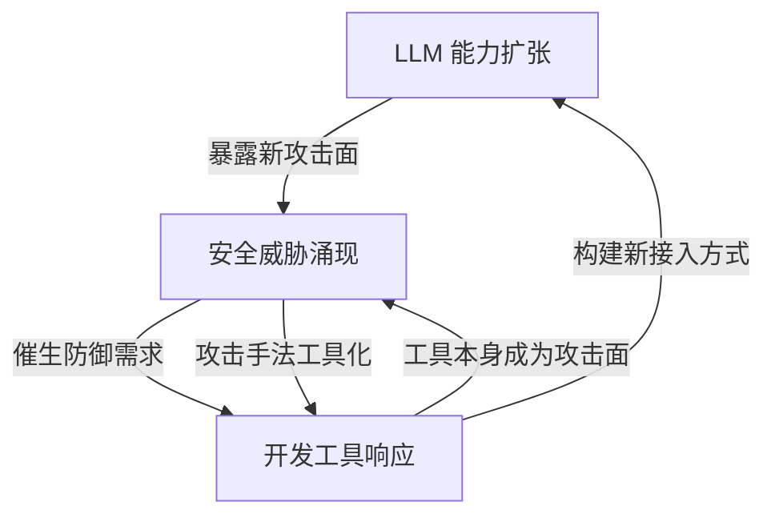
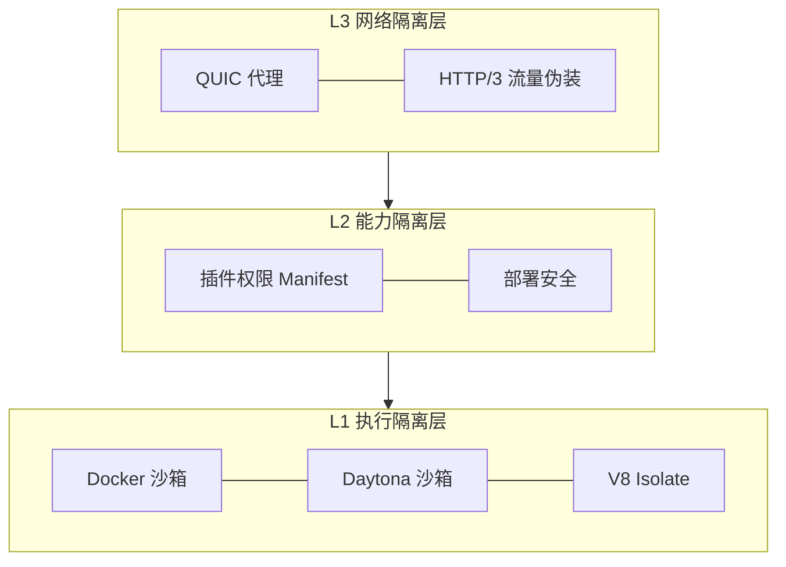

## 研究问题

**LLM 的安全威胁如何驱动开发工具链的结构性变化？为 LLM 构建的开发工具是否反过来引入了新的攻击面？三者之间存在怎样的共演反馈回路？**

本综合分析横跨 LLM、安全/隐私、开发工具三个标签的交叉地带，综合 18 个概念与 3 篇已有双标签 synthesis 的洞察，提炼出一个**三边共演模型**——这是任何双标签视角都无法完整呈现的动力学结构。

## 综合分析

### 一、三边共演模型：攻击 → 工具化 → 新攻击面

三个标签之间不是静态的分类关系，而是形成了一个自我强化的反馈回路：

三篇已有 synthesis 各自捕捉了一条边的逻辑：

| 已有 Synthesis | 覆盖的边 | 未覆盖的维度 |

| --- | --- | --- |

| [Untitled](syntheses/LLM 安全威胁图谱：从提示注入到账号风控的攻击面分析与多层防御策略.md) | LLM → 安全/隐私 | 威胁如何驱动工具演化 |

| [Untitled](syntheses/AI Agent 安全基础设施分层图谱：从沙箱隔离到网络身份伪装的开发工具链演进.md) | 安全/隐私 → 开发工具 | 工具如何反向制造新攻击面 |

| [Untitled](syntheses/大语言模型重塑开发工具链：从本地推理到数据编译的技术栈分层与工程化演进.md) | LLM → 开发工具 | 工具接入层的安全代价 |

**本 synthesis 的独特价值**：将三条边连成闭环，揭示共演动力学。

### 二、攻击面扩张如何驱动工具化防御

从 LLM 安全威胁到开发工具响应，存在清晰的因果链：

| LLM 攻击向量 | 威胁本质 | 催生的工具化防御 | 工具层级 |

| --- | --- | --- | --- |

| [Untitled](concepts/提示注入.md) | 通过输入诱导模型偏离指令 | [Untitled](concepts/Docker 沙箱执行.md) · [Untitled](concepts/V8 Isolate.md) | 执行隔离层 |

| [Untitled](concepts/间接提示注入.md) | 恶意指令埋入外部内容，Agent 被动摄入 | [Untitled](concepts/插件权限 Manifest.md) · [Untitled](concepts/Daytona 沙箱.md) | 能力边界层 |

| [Untitled](concepts/System Prompt 泄露.md) | 提取并公开隐藏的系统配置 | [Untitled](concepts/HTTP-3 流量伪装.md) · [Untitled](concepts/QUIC 代理.md) | 通信隐匿层 |

| [Untitled](concepts/账号风控.md) | 平台通过环境信号识别并封禁异常账户 | [Untitled](concepts/Cloudflare Email Routing.md) · 浏览器指纹模拟 | 身份伪装层 |

**关键洞察**：每种 LLM 攻击向量都催生了一个对应的工具化防御层级。防御不再是一次性的安全策略，而是**被编码为可复用的开发工具基础设施**。

### 三、开发工具的「安全二象性」——赋能与暴露并存

这是三标签交叉才能看到的核心矛盾：**为 LLM 构建的开发工具在解决一个安全问题的同时，往往制造新的攻击面。**

| 开发工具 | 赋能价值 | 引入的新攻击面 | 安全代价 |

| --- | --- | --- | --- |

| [Untitled](concepts/Web Session 转 API.md) | 让无 API 的 LLM 服务可编程接入 | 登录态凭证暴露、会话劫持风险 | 风控触发率高，凭证失效频繁 |

| [Untitled](concepts/Token 污染.md) | 多环境并行部署提高效率 | 旧凭证残留导致请求接管混乱 | 排障成本飙升，安全审计失真 |

| [Untitled](concepts/Cloudflare Email Routing.md) | 自有域名邮箱统一收件入口 | 成为批量注册的「账号工厂」基础设施 | 平台对域名邮箱的风控升级 |

| [Untitled](concepts/Docker 沙箱执行.md) | Agent 代码安全隔离执行 | 沙箱逃逸、资源耗尽攻击 | 冷启动开销 vs 安全性权衡 |

> 这种「二象性」揭示了一个深层模式：**LLM 生态中不存在纯防御性工具**。每个工具既是盾牌也是攻击面。安全不是一个状态，而是一个持续的攻防博弈过程。

### 四、模型层安全工程的工具化趋势

安全实践本身也在被「开发工具化」——从手动审计变成可自动化运行的工程流水线：

| 安全实践 | 传统方式 | 工具化演进 | 工具化程度 |

| --- | --- | --- | --- |

| [Untitled](concepts/红队演练.md) | 人工对抗性测试 | 自动化越狱测试框架 + Agent Harness | ⭐⭐⭐ 半自动 |

| [Untitled](concepts/Expert-Granular Abliteration.md) | 整模型统一去对齐 | 按 Expert 切片精准编辑拒绝方向 | ⭐⭐⭐⭐ 可编程 |

| [Untitled](concepts/部署安全.md) | 手动审批 + 文档审计 | 权限分级 + 接入条件自动验证 | ⭐⭐ 制度化中 |

| [Untitled](concepts/联邦学习.md) | 数据集中到单一信任方 | [FLock.io](http://flock.io/) 等链上验证 + 分布式训练 | ⭐⭐⭐ 协议化 |

**演进方向**：安全正在从「合规检查清单」变成「可编程的基础设施层」。Expert-Granular Abliteration 尤其有代表性——它把去对齐从粗暴的全局删除变成了按 MoE Expert 粒度的精准手术，这本质上是把安全工程「IDE 化」了。

### 五、三层隔离的收敛——从碎片到栈

综合三个标签的隔离相关概念，可以看到一个正在形成的三层隔离栈：

- **L1 执行隔离**：Agent 代码运行在哪里？从 Docker（重量级）到 V8 Isolate（轻量级）的光谱

- **L2 能力隔离**：Agent 能做什么？声明式权限 Manifest + 部署安全的分级约束

- **L3 网络隔离**：Agent 的流量是否可见？QUIC + HTTP/3 伪装构建的通信隐匿层

**三层叠加后的效果**：Agent 在隔离环境中运行（L1），只能调用声明过的能力（L2），通信流量不可被特征识别（L3）。这是一个**纵深防御架构**，而非单点防护。

## 关键发现

> **💡** 

  1. **三边共演回路是 LLM 安全的核心动力学**：LLM 能力扩张 → 新攻击面涌现 → 新工具响应 → 工具本身成为攻击面 → 更多安全威胁。这个闭环意味着安全不会收敛到一个稳态，而是持续加速螺旋升级。任何只看双边关系的分析都会遗漏这一动力学。

  1. **开发工具的「安全二象性」是不可消除的结构性特征**：Web Session 转 API 既赋能了 LLM 编程接入，又暴露了凭证风险；Cloudflare Email Routing 既是收件基础设施，又是账号工厂入口。这不是设计缺陷，而是工具在开放生态中的必然属性。

  1. **安全工程正在从「合规动作」变成「可编程基础设施」**：Expert-Granular Abliteration 把去对齐变成可编程的精准手术，联邦学习通过链上验证把隐私保护协议化，红队演练正在走向自动化框架。安全不再是发布前的检查清单，而是嵌入开发工具链的持续运行层。

  1. **三层隔离栈（执行 × 能力 × 网络）是 Agent 纵深防御的雏形**：Docker/V8 Isolate 解决「在哪执行」，插件权限 Manifest 解决「能做什么」，QUIC/HTTP/3 伪装解决「是否可见」。三层缺一不可，但目前仍是碎片化的工具拼凑，尚未形成统一框架。

  1. **账号风控是三边共演的「压力测试场」**：账号风控同时涉及 LLM 平台策略（安全）、环境伪装工具链（开发工具）、和使用行为模式（LLM 接入），是三个标签交汇最密集的战场。在这里，攻防双方的工具化程度最高，迭代速度最快。

## 来源列表

### 核心概念页面（审核中）

- [提示注入](concepts/提示注入.md) · [间接提示注入](concepts/间接提示注入.md) · [System Prompt 泄露](concepts/System Prompt 泄露.md) · [Expert-Granular Abliteration](concepts/Expert-Granular Abliteration.md) · [联邦学习](concepts/联邦学习.md)

- [Docker 沙箱执行](concepts/Docker 沙箱执行.md) · [QUIC 代理](concepts/QUIC 代理.md) · [HTTP/3 流量伪装](concepts/HTTP-3 流量伪装.md) · [Cloudflare Email Routing](concepts/Cloudflare Email Routing.md)

- [Web Session 转 API](concepts/Web Session 转 API.md)

### 补充概念页面（草稿）

- [账号风控](concepts/账号风控.md) · [红队演练](concepts/红队演练.md) · [部署安全](concepts/部署安全.md)

- [Daytona 沙箱](concepts/Daytona 沙箱.md) · [V8 Isolate](concepts/V8 Isolate.md) · [插件权限 Manifest](concepts/插件权限 Manifest.md) · [Token 污染](concepts/Token 污染.md)

### 关联 Synthesis 页面

- [LLM 安全威胁图谱：从提示注入到账号风控的攻击面分析与多层防御策略](syntheses/LLM 安全威胁图谱：从提示注入到账号风控的攻击面分析与多层防御策略.md)

- [AI Agent 安全基础设施分层图谱：从沙箱隔离到网络身份伪装的开发工具链演进](syntheses/AI Agent 安全基础设施分层图谱：从沙箱隔离到网络身份伪装的开发工具链演进.md)

- [大语言模型重塑开发工具链：从本地推理到数据编译的技术栈分层与工程化演进](syntheses/大语言模型重塑开发工具链：从本地推理到数据编译的技术栈分层与工程化演进.md)

## 行动建议

> **🎯** 

  1. **为 OpenClaw Agent 构建三层隔离栈原型**：将 V8 Isolate（执行隔离）+ 插件权限 Manifest（能力隔离）+ QUIC 代理（网络隔离）组合成一套最小可行的纵深防御方案。先在非关键任务上验证三层联动的可行性，再逐步推广到高权限 Agent 场景。

  1. **建立「安全二象性」评估清单**：对 OpenClaw 工作流中每个新引入的开发工具，强制评估其「赋能面」和「暴露面」——它解决了什么问题？同时引入了什么新的攻击面？将 Web Session 转 API 和 Token 污染的教训编码为评估模板。

  1. **跟踪账号风控攻防的工具化演进**：账号风控是三边共演最活跃的战场。建议在知识 Wiki 中为「风控攻防」开设专项追踪，定期更新平台侧的检测升级和工具侧的伪装迭代，作为理解整个共演动力学的实时观测窗口。
