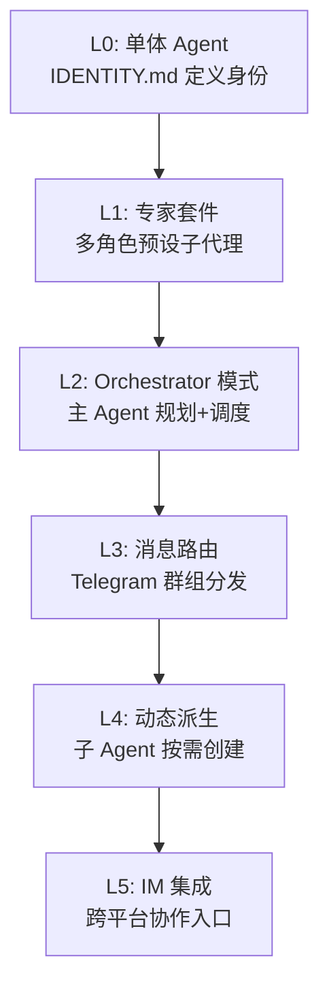

## 研究问题

**OpenClaw 生态中的多智能体编排已经从理论走向了怎样的实践？从单个 Agent 到多 Agent 团队，有哪些可选的架构模式、各自适用什么场景、Tizer 应该如何选择？**

本综合分析聚焦 6 个「Agent 编排 × OpenClaw」交叉概念和 10 篇相关摘要，提炼出 OpenClaw 多智能体编排从身份配置到团队自组织的完整架构路径。

---

## 综合分析

### 一、编排模式的演进阶梯

OpenClaw 的多智能体编排并非一步到位，而是沿着一个清晰的复杂度阶梯逐步演进：

### 二、六种架构模式详细对比

| **模式** | **核心机制** | **Agent 数量** | **上下文隔离** | **适用场景** | **典型案例** |

| --- | --- | --- | --- | --- | --- |

| [**IDENTITY.md**](http://identity.md/)** 身份配置** | 文件化人设+行为边界 | 1 | 无需 | 个人助手、单一领域任务 | 个人 OpenClaw 助手 |

| **Expert Suite 专家套件** | 预设多位角色化子代理 | 固定（~9） | 角色隔离 | 多视角思考、决策分析 | 研究+教练+决策+方法论 |

| **Orchestrator 模式** | 主 Agent 规划调度，子 Agent 执行 | 1+N | 任务隔离 | 并行性强、角色分工清晰 | Claude Code 调度 Codex |

| **Telegram 群组路由** | 消息分发+群组/Topic 路由 | N | 群组隔离 | 多角色协作、持续在线 | PM/工程/QA 群组 |

| **子 Agent 动态派生** | 对话中按需创建子 Agent | 动态 | 任务隔离+交接文档 | 复杂长流程任务 | 1M 上下文并行任务拆分 |

| **IM 集成 Agent** | 接入微信/飞书/Slack 等入口 | N | 平台隔离 | 跨平台触发、随时协作 | Nexu 微信+飞书客户端 |

### 三、身份层 vs 编排层：两个互补的设计维度

一个常见误解是把 [IDENTITY.md](http://identity.md/) 仅看作「配置文件」。实际上，它与编排模式之间存在深层的互补关系：

- [**IDENTITY.md**](http://identity.md/)** 定义的是「我是谁」** — 身份、人设、行为边界、长期偏好。它与 [GUIDELINES.md](http://guidelines.md/)、[SOUL.md](http://soul.md/) 共同构成个性化行为约束层。

- **Orchestrator/子 Agent 派生定义的是「谁做什么」** — 任务分工、调度策略、上下文传递。

两者缺一不可：没有身份配置的编排会产生无差别的「工具人」Agent；没有编排的身份配置只能产生单一但有个性的助手。**OpenClaw 的独特价值在于让用户通过文件编辑（而非代码）同时控制这两个维度。**

### 四、从静态预设到动态派生的范式转变

OpenClaw 编排的最大跃迁发生在 2026 年 2 月 17 日版本引入的子 Agent 派生能力：

| **维度** | **静态预设（Expert Suite）** | **动态派生（Sub-Agent Spawning）** |

| --- | --- | --- |

| Agent 创建时机 | 配置阶段预定义 | 执行阶段按需创建 |

| 角色灵活度 | 固定角色池 | 任务驱动，角色随需生成 |

| 上下文传递 | 共享主 Agent 上下文 | 1M 窗口交接文档，无信息损耗 |

| 并行能力 | 有限 | 一条指令拆分为多个并行子任务 |

| 配置门槛 | 需编写角色配置 | 对话中直接创建，零配置 |

这个转变的核心意义是：**编排从「设计时」活动变成了「运行时」活动。** 用户不再需要预见所有可能的角色组合，而是让 Agent 在执行过程中自主决定需要什么样的帮手。

### 五、消息路由：多 Agent 的持久化协作界面

Telegram 群组路由和 IM 集成 Agent 共同解决了一个关键问题：**多 Agent 团队如何与人类持续在线协作？**

路由架构的设计要点：

- 单个 Gateway/Bot 入口，按群组 ID、Topic 或提及规则分发消息

- 多个角色 Agent 共享消息入口，但保持工作区和记忆隔离

- 把聊天工具从「通知出口」变成「Agent 主入口」

这本质上是在复刻人类团队的协作模式：不同角色在同一个群里讨论，但各自维护自己的「笔记本」。

---

## 关键发现

1. **OpenClaw 的编排优势在于「文件即配置」**：与代码驱动的框架（如 LangGraph、CrewAI）不同，OpenClaw 的编排从 [IDENTITY.md](http://identity.md/) 到 Orchestrator 模式，全部通过可编辑文件控制。这意味着非技术用户也能调整多 Agent 团队的行为——这是 OpenClaw 在编排层的核心差异化竞争力。

1. **静态与动态编排的混合才是最优解**：Expert Suite 提供可预测的角色基线，子 Agent 派生提供灵活的临时扩展。实践中最高效的模式不是二选一，而是用静态角色处理常见任务，用动态派生处理意外分支——类似公司的固定团队 + 临时项目组。

1. **1M 上下文窗口解锁了「无损交接」**：子 Agent 派生的真正突破不是「能创建子 Agent」（这早已可行），而是交接文档可以无限长。这消除了之前多 Agent 系统中最大的痛点——上下文在 Agent 间传递时的信息损耗。

1. **消息路由是多 Agent 系统的「最后一公里」**：技术上的编排（Orchestrator、子 Agent）解决的是 Agent 之间的协作，但 Telegram 群组路由解决的是 Agent 与人类的协作界面问题。很多多 Agent 项目在技术层面已经成熟，但因为缺乏自然的人机交互界面而难以落地。

1. **A2A 协议是编排外部化的信号**：Google A2A 协议 + Hermes 的实践表明，Agent 编排正在从框架内部能力变成跨框架互操作标准。OpenClaw 如果能率先支持 A2A，将从「单一生态编排」升级为「多生态枢纽」。

---

## 来源列表

### 概念页面

- [IDENTITY.md](concepts/IDENTITY.md.md)

- [OpenClaw Expert Suite](concepts/OpenClaw Expert Suite.md)

- [Orchestrator 模式](concepts/Orchestrator 模式.md)

- [Telegram 群组路由](concepts/Telegram 群组路由.md)

- [子 Agent 派生](concepts/子 Agent 派生.md)

- [IM 集成 Agent](concepts/IM 集成 Agent.md)

### 摘要页面

- [摘要：用 50 行 Python 跑通 Google A2A 协议：Hermes + OpenClaw 的多 Agent 互联实践](summaries/摘要：用 50 行 Python 跑通 Google A2A 协议：Hermes + OpenClaw 的多 Agent 互联实践.md)

- [摘要：花叔用多个 OpenClaw Agent 联动，给自己的推文自动生成运营分析报告](summaries/摘要：花叔用多个 OpenClaw Agent 联动，给自己的推文自动生成运营分析报告.md)

- [摘要：ClawTeam：港大开源的 AI Agent 组队框架，让模型们自己分工协作](summaries/摘要：ClawTeam：港大开源的 AI Agent 组队框架，让模型们自己分工协作.md)

- [摘要：SwarmClaw：从管理一个 AI 助手到指挥一支 AI 团队](summaries/摘要：SwarmClaw：从管理一个 AI 助手到指挥一支 AI 团队.md)

- [摘要：OpenClaw 多角色 Telegram 群聊：一个 Gateway 跑产品经理、工程师、QA 的实战指南](summaries/摘要：OpenClaw 多角色 Telegram 群聊：一个 Gateway 跑产品经理、工程师、QA 的实战指南.md)

- [摘要：OpenClaw 专家套件：给你的 AI 助手配上九位顶级顾问](summaries/摘要：OpenClaw 专家套件：给你的 AI 助手配上九位顶级顾问.md)

- [摘要：OpenClaw 深度使用指南：10 个让 Agent 越用越顺手的实战技巧](summaries/摘要：OpenClaw 深度使用指南：10 个让 Agent 越用越顺手的实战技巧.md)

- [摘要：OpenClaw Orchestrator 模式：一条提示词让智能体效率提升 10 倍？](summaries/摘要：OpenClaw Orchestrator 模式：一条提示词让智能体效率提升 10 倍？.md)

- [摘要：ClawPort：为 OpenClaw 多智能体团队打造的可视化指挥中心](summaries/摘要：ClawPort：为 OpenClaw 多智能体团队打造的可视化指挥中心.md)

---

## 行动建议

1. **为 Tizer 的 OpenClaw 环境设计「静态+动态」混合编排方案**：保留 [IDENTITY.md](http://identity.md/) + Expert Suite 作为日常基线（如内容管线的固定角色），同时启用子 Agent 派生处理非标任务（如临时调研、跨项目协调）。建议先在 Telegram 群组中以 PM/研究/写作三个角色试运行。

1. **关注 A2A 协议集成进展**：Hermes + OpenClaw 的 A2A 实践已经跑通。如果 Tizer 的工具链涉及多个 AI 框架（如 OpenClaw + HITL workflow + Notion AI），A2A 可能是让它们互通的最标准化路径。建议在知识 Wiki 中跟踪 A2A 生态的关键进展。

1. **试验 Telegram 群组路由作为 Agent 团队的统一入口**：当前 Tizer 使用的 Agent 交互可能分散在多个界面。一个 Telegram 群组 + 多角色 Agent 的设置可以把日常 Agent 交互集中到一个入口，降低上下文切换成本。
