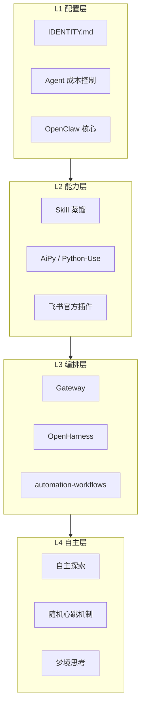

## 研究问题

OpenClaw 生态中的工作流相关概念（[IDENTITY.md](http://identity.md/)、Gateway、OpenHarness、Skill 蒸馏、AiPy、飞书插件、成本控制、自主探索、随机心跳等）如何共同构成一套完整的 **Agent 运行架构**？从静态配置到自主行动，这些能力模块之间存在怎样的层级关系和演进逻辑？

## 综合分析

### 一、OpenClaw 工作流的四层架构模型

通过对 12 个工作流概念的交叉分析，可以识别出一个清晰的四层架构：

| **层级** | **核心模块** | **职责** | **关键设计** |

| --- | --- | --- | --- |

| L1 配置层 | [IDENTITY.md](http://identity.md/)、成本控制、OpenClaw 核心 | 定义 Agent 是谁、能花多少钱、基础能力边界 | 文件化配置 → 持续迭代而非一次性对话注入 |

| L2 能力层 | Skill 蒸馏、AiPy、飞书插件 | 赋予 Agent 具体的执行能力 | MD Skill → Python Skill 的范式转移 |

| L3 编排层 | Gateway、OpenHarness、automation-workflows | 协调多能力、多 Agent、多渠道的执行 | 消息路由 + 状态管理 + 自愈机制 |

| L4 自主层 | 自主探索、随机心跳、梦境思考 | 让 Agent 在无指令时也能行动 | 从固定 cron 到随机心跳的「拟人化」调度 |

### 二、能力获取的两条路径：MD Skill vs Python Skill

OpenClaw 工作流中最关键的分歧之一是 **Agent 如何获得执行能力**：

| **维度** | **MD Skill（传统路径）** | **Python Skill（AiPy 路径）** |

| --- | --- | --- |

| 执行方式 | LLM 理解 Markdown 描述后行动 | LLM 生成 Python 代码 → 解释器执行 |

| Token 消耗 | 高（每次都要读 Skill 文档） | 低（代码执行不消耗 Token） |

| 准确性 | 依赖 LLM 理解，可能幻觉 | 确定性代码，结果可预测 |

| 生态覆盖 | 依赖社区贡献 Skill | Python 生态覆盖几乎所有场景 |

| 可审计性 | 难以审查执行过程 | 代码可审查、可追溯 |

| 沉淀方式 | 直接编写 [SKILL.md](http://skill.md/) | Skill 蒸馏 → 沉淀为可复用脚本 |

**关键洞察**：Skill 蒸馏与 AiPy 形成了互补闭环——蒸馏负责「从已有工具中提取最佳实践」，AiPy 负责「用代码而非自然语言执行」。两者结合后，一个 Agent 可以先用蒸馏提炼出设计模式，再用 Python 精确实现，最终沉淀为可复用的自动化单元。

### 三、编排层的三种模式对比

Gateway、OpenHarness 和 automation-workflows 代表了三种不同的编排哲学：

| **方案** | **编排模式** | **核心能力** | **适用场景** |

| --- | --- | --- | --- |

| Gateway | 消息路由型 | 多渠道接入、多 Agent 路由、会话管理 | 多角色群聊、跨平台 Agent 服务 |

| OpenHarness | 自治运行型 | 7×24 调度、三层自愈记忆、熔断机制、KAIROS 梦境 | 长期无人值守的自动化任务 |

| automation-workflows | 流水线型 | 多 Skill 串联、端到端执行链路 | 固定流程的批量自动化 |

**隐藏的协作关系**：在生产部署中，三者通常不是二选一，而是嵌套组合——Gateway 做消息入口，automation-workflows 做单个任务的执行链路，OpenHarness 做整体调度和自愈。这构成了 OpenClaw 工作流的「三层编排嵌套」。

### 四、成本控制：工作流可持续运行的生命线

Agent 成本控制概念揭示了四个关键的 **Token 消耗黑洞**：

1. **Context 装了不该装的**：记忆系统注入过多无关上下文

1. **子 Agent 重复抓取相同数据**：缺乏缓存层

1. **Prompt 模糊导致反复确认**：[IDENTITY.md](http://identity.md/) 配置不够精确

1. **截图分辨率未控制**：多模态输入的隐藏成本

成本控制与工作流架构的其他组件深度耦合：

- [**IDENTITY.md**](http://identity.md/) 的精确度直接影响 Prompt 消耗

- **AiPy 路径** 天然比 MD Skill 省 Token

- **OpenHarness 的熔断机制** 防止失控任务无限消耗

- **子 Agent 模型分级**（数据抓取用 mini、分析用 Sonnet、决策用主模型）是多 Agent 编排的关键经济学

### 五、从被动响应到自主行动的演进路径

12 个概念中最前沿的三个——**自主探索、随机心跳机制、梦境思考**——共同描绘了 Agent 从「工具」到「同事」的跃迁：

| 阶段 | 触发方式 | Agent 行为 | 代表 |

| --- | --- | --- | --- |

| 被动响应 | 用户指令 | 收到指令才行动 | 基础 OpenClaw |

| 定时执行 | 固定 cron | 按计划执行预设任务 | OpenHarness |

| 随机心跳 | 随机区间 | 不定时触发，弱化机械感 | 随机心跳机制 |

| 自主探索 | 内生驱动 | 根据问题队列主动调研 | 自主探索 |

| 深度反思 | 慢变量 | 回顾历史、生成新问题 | 梦境思考 |

这条路径的终点是一个有「存在感」的 Agent——它不只在你叫它时才出现，而是像一个真正的同事一样，有自己的工作节奏和思考习惯。

## 关键发现

1. **OpenClaw 工作流已形成「四层架构」但缺乏统一抽象**：配置层、能力层、编排层、自主层各有方案，但没有一个统一框架把它们串联起来。OpenHarness 最接近，但仍需要用户手动组合。

1. **AiPy 的「Code is Agent」理念可能终结 MD Skill 生态**：当 Python 生态可以覆盖几乎所有场景，且 Token 消耗更低、结果更确定时，传统 Markdown Skill 的存在意义仅限于快速原型和社区分享。

1. **Gateway 的多 Agent 路由能力与成本控制的模型分级形成了「经济路由」**：不同复杂度的任务路由到不同成本的模型，这不是简单的功能拼接，而是一种新的 Agent 经济学设计模式。

1. **飞书插件的重复出现（两个独立概念页）反映了平台集成的碎片化**：当官方插件和社区插件并存时，用户面临选择困难。这暗示 OpenClaw 生态需要更清晰的「官方认证」机制。

1. **随机心跳 + 梦境思考 + 自主探索三者结合，构成了业界首个完整的「Agent 自主运行时」设计**：这不只是调度创新，更是让 Agent 具备类似人类「念头浮现」的认知模拟——这在其他 Agent 框架中尚未见到。

## 来源列表

### 概念页面

- [IDENTITY.md](concepts/IDENTITY.md.md)

- [AiPy / Python-Use](concepts/AiPy - Python-Use.md)

- [OpenHarness](entities/OpenHarness.md)

- [飞书官方 OpenClaw 插件](concepts/飞书官方 OpenClaw 插件.md)

- OpenClaw 飞书官方插件

- [Skill 蒸馏](concepts/Skill 蒸馏.md)

- [Gateway](concepts/Gateway.md)

- [Agent 成本控制](concepts/Agent 成本控制.md)

- OpenClaw

- [automation-workflows](entities/automation-workflows.md)

- [自主探索](concepts/自主探索.md)

- [随机心跳机制](concepts/随机心跳机制.md)

### 摘要页面

- 摘要：万字干货：理解 Harness Engineering，看这一篇就够了

- 摘要：把 Claude Code 源码蒸馏成 Agent Skill — Harness Engineering 实践

- 摘要：飞书官方出手：OpenClaw 插件免费额度直升 100 万次，AI 助手终于能「亲自动手」了

- [摘要：飞书官方出手：OpenClaw 插件免费额度直升 100 万次，AI 助手终于能「亲自动手」了](summaries/摘要：飞书官方出手：OpenClaw 插件免费额度直升 100 万次，AI 助手终于能「亲自动手」了.md)

- 摘要：OpenClaw 多角色 Telegram 群聊：一个 Gateway 跑产品经理、工程师、QA 的实战指南

- 摘要：OpenClaw + Obsidian：用 AI 智能体打造 7×24 小时内容工厂

- [摘要：wechat-decrypt + OpenClaw：让 AI 帮你把微信群消息变成每日日报](summaries/摘要：wechat-decrypt + OpenClaw：让 AI 帮你把微信群消息变成每日日报.md)

- [摘要：6551-twitter-to-binance-square：用龙虾一句话同步推特到币安广场](summaries/摘要：6551-twitter-to-binance-square：用龙虾一句话同步推特到币安广场.md)

## 行动建议

1. **为 Tizer 的 HITL 工作流构建「AiPy + Skill 蒸馏」闭环**：当前内容管道中的重复性任务（如格式转换、标签提取、摘要生成）适合先用蒸馏提炼最佳实践，再用 AiPy 转为 Python Skill 执行，预计可降低 50%+ 的 Token 消耗。

1. **部署 Gateway + OpenHarness 的嵌套编排**：Tizer 的多平台内容分发（微信、飞书、X）适合用 Gateway 做消息路由入口，OpenHarness 做长期调度，automation-workflows 做单条内容的处理链路。三层嵌套可实现真正的 7×24 内容工厂。

1. **实验随机心跳 + 自主探索模式在知识管理中的应用**：让 Agent 在非工作时间随机巡逻 Wiki、发现过时内容、提出新的调研问题。这与当前 Wiki Synthesizer 的定时扫描互补——一个按计划生成综合分析，一个随机发现新的知识缺口。
