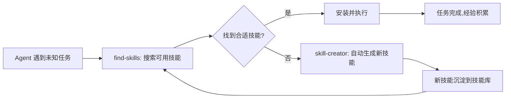

## 研究问题

OpenClaw 的技能（Skill）生态正在从零散的技能文件走向完整的能力系统。在这一演进中，**技能的粒度设计、发现机制、分发市场和自进化闭环**如何协同？不同层次的技能（通用工具、垂直领域、元技能）各自解决什么问题？对 Tizer 构建 OpenClaw 工作流有哪些可操作的启示？

## 综合分析

### 一、OpenClaw 技能生态的四层架构

| 层级 | **定义** | **代表概念** | **核心问题** |

| --- | --- | --- | --- |

| **L1 工具技能** | 单一功能封装，完成具体操作 | x-tweet-fetcher（抓取推文）、Antigravity MCP（标准化外部能力接入） | 如何把外部 API / 浏览器操作变成 Agent 可调用的能力 |

| **L2 垂直技能库** | 面向特定领域的大规模技能集合 | OpenClaw-Medical-Skills（869 个医学技能）、ClawBio（生信流程封装） | 如何把专业知识技能化，而非重训模型 |

| **L3 元技能** | 管理、发现和创造其他技能的技能 | find-skills（自动发现可安装技能）、skill-creator（按需生成新技能） | 如何让 Agent 从「不会就停」变成「不会就学」 |

| **L4 分发市场** | 技能的组织、审核和分发平台 | SkillHub（腾讯本土化市场）、ClawHub（官方市场）、[skills.sh](http://skills.sh/)（开放目录） | 分发权、审核标准和生态治理 |

### 二、L1 工具技能：从 API 包装到协议化接入

**x-tweet-fetcher** 和 **Antigravity MCP** 代表了工具技能的两种路径：

| **维度** | **x-tweet-fetcher（Skill 文件路径）** | **Antigravity MCP（协议路径）** |

| --- | --- | --- |

| 接入方式 | [SKILL.md](http://skill.md/) 定义 + 三层后端自动降级 | MCP 标准接口，协议化可插拔 |

| 灵活性 | 高——可快速开发、自定义降级策略 | 中——受协议约束，但复用性更强 |

| 适用场景 | 单一平台深度集成（X 推文全功能抓取） | 多工具标准化接入（搜索、抓取等通用能力） |

| 可维护性 | 依赖开发者持续更新后端 | 协议层稳定，实现可替换 |

x-tweet-fetcher 的三层自动降级（FxTwitter API → Nitter → Playwright 浏览器）是一个值得借鉴的工程模式：**不要假设任何单一后端是可靠的，设计降级链路比优化单一路径更重要。**

### 三、L2 垂直技能库：专业知识技能化的范式

**OpenClaw-Medical-Skills**（869 个技能）和 **ClawBio** 共同展示了一条路径：**把垂直领域专业知识包装成 Skills，而不是重新训练专用模型。**

关键设计原则：

- **技能粒度足够细**：用户可以按需加载，而不是一次性塞满上下文

- **数据库访问 + 流程封装 + 结构化输出**：三位一体的打包方式

- **安全性与权限治理**的重要性不亚于技能覆盖面本身

与 HuatuoGPT 等专用医疗模型相比，技能化路径的优势在于**可组合性和低切换成本**——同一个 OpenClaw Agent 可以按需装载不同领域的技能库，而不需要为每个领域部署一个专用模型。

### 四、L3 元技能：自进化闭环的关键

**find-skills** 和 **skill-creator** 构成了 OpenClaw 技能生态最具想象力的一层：

这个闭环把 Agent 从「不会就停」升级为「不会就自动学」，本质上是一个**能力自增长系统**。但现阶段仍有局限：

- find-skills 依赖技能目录的完善度

- skill-creator 生成的技能质量和安全性需要验证

- 闭环的自动化程度取决于技能元数据的标准化水平

### 五、L4 分发市场：开放 vs 平台化的角力

| **市场** | **定位** | **特征** | **优势** | **局限** |

| --- | --- | --- | --- | --- |

| [skills.sh](http://skills.sh/) | 开放主目录 | 无审核门槛，社区驱动 | 技能数量多，发现成本低 | 质量参差不齐 |

| ClawHub | 官方市场 | OpenClaw 核心团队运营 | 与平台深度集成 | 国际化优先，本土化不足 |

| SkillHub | 本土化镜像 | 腾讯运营，中文生态 | 国内访问、安全审核、本地化体验 | 与上游生态的同步和来源争议 |

**核心洞察**：技能生态一旦成熟，**分发权就会变成新的竞争焦点**。这与移动互联网时代的应用商店竞争逻辑一致——真正的价值不在于谁写了技能，而在于谁控制了发现、审核和安装的通道。

## 关键发现

> **💡** **发现 1：OpenClaw 技能生态正在复现「包管理器 → 应用商店」的演进路径**

  从 [SKILL.md](http://skill.md/) 文件到 skills CLI 到 ClawHub/SkillHub，这条路径几乎完整复现了从 npm/pip 到 App Store 的产业演进。元技能（find-skills）的出现相当于引入了「自动依赖解析」，标志着生态正在从手动管理走向自动化。

> **💡** **发现 2：「专业知识技能化」比「训练专用模型」更适合长尾场景**

  OpenClaw-Medical-Skills 和 ClawBio 的经验表明，把垂直知识封装为可组合 Skills，比为每个领域训练专用模型更灵活、成本更低。这种模式尤其适合 Tizer 面对的多领域知识管理需求。

> **💡** **发现 3：三层降级是 Agent 工具技能的工程最佳实践**

  x-tweet-fetcher 的 FxTwitter → Nitter → Playwright 降级链路，提供了一个可迁移的工程模式：任何依赖外部服务的技能都应设计多层后备方案，而不是假设单一后端可靠。

> **💡** **发现 4：元技能是 Agent 从「工具」变成「系统」的分水岭**

  find-skills + skill-creator 的闭环，让 OpenClaw 从「用户配置工具的 Agent」变成「自主获取能力的系统」。这个分水岭的意义在于：Agent 的能力边界不再由初始配置决定，而由生态丰富度决定。

> **💡** **发现 5：技能分发的本土化不只是翻译问题，而是治理问题**

  SkillHub 的争议（来源标注、镜像复制）揭示了开源技能生态与平台化运营之间的天然张力。这与 npm 镜像、Docker Hub 镜像面临的问题本质相同——本土化的真正难点是建立可信的审核和归因体系。

## 来源列表

### 概念页面（7 篇）

- [Antigravity MCP](concepts/Antigravity MCP.md) · [ClawBio](concepts/ClawBio.md) · [find-skills](concepts/find-skills.md) · OpenClaw-Medical-Skills

- [skill-creator](concepts/skill-creator.md) · [SkillHub](entities/SkillHub.md) · [x-tweet-fetcher](entities/x-tweet-fetcher.md)

### 摘要页面（6 篇）

- [摘要：OpenClaw find-skills：让你的 AI 龙虾「不会就自动学」](summaries/摘要：OpenClaw find-skills：让你的 AI 龙虾「不会就自动学」.md) · [摘要：OpenClaw Medical Skills：869个技能把Claude变成你的专属医学科研助手](summaries/摘要：OpenClaw Medical Skills：869个技能把Claude变成你的专属医学科研助手.md) · [摘要：Agent Skills 生态全景：四大技能市场横评，让你的 AI 解锁超能力](summaries/摘要：Agent Skills 生态全景：四大技能市场横评，让你的 AI 解锁超能力.md)

- [摘要：OpenClaw 养虾踩坑实录：如何用 CDP 把浏览器完全交给 AI Agent 控制](summaries/摘要：OpenClaw 养虾踩坑实录：如何用 CDP 把浏览器完全交给 AI Agent 控制.md) · [摘要：OpenClaw-Medical-Skills：869个技能让你的AI助手变身专业医学科研伙伴](summaries/摘要：OpenClaw-Medical-Skills：869个技能让你的AI助手变身专业医学科研伙伴.md) · [摘要：腾讯 SkillHub：专为中国用户打造的 OpenClaw 技能社区](summaries/摘要：腾讯 SkillHub：专为中国用户打造的 OpenClaw 技能社区.md)

## 行动建议

> **1️⃣** **为 Tizer 的 OpenClaw 工作流建立三层技能降级策略**

  参考 x-tweet-fetcher 的设计，为每个关键技能（信息抓取、内容发布、知识检索）设计至少两层后备方案。在 [AGENTS.md](http://agents.md/) 中记录降级链路和触发条件，确保单一服务失效不会阻断整个工作流。

> **2️⃣** **优先接入 find-skills 元技能，构建能力自增长闭环**

  Tizer 当前的 OpenClaw 配置是静态的——有什么技能就用什么技能。接入 find-skills 后，Agent 在遇到新任务时可以自动搜索和安装技能。下一步可以叠加 skill-creator，让经验沉淀为可复用能力。

> **3️⃣** **借鉴 OpenClaw-Medical-Skills 的模式，将知识管理领域知识技能化**

  Tizer 的知识 Wiki 编译、标签管理和质量检查流程，可以参考 Medical-Skills 的「数据库访问 + 流程封装 + 结构化输出」三位一体模式，封装为标准 Skills。这样其他 Agent 也可以复用这些知识管理能力。
