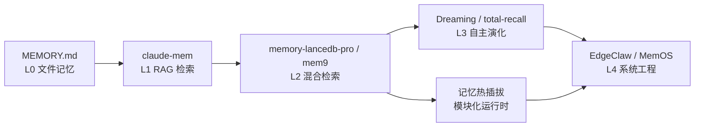

## 研究问题

OpenClaw 生态中涌现了多种记忆方案（[MEMORY.md](http://memory.md/)、memory-lancedb-pro、total-recall、mem9、claude-mem、MemOS、EdgeClaw、Dreaming 等），它们在**存储架构、检索策略、记忆生命周期管理**上有何本质差异？对于不同使用场景，应该如何选型？这些方案的演进揭示了 Agent 记忆系统怎样的发展趋势？

## 综合分析

### 一、记忆方案架构光谱：从文件到操作系统

OpenClaw 记忆生态可以沿「架构复杂度」轴排列为一条清晰的光谱：

| **方案** | **架构层级** | **存储方式** | **检索策略** | **记忆演化** | **适用场景** |

| --- | --- | --- | --- | --- | --- |

| [MEMORY.md](http://memory.md/) | L0 文件层 | 本地 Markdown 文件 | 全文匹配 | 手动编辑 | 简单偏好、轻量使用 |

| claude-mem | L1 RAG 层 | SQLite FTS5 + Chroma | 语义检索 | Hook 自动采集 | 个人跨会话记忆 |

| memory-lancedb-pro | L2 混合检索层 | LanceDB 向量库 | 向量 + BM25 + 重排序 | 分层提取 + 遗忘曲线 | 结构化长期项目 |

| mem9 | L2 混合检索层 | TiDB Cloud | 向量 + jieba 全文 + RRF | 两段式提取 + 调和 | 跨设备、多端同步 |

| total-recall | L3 自主演化层 | 五层结构 | 观察 + 反思 | 梦境循环自动整合 | 长期自主运行 Agent |

| EdgeClaw | L3 自主演化层 | 三层记忆架构 | 成本感知路由 | 工作/情节/语义分层 | 大型代码库、敏感数据 |

| MemOS | L4 操作系统层 | 本地 + 可视化面板 | 自动总结 + 复用 | 团队记忆共享 | 团队协作、技能沉淀 |

### 二、三种记忆范式的核心差异

通过对 14 个概念的交叉分析，可以识别出三种根本不同的**记忆范式**：

范式 A：检索增强型（memory-lancedb-pro、mem9、claude-mem）

核心逻辑是「**存得多、找得准**」。通过混合检索（向量 + 关键词 + 重排序）解决召回质量问题。

- memory-lancedb-pro 的多 Scope 隔离让多项目记忆互不干扰

- mem9 的两段式提取（先抽事实、再调和冲突）解决了记忆冲突问题

- claude-mem 的 Hook 采集机制最轻量，但缺乏记忆治理能力

范式 B：自主演化型（total-recall、Dreaming/梦境思考）

核心逻辑是「**记忆自己会长大**」。不只是检索，更强调记忆的自动观察、反思和巩固。

- Dreaming 的三阶段机制（浅睡/REM/深睡）模拟人类睡眠记忆整合

- total-recall 的五层结构强调定期回顾和长期压缩

- 梦境思考则更进一步，负责从历史对话中生成新的待探索问题

范式 C：系统工程型（EdgeClaw、MemOS、记忆热插拔）

核心逻辑是「**记忆是可管理的基础设施**」。引入分层架构、成本感知、团队共享等工程化能力。

- EdgeClaw 的三层隐私路由（S1/S2/S3）在记忆系统中首次引入数据分级

- MemOS 将记忆提升到团队级，让多人共享经验库

- 记忆热插拔则把记忆模块化，支持运行时动态切换

### 三、演进时间线与关键转折

**关键转折点**：Dreaming 机制的引入（2026.4.5 版本）标志着 OpenClaw 记忆从「被动存取」转向「主动巩固」。其灵感来源——Claude Code 泄露源码中的 KAIROS 系统——说明这一方向已获得顶级 AI 实验室的内部验证。

### 四、本地 vs 云端：存储架构的根本分歧

| **维度** | **本地方案** | **云端方案** |

| --- | --- | --- |

| 代表 | [MEMORY.md](http://memory.md/)、claude-mem、EdgeClaw、MemOS | mem9（TiDB Cloud） |

| 核心优势 | 隐私可控、零延迟、可人工编辑 | 跨设备同步、记忆跟人走 |

| 核心劣势 | 设备绑定、团队共享困难 | 依赖网络、隐私风险 |

| 发展方向 | EdgeClaw 的端云协同（脱敏上云） | mem9 的防循环与手动置顶 |

**隐藏趋势**：EdgeClaw 的 ClawXRouter 双轨记忆设计（云端脱敏版 + 端侧完整版）代表了一种折中路径——既享受云端同步，又保留本地隐私。这可能成为未来主流架构。

### 五、记忆质量治理：被忽视的关键环节

跨概念分析揭示了一个共性问题：**记忆越多，噪声越大**。各方案的应对策略截然不同：

- **memory-lancedb-pro**：遗忘曲线机制，让低频记忆自然衰减

- **mem9**：年龄越大的记忆在冲突时越容易被标记过时 + 防循环设计

- **Dreaming**：六维评分（相关性 0.30 > 频率 0.24 > 查询多样性 > 时效性 > 复现强度 > 概念丰富度），相关性权重最高

- **claude-mem**：**无治理机制**，承认「记忆库越大越容易错抓」

## 关键发现

1. **「记忆范式三分法」已成型**：检索增强、自主演化、系统工程三条路径正在分化，但尚无方案真正打通三者。未来的赢家很可能是能在一个架构中融合三种范式的方案。

1. **Dreaming 的相关性 > 频率设计暗示了「高质量低频记忆」的价值**：传统记忆系统倾向于保留高频出现的信息，但 Dreaming 选择让「在不同场景被检索」的记忆胜出——这意味着跨领域关联比重复出现更有价值。

1. **团队记忆是被严重低估的方向**：14 个概念中只有 MemOS 涉及团队共享，但在实际工作流中，多人协作场景（如 Tizer 的内容管道）对共享经验库的需求远大于个人记忆。

1. **记忆热插拔暗示了「记忆即插件」的未来**：当记忆模块可以在运行时动态挂载卸载，记忆系统本身就变成了可组合的能力层——这与 OpenClaw 的 Skill 生态高度契合。

1. **OpenClaw Context Engine 代表了从「记忆存取」到「上下文维护」的范式转移**：传统记忆关注「存了什么、能找到什么」，Context Engine 关注「当前任务需要什么上下文」——这是从数据库思维到工作流思维的跃迁。

## 来源列表

### 概念页面

- [MEMORY.md](concepts/MEMORY.md.md)

- [claude-mem](entities/claude-mem.md)

- [memory-lancedb-pro](concepts/memory-lancedb-pro.md)

- memory-lancedb-pro

- [mem9](entities/mem9.md)

- total-recall

- [total-recall](concepts/total-recall.md)

- [EdgeClaw](entities/EdgeClaw.md)

- [Dreaming 记忆机制](concepts/Dreaming 记忆机制.md)

- OpenClaw Dreaming（睡眠记忆机制）

- [MemOS](entities/MemOS.md)

- [OpenClaw Context Engine](concepts/OpenClaw Context Engine.md)

- [记忆热插拔](concepts/记忆热插拔.md)

- [梦境思考](concepts/梦境思考.md)

### 摘要页面

- [摘要：OpenClaw 长期记忆终极方案：memory-lancedb-pro vs total-recall 深度对比](summaries/摘要：OpenClaw 长期记忆终极方案：memory-lancedb-pro vs total-recall 深度对比.md)

- 摘要：memory-lancedb-pro：给你的 OpenClaw Agent 装上真正会记忆的大脑

- [摘要：memory-lancedb-pro：给 OpenClaw 装上真正记得住事的大脑](summaries/摘要：memory-lancedb-pro：给 OpenClaw 装上真正记得住事的大脑.md)

- [摘要：Anthropic是怎么给AI造记忆的——从泳露的源码里拆的](summaries/摘要：Anthropic是怎么给AI造记忆的——从泳露的源码里拆的.md)

- 摘要：脑子是个好东西：为龙虾和 CC 加装外脑之后，这俩货要上天了

- [摘要：脑子是个好东西：为龙虾和 CC 加装外脑之后，这俩货要上天了](summaries/摘要：脑子是个好东西：为龙虾和 CC 加装外脑之后，这俩货要上天了.md)

- [摘要：EdgeClaw：把 Claude Code 体验带到 OpenClaw](summaries/摘要：EdgeClaw：把 Claude Code 体验带到 OpenClaw.md)

- 摘要：EdgeClaw：把 Claude Code 体验带到 OpenClaw

- 摘要：Anthropic封杀48小时，逼出OpenClaw最强反击！

- [摘要：Anthropic 封杀 48 小时，逼出 OpenClaw 最强反击！龙虾首次会生视频了](summaries/摘要：Anthropic 封杀 48 小时，逼出 OpenClaw 最强反击！龙虾首次会生视频了.md)

- [摘要：10,000+ markdown files（GBrain 开源发布）](summaries/摘要：10,000+ markdown files（GBrain 开源发布）.md)

- [摘要：Hermes Agent 实测，龙虾新对手是进化版爱马仕](summaries/摘要：Hermes Agent 实测，龙虾新对手是进化版爱马仕.md)

- 摘要：Hermes Agent实测，龙虾新对手是进化爱马仕

## 行动建议

1. **为 Tizer 的内容管道构建「混合记忆栈」**：底层用 [MEMORY.md](http://memory.md/) 存核心偏好，中层用 memory-lancedb-pro 做项目级检索，上层用 Dreaming 做定期记忆巩固。三层各司其职，避免单一方案的局限。

1. **优先试验 EdgeClaw 的端云协同模式**：Tizer 的工作涉及多设备（本地开发 + 服务器部署），EdgeClaw 的 ClawXRouter 双轨记忆设计（脱敏上云 + 端侧完整）最贴合实际需求，建议作为 mem0 的升级方向评估。

1. **关注记忆热插拔能力在 OpenClaw 飞轮中的价值**：当前 Tizer 的 HITL 工作流中，不同阶段需要不同记忆上下文。记忆热插拔可以让 Agent 在「内容创作模式」和「代码开发模式」间无缝切换，避免跨领域记忆污染。
