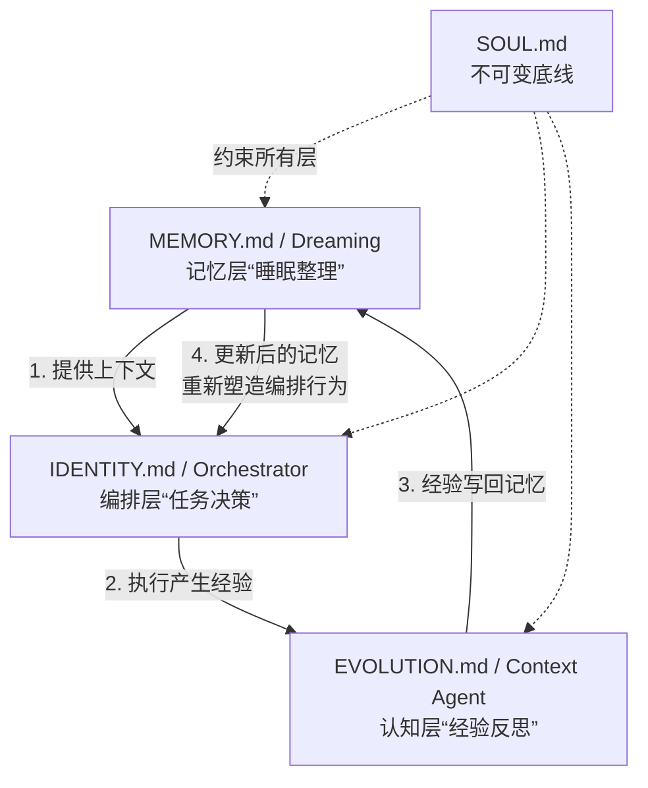

## 研究问题

**OpenClaw 生态中，记忆系统与 Agent 编排为何能在同一架构中实现深度融合，而非只是松耦集成？** 「文件即认知」的设计哲学如何同时塑造 OpenClaw 的记忆形态和编排拓扑？这种三体共演将 Agent 推向怎样的自主性边界？

本三标签综合分析以三篇已有双标签 synthesis 为输入，交叉分析 51 个位于 OpenClaw×编排、OpenClaw×记忆、编排×记忆三条边上的概念/实体，提炼只有同时看三条边才能浮现的洞察。

### 输入的双标签 synthesis

- [OpenClaw 多智能体编排实践图谱：从单体助手到自组织 Agent 团队的六种架构模式](syntheses/OpenClaw 多智能体编排实践图谱：从单体助手到自组织 Agent 团队的六种架构模式.md)（OpenClaw × Agent 编排）

- [OpenClaw 记忆系统方案分化与选型决策：从文件记忆到自主记忆操作系统的架构光谱](syntheses/OpenClaw 记忆系统方案分化与选型决策：从文件记忆到自主记忆操作系统的架构光谱.md)（OpenClaw × 记忆系统）

- [Agent 编排与记忆系统的协同演化：从上下文工程到自主人格的架构融合光谱](syntheses/Agent 编排与记忆系统的协同演化：从上下文工程到自主人格的架构融合光谱.md)（Agent 编排 × 记忆系统）

---

## 综合分析

### 一、三条边的共同基底：文件即认知

三篇双标签 synthesis 分别揭示了：

- **编排边**：OpenClaw 的编排从 [IDENTITY.md](http://identity.md/) 到 Orchestrator 模式，全部通过可编辑文件控制

- **记忆边**：OpenClaw 的记忆从 [MEMORY.md](http://memory.md/) 到 Dreaming 机制，全部以文件为底层存储

- **融合边**：编排与记忆的融合正在从「工具」走向「类生命体」

但只有同时看三条边才能看到一个更深层的结构：**OpenClaw 的文件系统不是记忆和编排的「容器」，而是它们的「共享基底」——记忆和编排通过同一组文件相互感知、相互塑造。**

| **文件** | **编排侧角色** | **记忆侧角色** | **三体洞察** |

| --- | --- | --- | --- |

| [IDENTITY.md](http://identity.md/) | 定义「我是谁」的行为边界 | 自生长人格的演化载体 | 编排约束与记忆沉淀在同一文件中博弈，形成「人格张力」 |

| [MEMORY.md](http://memory.md/) | 任务执行的上下文来源 | 长期记忆的持久化层 | 编排决策依赖记忆内容，记忆沿淀反过来改变编排偏好 |

| [EVOLUTION.md](http://evolution.md/) | 受控自进化的规则记录 | 经验累积的结构化日志 | 编排的「学习」和记忆的「整理」通过同一进化日志协同 |

| [SOUL.md](http://soul.md/) | 不可变的编排约束层 | 记忆治理的底线规则 | 定义了记忆和编排共同不可越过的「红线」 |

**这是 OpenClaw 的结构性独特性**：在 LangGraph、CrewAI 等代码驱动的框架中，记忆和编排是两个独立的代码模块，通过 API 通信。但在 OpenClaw 中，它们共享同一套文件系统——这意味着记忆的每一次更新都会立即被编排层感知，编排的每一次决策都可以直接写入记忆层。无需序列化/反序列化，无需消息队列——**文件就是总线。**

### 二、三体共演回路：记忆→编排→经验→记忆

三条边合在一起，浮现出一个在单独看任何两条边时都不完整的反馈回路：

这个回路在 OpenClaw 中的具体运转方式：

1. **Dreaming 机制凌晨 3 点自动整理短期记忆**，将「持久真相」写入 [MEMORY.md](http://memory.md/)（记忆 → 记忆）

1. **编排层在下一次任务启动时读取更新后的 **[**MEMORY.md**](http://memory.md/)，决策偏好随之改变（记忆 → 编排）

1. **Orchestrator 模式分派子 Agent，子 Agent 执行后的经验被 Context Agent 收集**（编排 → 认知）

1. **受控自进化机制将经验写入 **[**EVOLUTION.md**](http://evolution.md/)，并经人工确认后可能更新 [IDENTITY.md](http://identity.md/)（认知 → 记忆/编排）

1. [**SOUL.md**](http://soul.md/)** 作为不可变层约束整个回路**，防止 identity crisis（底线 → 全局）

**这个回路的突破性意义**：在传统 Agent 架构中，记忆更新和编排调整是两个独立的循环，各自有自己的触发时机和更新频率。但在 OpenClaw 中，因为共享文件基底，两个循环自然融合为一个——这就是为什么 OpenClaw 能在记忆-编排融合上走得比其他框架更远的结构性原因。

### 三、六种编排模式的记忆需求图谱

从「编排边」的六种模式出发，叠加「记忆边」的方案光谱，可以画出每种编排模式对记忆系统的具体需求：

| **编排模式** | **记忆需求类型** | **最佳记忆方案** | **融合点** |

| --- | --- | --- | --- |

| [IDENTITY.md](http://identity.md/) 单体 | 个人偏好 + 长期事实 | [MEMORY.md](http://memory.md/)（L0 文件层） | 记忆与身份在同一目录，形成「数字人格」 |

| Expert Suite 专家套件 | 角色隔离记忆 | Mem0（跨 Agent 共享） | 多角色共享同一个记忆池，但违背专家隔离原则 |

| Orchestrator 模式 | 任务状态 + 中间结果 | memory-lancedb-pro（多 Scope 隔离） | Context Agent 专职获取上下文，记忆成为编排拓扑中的节点 |

| Telegram 群组路由 | 跨会话流记忆 | mem9（跨设备同步） | 多 Agent 在同一群交流，记忆需要「跟着对话走」 |

| 子 Agent 动态派生 | 1M 交接文档 + 上下文压缩 | total-recall / Dreaming（自主演化） | 子 Agent 生命周期短，必须开拠与压缩并行——派生即抽取，回收即压缩 |

| IM 集成 Agent | 平台隔离 + 团队共享 | MemOS（团队级） | 多平台多 Agent 需要统一的记忆治理层，否则经验碗片化 |

**洞察**：编排复杂度与记忆复杂度存在强关联，但不是线性的。专家套件（多角色但固定）的记忆需求反而比 Orchestrator（单调度但动态）更棘手——因为角色隔离与经验共享是天然矛盾的。这是只有同时看编排和记忆两个维度才能发现的非线性耦合。

### 四、三层时间尺度的编排-记忆协调

OpenClaw 的三体架构在三个截然不同的时间尺度上同时运行：

| **时间尺度** | **编排侧活动** | **记忆侧活动** | **协调机制** |

| --- | --- | --- | --- |

| **秒级**（单次任务） | 子 Agent 派生、工具调用 | Context Compaction、上下文压缩 | 任务内实时压缩，延缓 Context Rot |

| **小时级**（工作会话） | Orchestrator 调度、群组路由 | Session Event Log、共享状态 | 会话级状态持久化、跨 Agent 事件广播 |

| **天/周级**（长期演化） | 受控自进化、人格演变 | Dreaming 整理、[MEMORY.md](http://memory.md/) 沿淀 | 凌晨 3 点 Dreaming + 人工确认门 |

**核心矛盾**：秒级编排需要快速、确定的上下文；天级记忆需要慢速、深度的反思。OpenClaw 的解决方案是「时间隔离」：Dreaming 在凌晨执行（Agent 空闲时），避免与实时编排争抢计算资源和上下文窗口。这显然借鉴了人类的睡眠-工作周期——白天做事，晚上整理记忆。

### 五、「记忆热插拔」×「动态派生」：三体融合的前沿边界

「记忆边」的记忆热插拔与「编排边」的子 Agent 动态派生，在 OpenClaw 中的结合点是一个极具前瞻性的架构节点：

- **当前状态**：子 Agent 派生时继承主 Agent 的记忆（通过1M 交接文档），但无法动态选择「带哪块记忆」

- **潜在突破**：如果记忆热插拔与子 Agent 派生结合，就能实现「按任务类型挂载对应记忆模块」——编排层不仅决定「派谁做」，还决定「带什么记忆做」

- **与 Skill 生态的共振**：记忆热插拔和 OpenClaw 的 Skill 生态高度契合——记忆模块和技能模块都是可组合的能力单元，编排层是组合的指挥官

这指向了一种「**Agent-as-a-Process**」的架构演进：Agent 不再是带有固定记忆的实体，而是带有可组合记忆的进程——类似操作系统中进程可以挂载不同的内存映射。

### 六、从工具到自主体的演进光谱（三体视角）

综合三条边的分析，可以画出 OpenClaw Agent 从工具到自主体的完整演进路径：

| **阶段** | **记忆状态** | **编排状态** | **OpenClaw 实现** | **自主性水平** |

| --- | --- | --- | --- | --- |

| **S0 无状态工具** | 无记忆 | 单次指令执行 | 基础 API 调用 | 纯被动 |

| **S1 有记忆助手** | [MEMORY.md](http://memory.md/) 文件记忆 | [IDENTITY.md](http://identity.md/) 单体编排 | 基础 OpenClaw 配置 | 个性化被动 |

| **S2 协作团队** | Mem0/memory-lancedb-pro | Expert Suite / Orchestrator | 多 Agent + 混合检索 | 任务级自主 |

| **S3 自演化体** | Dreaming + total-recall | 子 Agent 动态派生 + 受控自进化 | 完整三体架构 | 经验驱动的持续进化 |

| **S4 自主存在体** | 记忆塑造人格 | 存在姿态三角形 + 无任务编排 | 概念验证阶段 | 自主目标生成 |

**核心洞察**：S2 到 S3 的跳跃是关键节点。它不是记忆或编排单独的升级，而是两者开始形成自增强回路的时刻——Dreaming 让记忆自动整理，受控自进化让编排行为随经验调整，OpenClaw 的文件基底让这两个过程在同一介质上发生。这是「三体共演」的精确含义。

---

## 关键发现

1. **OpenClaw 的文件系统是记忆与编排融合的「共享总线」而非「集成接口」**：在代码驱动的框架中，记忆和编排通过 API 通信，存在序列化开销和状态同步问题。OpenClaw 的文件基底让两个系统共享同一个「状态空间」，自然消除了同步开销。这是一个架构级优势，其他框架难以通过「加插件」复制。

1. **编排复杂度与记忆复杂度的耦合是非线性的，而且最难的点不在顶端**：Expert Suite（多角色固定）的记忆治理比 Orchestrator（单调度动态）更难，因为角色隔离与经验共享是天然矛盾的。这意味着选择编排模式时必须同时考虑记忆方案的配套能力。

1. **Dreaming 的「睡眠-工作分离」是三体协调的关键设计模式**：将深度记忆整理放在凌晨「空闲时段」执行，避免与实时编排争抢上下文窗口。这不仅是工程优化，更是一个深层的架构原则：记忆整合和任务执行必须在时间上隔离，因为它们竞争同一个稀缺资源（LLM 的注意力）。

1. **「记忆热插拔 × 子 Agent 派生」的组合是下一个架构突破口**：当编排层能为每个子 Agent 动态挂载对应的记忆模块时，Agent 就从「带有记忆的实体」进化为「带有可组合记忆的进程」——这是操作系统的内存映射隐喻在 Agent 架构中的再现。

1. **S2→S3 是自主性的「相变」节点，而非渐变**：当 Dreaming 和受控自进化同时启用时，记忆和编排不再是独立运转的两个系统，而是形成自增强回路。这是一个质变而非量变——Agent 从「被配置」变成「会成长」。OpenClaw 是目前唯一让非技术用户也能走到这一步的平台。

---

## 来源列表

### 输入的双标签 synthesis

- [OpenClaw 多智能体编排实践图谱：从单体助手到自组织 Agent 团队的六种架构模式](syntheses/OpenClaw 多智能体编排实践图谱：从单体助手到自组织 Agent 团队的六种架构模式.md)

- [OpenClaw 记忆系统方案分化与选型决策：从文件记忆到自主记忆操作系统的架构光谱](syntheses/OpenClaw 记忆系统方案分化与选型决策：从文件记忆到自主记忆操作系统的架构光谱.md)

- [Agent 编排与记忆系统的协同演化：从上下文工程到自主人格的架构融合光谱](syntheses/Agent 编排与记忆系统的协同演化：从上下文工程到自主人格的架构融合光谱.md)

### 核心概念页面（OpenClaw × 编排）

- [IDENTITY.md](concepts/IDENTITY.md.md)

- [OpenClaw Expert Suite](concepts/OpenClaw Expert Suite.md)

- [Orchestrator 模式](concepts/Orchestrator 模式.md)

- [Telegram 群组路由](concepts/Telegram 群组路由.md)

- [子 Agent 派生](concepts/子 Agent 派生.md)

- [IM 集成 Agent](concepts/IM 集成 Agent.md)

- [SwarmClaw](entities/SwarmClaw.md)

- [HermesClaw](entities/HermesClaw.md)

- [EVOLUTION.md](concepts/EVOLUTION.md.md)

- [受控自进化](concepts/受控自进化.md)

- [Molty SOUL](concepts/Molty SOUL.md)

- [STYLE.md](concepts/STYLE.md.md)

### 核心概念页面（OpenClaw × 记忆）

- [MEMORY.md](concepts/MEMORY.md.md)

- [Dreaming 记忆机制](concepts/Dreaming 记忆机制.md)

- [graph-memory](entities/graph-memory.md)

- [Mem0](entities/Mem0.md)

- [MemOS](entities/MemOS.md)

- [memory-lancedb-pro](concepts/memory-lancedb-pro.md)

- [mem9](entities/mem9.md)

- [total-recall](concepts/total-recall.md)

- [EdgeClaw](entities/EdgeClaw.md)

- [Mini-OpenClaw](entities/Mini-OpenClaw.md)

- [lossless-claw](entities/lossless-claw.md)

- [记忆热插拔](concepts/记忆热插拔.md)

- [梦境思考](concepts/梦境思考.md)

- [daily memory](concepts/daily memory.md)

- [grounded REM backfill](concepts/grounded REM backfill.md)

### 核心概念页面（编排 × 记忆）

- [Context Agent](concepts/Context Agent.md)

- [Context Compaction](concepts/Context Compaction.md)

- [Context Rot](concepts/Context Rot.md)

- [Context Constitution](concepts/Context Constitution.md)

- [Session Event Log](concepts/Session Event Log.md)

- [共享状态](concepts/共享状态.md)

- [双层记忆架构](concepts/双层记忆架构.md)

- [自我进化 Agent](concepts/自我进化 Agent.md)

- [Memory KPI](concepts/Memory KPI.md)

- [Open Memory](concepts/Open Memory.md)

- [EvoAgentBench](entities/EvoAgentBench.md)

- [EverMemBench](entities/EverMemBench.md)

---

## 行动建议

1. **为 Tizer 的 OpenClaw 环境设计「三体协调配置单」**：根据当前实际使用的编排模式（如 Orchestrator），对应选择最匹配的记忆方案（如 memory-lancedb-pro 多 Scope 隔离）。避免「编排用 S3、记忆用 S1」的错配，这会让高级编排能力因为记忆短板而失效。

1. **优先启用 Dreaming + 受控自进化的组合，达到 S3 自演化体阶段**：这两个功能单独启用时价值有限，但组合启用后会形成自增强回路——Dreaming 整理的记忆供受控自进化参考，自进化产生的新规则又反过来影响 Dreaming 的整理策略。建议先在内容管线 Agent 上试运行 2 周，观察回路是否形成。

1. **跟踪「记忆热插拔 × 子 Agent 派生」的社区进展**：这是三体融合的下一个突破口。当这个能力落地时，Tizer 的多 Agent 工作流可以实现「内容创作模式」和「代码开发模式」之间的无缝切换——每个模式带有自己的专属记忆，避免跨领域记忆污染。
