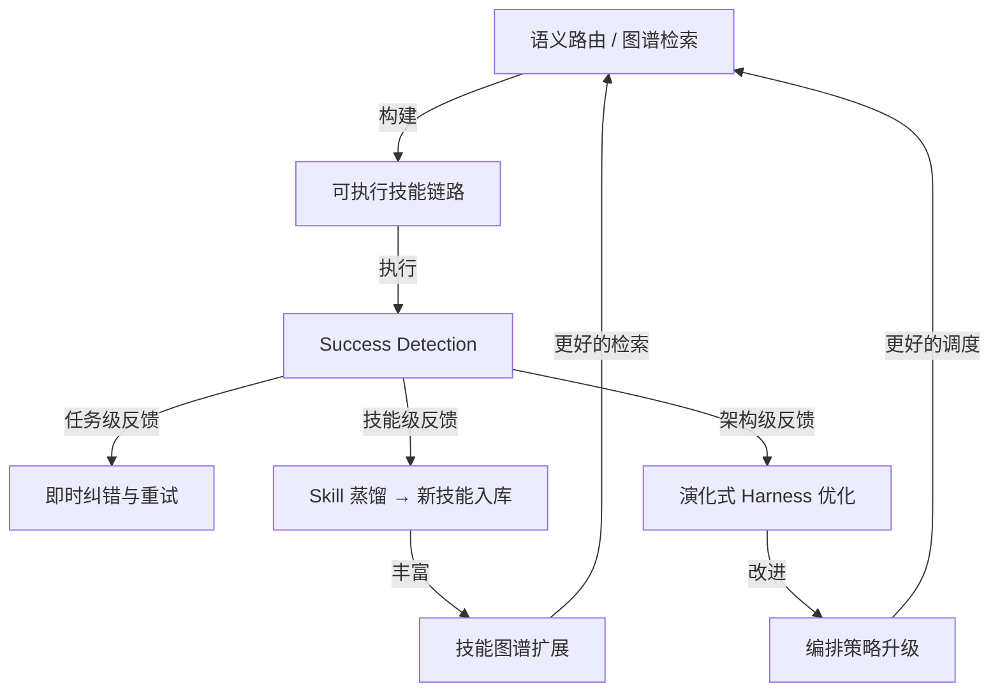

## 研究问题

当 Agent 的技能库从十几个增长到数百甚至上千个时，**如何把离散的 Skill 组合成可执行的任务链路**，以及**这些链路如何通过反馈闭环实现自动优化**？本文综合 20 个跨越「Agent 技能」与「Agent 编排」的概念，聚焦两个被现有 synthesis 未充分覆盖的维度：技能组合的链路构建机制，与组合后管线的演化式自优化。

> 与 [Agent 技能与编排的耦合设计：从静态工具列表到运行时能力自组织的架构演进](syntheses/Agent 技能与编排的耦合设计：从静态工具列表到运行时能力自组织的架构演进.md) 的区分：该文关注技能与编排的耦合模式（静态→动态→自组织），本文关注的是**耦合之后**发生的事——Skill 如何被拼装成可执行链路、链路如何自动变得更好。

## 综合分析

### 一、Skill 组合的三种链路构建范式

技能从孤立调用到组合执行，需要回答一个核心问题：**给定任务，该加载哪些 Skill、以什么顺序、哪些可以并行？** 从已有概念中，可以提炼出三种递进的链路构建范式：

| **范式** | **链路构建方式** | **核心概念** | **优势** | **瓶颈** |

| --- | --- | --- | --- | --- |

| **语义路由** | 从技能库中检索 Top-K，注入 Agent 上下文 | [Untitled](concepts/SkillRouter.md)、[Untitled](concepts/动态工具发现.md) | 简单直接，适配现有 Agent 框架 | 只找到"相似"技能，可能漏掉执行依赖 |

| **依赖图谱** | 离线构建技能有向图，在线沿依赖边检索完整链路 | [Untitled](concepts/Graph of Skills.md)、[Untitled](concepts/逆向感知图谱扩散.md) | 补齐底层依赖，保证链路可执行 | 依赖图谱质量决定上限 |

| **阶段编排** | 按工作流阶段预定义技能槽位，Coordinator 动态填充 | [Untitled](concepts/阶段导演技能.md)、[Untitled](concepts/Coordinator 技能.md)、[Untitled](concepts/工具并发分类.md) | 结构清晰，支持并发优化 | 阶段划分依赖先验知识 |

**关键洞察：三种范式并非互斥，而是可以分层组合。** 例如，一个视频生产管线可以在顶层使用阶段编排（research → script → edit → compose），在每个阶段内部使用 Graph of Skills 检索所需的技能依赖链，再由 SkillRouter 对候选技能做最终排序。

### 二、链路内部的执行治理

技能组合成链路后，执行层面临三个治理问题：

**粒度选择：什么该是 Skill，什么不该是？**

[Agent-Skill-Script 三层架构](concepts/Agent-Skill-Script 三层架构.md) 提出了清晰的判断标准：逻辑固定的下沉为 Script，需要泛化但不需要自主决策的封装为 Skill，需要动态规划的才交给 Agent。[Agent 封装粒度](concepts/Agent 封装粒度.md) 进一步指出，封装粒度选择本质上是架构决策——过度封装导致调用开销膨胀，封装不足则复用率低下。

**确定性边界：哪些环节不能交给模型？**

[确定性工具](concepts/确定性工具.md) 指出 Agent 系统中存在一条「确定性边界」：模型负责"做什么"的决策，但查询、计算、校验等需要精确可复现的步骤必须由确定性工具承接。在技能组合链路中，这意味着每个 Skill 内部也需要区分哪些子步骤由 LLM 处理、哪些由硬编码逻辑执行。

**并发安全：哪些技能可以同时跑？**

[工具并发分类](concepts/工具并发分类.md) 提出的只读/写入分类机制直接决定了链路的并发策略。在阶段编排范式中，同一阶段内的只读型技能（搜索、抓取、分析）可以并发，写入型技能（代码修改、状态更新）必须串行。这不是单个 Skill 的属性，而是编排层的调度决策。

### 三、从执行到优化：反馈驱动的三层闭环

技能组合链路建好只是起点。真正的竞争优势在于链路能否**自动变得更好**。从已有概念中，可以提炼出三层递进的自优化闭环：

第一层：任务级反馈——成功检测与即时纠错

[Success Detection](concepts/Success Detection.md) 提供了最基础的闭环：在每个 Skill 执行后判断"是否真正完成"，决定重试、纠错还是继续。[反馈控制](concepts/反馈控制.md) 将这种机制概括为反馈控制——通过测试、lint、校验等 Sensor 检测偏差并拉回目标。

这一层解决的是**单次执行**的质量问题。

第二层：技能级反馈——蒸馏沉淀与自我改进

[self-improving-agent](concepts/self-improving-agent.md) 描述了一种更深层的闭环：Agent 在执行后自动复盘，将成功模式提炼为新的 Skill。[Skill 蒸馏](concepts/Skill 蒸馏.md) 将这个过程系统化为 Skill 蒸馏——从源码、行为或专家知识中提取设计原则，打包为可安装的标准化技能。

[心智模型蒸馏](concepts/心智模型蒸馏.md) 甚至将蒸馏对象扩展到人的认知框架，把"思考方式"而非仅仅"操作步骤"封装为可调用技能。而 [反蒸馏](concepts/反蒸馏.md) 则揭示了蒸馏的对抗面——当技能成为可共享资产，保护核心知识产权的需求催生了反蒸馏技术。

这一层解决的是**技能库**的持续膨胀和质量提升。

第三层：架构级反馈——编排策略的演化式优化

[策略自我进化](concepts/策略自我进化.md) 描述了最高层的闭环：系统根据真实执行结果自动复盘、归因并调整决策规则。[演化式 Harness 优化](concepts/演化式 Harness 优化.md) 将进化算法应用到 Agent harness 设计上——通过选择、变异、交叉与代际知识传递，持续寻找更优的提示、工具配置与编排方式。

[Advisor Tool](concepts/Advisor Tool.md) 揭示了这一层的一个关键机制：在遇到高难决策点时，主模型可以按需调用更强模型作为顾问，获取指导后再继续执行。这意味着优化不仅来自执行后的复盘，也来自执行中的实时咨询。

这一层解决的是**编排架构本身**的持续进化。

### 四、组合与优化的飞轮效应

三种链路构建范式和三层优化闭环之间存在正向飞轮：

**飞轮的核心动力**：每一次成功执行都可能蒸馏出新技能，新技能扩展了 Graph of Skills 的节点和边，更丰富的图谱让下一次检索组合更精准；同时，演化式优化持续改进编排策略，让同样的技能组合产出更好的结果。

但飞轮也有刹车：

- **Agent Drift**（[Agent Drift](concepts/Agent Drift.md)）：当外部 API 变化时，已蒸馏的 Skill 会过时，需要运行时文档注入来缓解

- **上下文隔离**（[Sub agent 上下文隔离](concepts/Sub agent 上下文隔离.md)）：飞轮产生的中间噪音必须被隔离在子线程中，否则会污染主执行流

- **反蒸馏阻力**：在团队环境中，核心知识的保护需求可能抑制技能共享，减缓飞轮速度

### 五、实践路径：从当前到自优化管线的三步跃迁

| **阶段** | **组合能力** | **优化能力** | **关键行动** |

| --- | --- | --- | --- |

| **阶段 1：结构化组合** | 阶段导演 + 手动技能分配 | Success Detection + 人工复盘 | 把现有工作流拆成阶段技能文件，为每个 Skill 添加完成态判断 |

| **阶段 2：动态组合** | SkillRouter + 并发分类 | self-improving-agent + Skill 蒸馏 | 引入语义路由自动选择技能，建立执行后自动蒸馏管线 |

| **阶段 3：演化组合** | Graph of Skills + Coordinator 自组织 | 策略自我进化 + 演化式 Harness 优化 | 构建技能依赖图谱，让编排策略通过进化算法持续迭代 |

## 关键发现

> **💡** **发现 1：技能组合的核心瓶颈不是检索精度，而是依赖完整性。** SkillRouter 能找到最相关的技能，但 Graph of Skills 揭示了一个更深的问题：顶层求解器依赖底层解析器和预处理器，传统检索容易漏掉这些不"相似"但执行必需的底层依赖。逆向感知图谱扩散正是为了解决这个问题。

> **💡** **发现 2：三层优化闭环的投资回报率递增但实施难度也递增。** 任务级反馈（Success Detection）几乎零成本就能加入；技能级反馈（Skill 蒸馏）需要标准化的技能格式和蒸馏管线；架构级反馈（演化式 Harness 优化）需要 benchmark 驱动的实验基础设施。建议按层递进投入。

> **💡** **发现 3：Agent-Skill-Script 三层架构是组合优化的前提。** 如果所有任务都直接交给 Agent，就没有稳定的 Skill 单元可供组合和优化。只有先把可确定的逻辑下沉为 Script、把可泛化的模式封装为 Skill，Agent 层才能专注于真正需要动态判断的组合编排。

> **💡** **发现 4：组合与优化的飞轮需要主动对抗 Agent Drift。** 已蒸馏的技能会因外部 API 变化而过时。技能图谱需要内建"新鲜度"机制——定期验证技能的可执行性，失效的技能自动降权或触发重新蒸馏。

> **💡** **发现 5：Advisor Tool 揭示了优化的实时维度。** 传统优化都是事后复盘，但 Advisor Strategy 允许执行中按需调用更强模型。这意味着优化不仅发生在"执行后"，也发生在"执行中"——高难度的组合决策可以在运行时获得即时指导。

## 来源列表

### 核心概念（组合维度）

- [Graph of Skills](concepts/Graph of Skills.md)

- [SkillRouter](concepts/SkillRouter.md)

- [逆向感知图谱扩散](concepts/逆向感知图谱扩散.md)

- [Coordinator 技能](concepts/Coordinator 技能.md)

- [阶段导演技能](concepts/阶段导演技能.md)

- [工具并发分类](concepts/工具并发分类.md)

- [动态工具发现](concepts/动态工具发现.md)

- [Agent 封装粒度](concepts/Agent 封装粒度.md)

- [确定性工具](concepts/确定性工具.md)

- [Sub agent 上下文隔离](concepts/Sub agent 上下文隔离.md)

- [Agent-Skill-Script 三层架构](concepts/Agent-Skill-Script 三层架构.md)

### 核心概念（优化维度）

- [self-improving-agent](concepts/self-improving-agent.md)

- [Skill 蒸馏](concepts/Skill 蒸馏.md)

- [心智模型蒸馏](concepts/心智模型蒸馏.md)

- [反蒸馏](concepts/反蒸馏.md)

- [策略自我进化](concepts/策略自我进化.md)

- [演化式 Harness 优化](concepts/演化式 Harness 优化.md)

- [反馈控制](concepts/反馈控制.md)

- [Success Detection](concepts/Success Detection.md)

- [Advisor Tool](concepts/Advisor Tool.md)

- [Agent Drift](concepts/Agent Drift.md)

### 相关 Synthesis

- [Agent 技能与编排的耦合设计：从静态工具列表到运行时能力自组织的架构演进](syntheses/Agent 技能与编排的耦合设计：从静态工具列表到运行时能力自组织的架构演进.md)（技能-编排耦合模式，本文的前序讨论）

- [AI Agent 编排模式全景：从单体循环到自进化集群的架构演进与设计权衡](syntheses/AI Agent 编排模式全景：从单体循环到自进化集群的架构演进与设计权衡.md)（编排架构全景）

- [AI Agent 技能生态全景：从静态工具到自进化能力系统的设计范式与落地路径](syntheses/AI Agent 技能生态全景：从静态工具到自进化能力系统的设计范式与落地路径.md)（技能生态全景）

- [Agent 技能从静态封装到工作流原子的演进路径：能力获取、蒸馏复用与质量治理的三重架构分层](syntheses/Agent 技能从静态封装到工作流原子的演进路径：能力获取、蒸馏复用与质量治理的三重架构分层.md)（技能演进路径）

## 行动建议

1. **为 Wiki 知识库的编译管线引入 Graph of Skills 思路**：当前的 Wiki Synthesizer 是线性扫描标签交叉，可以尝试构建概念间的依赖图谱，让 synthesis 生成时自动补齐关联概念而非仅依赖标签匹配。

1. **在 OpenClaw 项目中实现 Skill 蒸馏自动化管线**：每次 Agent 成功完成复杂任务后，自动触发蒸馏流程，将成功模式提炼为新的 Skill 文件并提交到技能库。

1. **为关键 Skill 添加 Success Detection 断言**：从最常用的 5-10 个 Skill 开始，为每个 Skill 定义明确的"完成态"判断标准，让 Agent 在执行后能自主判断是否需要重试。

1. **探索 Advisor Strategy 在技能组合决策中的应用**：在 Coordinator 需要从 50+ 候选技能中选择组合方案时，调用更强模型作为顾问，降低组合决策的错误率。
