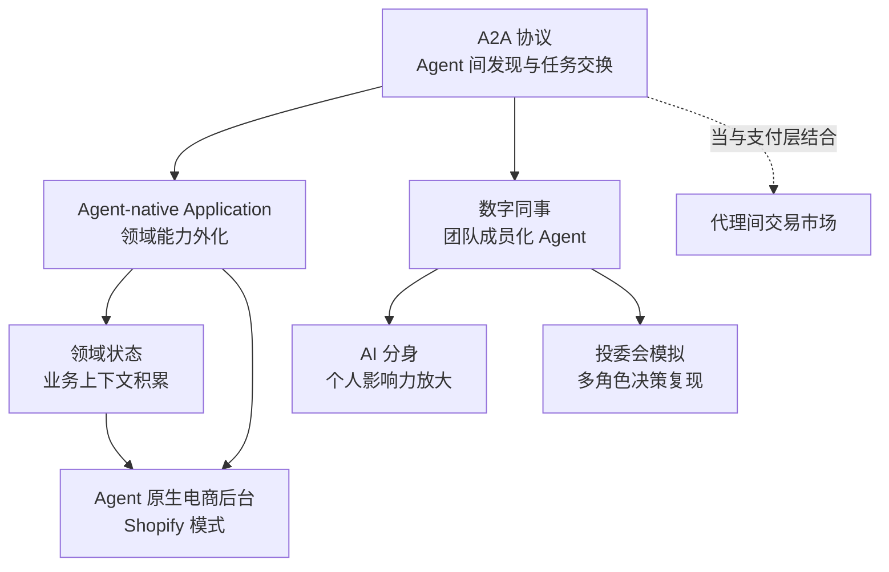

## 研究问题

**Agent 编排模式是如何从纯技术架构演化为商业基础设施的？多智能体协作的不同组织形态（数字同事、AI 分身、投委会模拟等）背后存在怎样的商业化逻辑和护城河结构？**

本综合分析聚焦「Agent 编排 × 商业/生态」交叉地带的 7 个概念，试图厘清技术编排能力向商业价值转化的路径与关键变量。

## 综合分析

### 一、七个概念的定位光谱：从协议层到应用层

| **层级** | **概念** | **核心功能** | **商业化指向** |

| --- | --- | --- | --- |

| **协议层** | A2A 协议 | Agent 间发现、任务发送与结果交换 | 代理间交易市场、能力分发网络 |

| **架构层** | Agent-native Application、领域状态 | 领域能力外化为 Agent 可调用服务；业务状态持久化 | 垂直 SaaS 的 Agent 化改造 |

| **角色层** | 数字同事、AI 分身 | Agent 作为团队成员或个人代理参与协作 | 人力替代与影响力放大 |

| **应用层** | Agent 原生电商后台、投委会模拟 | 具体业务场景的多 Agent 落地 | 垂直场景变现 |

### 二、两种商业化路径：平台化 vs. 角色化

从 7 个概念中可以提炼出两条截然不同的商业化路径：

    > **🏗️** **路径 A：平台化**

      A2A 协议 → Agent-native Application → Agent 原生电商后台

      核心逻辑：把结构化业务能力开放给任意 Agent 调用，平台本身不做 Agent，而是做 Agent 的底层基础设施。

      代表案例：Shopify AI Toolkit 把商品、订单、库存等操作面开放给 Claude Code / Cursor 等外部 Agent。

      护城河：领域状态（业务上下文积累）+ 生态网络效应

    > **👤** **路径 B：角色化**

      数字同事 → AI 分身 → 投委会模拟

      核心逻辑：把 Agent 包装成可感知、可协作的「人格化角色」，进入团队协作或个人影响力放大场景。

      代表案例：Pika AI Self（自拍 + 语音生成数字分身）、TradingAgents（多角色投委会模拟）。

      护城河：人格数据 + 场景深度 + 信任关系

### 三、护城河结构对比

| **维度** | **平台化路径** | **角色化路径** |

| --- | --- | --- |

| 核心资产 | 领域状态（持仓、订单、案件等结构化业务数据） | 人格模型（声音、表达习惯、决策风格） |

| 网络效应 | 强——更多 Agent 接入 → 平台价值越高 | 弱——偏个人化，难以形成网络效应 |

| 可复制性 | 低——领域状态和基础设施不可移植 | 中——人格模型存在被模仿风险 |

| 商业模式 | API 调用计费、交易抽成 | 订阅制、按场景/时间计费 |

| 监管风险 | 数据合规、操作审计 | 身份伪造、知情同意、误代表达 |

| 与 HITL 的关系 | 权限边界 + 回滚机制（审核节点） | 对外沟通边界 + 责任认定机制 |

### 四、A2A 协议作为连接枢纽

A2A 协议处于整个图谱的枢纽位置：**向左连接平台化路径**（让 Agent-native Application 可以被任意外部 Agent 发现和调用），**向右连接角色化路径**（让数字同事和 AI 分身可以跨组织协作）。当 A2A 与支付层结合时，还能催生代理间交易市场——这正是 OpenClaw 生态已经在探索的方向。

### 五、「Agent-native Application」与「Agent OS」的分野

一个值得特别关注的架构判断：Agent-native Application 明确选择 **不竞争通用 Agent OS**，而是把自己定位为「跑在 Agent 上的应用」。这意味着：

- 护城河不在 Prompt 或模型调用，而在 **领域状态、基础设施和规模经济**

- 复杂业务逻辑由外部服务承接，减轻 Agent 上下文负担

- Anthropic 的 Managed Agents 走的是 OS 路线（session、harness、sandbox 解耦），而 Shopify 走的是 Application 路线（开放业务操作面给外部 Agent）

这两者不矛盾，反而形成互补：**OS 层提供执行基础设施，Application 层提供领域能力和状态。**

## 关键发现

> **💡** **发现 1：编排模式的商业化拐点在于「领域状态」的积累深度。** Agent-native Application 和 Agent 原生电商后台都指向同一个结论——真正不可替代的不是 Agent 本身，而是它在服务过程中积累的结构化业务状态。这些状态越深，切换成本越高，护城河越宽。

> **💡** **发现 2：「数字同事」和「AI 分身」的差异不在技术，而在组织关系。** 前者强调的是 Agent 在团队中的「职责」（汇报、授权、复核），后者强调的是个人的「人格复制」（形象、声音、表达习惯）。这意味着它们需要完全不同的信任建立机制和治理框架。

> **💡** **发现 3：投委会模拟揭示了一种被低估的编排价值——「观点冲突的显式化」。** 传统多 Agent 编排追求高效协作，但投委会模式刻意制造角色间的分歧和辩论。这种「对抗性编排」在需要高质量决策的场景（战略分析、风险研判）中可能比协作式编排更有价值。

> **💡** **发现 4：A2A 协议 + 支付层的组合，正在催生「Agent 经济」的雏形。** 当 Agent 可以自主发现其他 Agent、发送任务并支付报酬时，本质上形成了一个机器对机器的服务市场。OpenClaw 生态中已有月流水百万美元级别的代理间交易，这不再是概念验证。

> **💡** **发现 5：平台化路径的真正门槛不是「接入模型」，而是「权限、审计、回滚」。** Shopify 案例中反复强调的是——一旦 Agent 可以直接操作后台，权限边界、操作审计和错误回滚必须成为默认能力。这恰恰是当前大多数 Agent 产品最薄弱的环节。

## 来源列表

### 概念页面

- [A2A 协议](concepts/A2A 协议.md)

- [Agent 原生电商后台](concepts/Agent 原生电商后台.md)

- [数字同事](concepts/数字同事.md)

- [AI 分身](concepts/AI 分身.md)

- [投委会模拟](concepts/投委会模拟.md)

- [Agent-native Application](concepts/Agent-native Application.md)

- [领域状态](concepts/领域状态.md)

### 摘要页面

- [摘要：Anthropic 的 Agent OS 野心：从 Managed Agents 看未来 Agent 基础设施](summaries/摘要：Anthropic 的 Agent OS 野心：从 Managed Agents 看未来 Agent 基础设施.md)

- [摘要：Shopify刚放了个大招，绝大多数人估计半年后才会反应过来。](summaries/摘要：Shopify刚放了个大招，绝大多数人估计半年后才会反应过来。.md)

- [摘要：用 50 行 Python 跑通 Google A2A 协议：Hermes + OpenClaw 的多 Agent 互联实践](summaries/摘要：用 50 行 Python 跑通 Google A2A 协议：Hermes + OpenClaw 的多 Agent 互联实践.md)

- [摘要：微信支付推出 AI 原生接入 Skills：一句话完成支付接入](summaries/摘要：微信支付推出 AI 原生接入 Skills：一句话完成支付接入.md)

- [摘要：Unusual Whales MCP：让 Claude 和 Cursor 直接调用专业美股交易数据](summaries/摘要：Unusual Whales MCP：让 Claude 和 Cursor 直接调用专业美股交易数据.md)

## 行动建议

> **🎯** **建议 1：在 OpenClaw 工作流中显式引入「领域状态」持久化层。** 当前 OpenClaw 的多 Agent 编排偏重任务执行，但如果能在每个 Agent 交互后沉淀结构化的业务状态（而非仅仅保存会话历史），就能构建出不可替代的长期价值。具体可以从 Tizer 的内容管线开始：为每篇文章积累编辑偏好、风格基线、受众反馈等领域状态。

> **🎯** **建议 2：探索「对抗性编排」模式在内容质量把控中的应用。** 投委会模拟的思路可以迁移到 Tizer 的内容审核流程：让不同角色的 Agent（事实核查员、风格审核员、受众代表）对同一篇内容进行多角度评审，用观点冲突替代单一模型的自我评估，提高输出质量。

> **🎯** **建议 3：关注 A2A 协议的标准化进展，评估 OpenClaw Agent 接入 A2A 生态的时机。** 当 A2A 成为事实标准时，能被外部 Agent 发现和调用的 OpenClaw 技能将获得远超当前生态范围的分发能力。早期接入意味着在标准制定中获得话语权。
