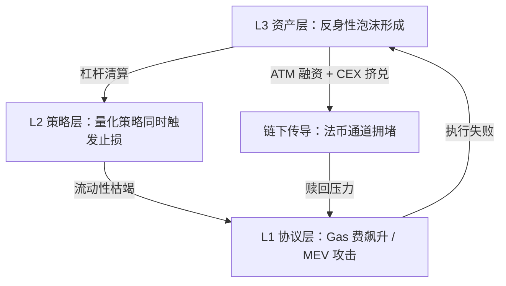

## 研究问题

加密资产、量化交易与链上协议三个标签各自拥有丰富的 concept/entity 条目（37/33/20），且两两交集均≥5。但此前的 synthesis 仅覆盖了 Crypto/DeFi 的宏观全景，从未深入这三个子领域的**三角互动**。本文试图回答：链上协议提供的透明数据基底、量化交易提炼的策略逻辑、加密资产承载的价值载体，三者之间存在怎样的**信号传导链路、风险传染路径和价值捕获闭环**？只有同时看三条边才能发现哪些盲区？

**三角验证**：

- 加密资产 ∩ 链上协议 = 15 个共享 concept/entity

- 加密资产 ∩ 量化交易 = 11 个共享 concept/entity

- 量化交易 ∩ 链上协议 = 5 个共享 concept/entity

## 综合分析

### 一、三层架构：协议→信号→策略的垂直传导

这三个标签并非平行关系，而是构成一个**垂直传导栈**：

| **层级** | **角色** | **代表 concept/entity** | **核心功能** |

| --- | --- | --- | --- |

| **L1 协议基底层**（链上协议） | 数据源 + 执行环境 | DeFiLlama、Fiat24、Barker、Helix | 提供链上状态的透明读取接口和交易执行的原子性保障 |

| **L2 信号提炼层**（量化交易） | 策略引擎 + 风险评估 | MVRV Z-Score、Bregman 投影、统计套利、整数规划 | 从链上原始数据中提炼可交易信号，构建风险调整后的策略 |

| **L3 资产承载层**（加密资产） | 价值载体 + 市场结构 | BTC 本位储备、ATM 融资、STRC、宏观流动性 | 承载策略执行的结果，形成市场结构和流动性格局 |

关键洞察：**信息流是自下而上的**（协议→信号→资产定价），但**风险传染是自上而下的**（资产崩盘→策略失效→协议拥堵）。这种不对称性是理解整个三角的核心。

### 二、三条边的互动机制

边 1：链上协议 × 量化交易（信号提取边）

链上协议为量化交易提供了传统金融不具备的**透明数据层**：

- **链上选币**：利用链上协议的公开数据（流动性、持仓结构、叙事热度）做候选发现和风险过滤

- **鲸鱼跟单**：利用链上地址的透明性追踪大额钱包，但延迟优势决定了策略的实际盈利能力

- **AI Wallet Matcher**：用算法扫描链上钱包表现，筛出高胜率交易者

- **延迟优势**：链上信息到达的时间差构成了量化策略的核心竞争力

> **⚠️** **三角视角的独特发现**：链上协议的透明性是一把双刃剑——它既为量化交易提供了信息优势（任何人都能看到鲸鱼动向），也同时消除了信息优势（所有人都能看到同样的数据）。延迟优势因此成为这条边上唯一可持续的竞争壁垒，而延迟优势的衰减速度取决于 L3 资产层的参与者密度。

边 2：加密资产 × 链上协议（价值锚定边）

加密资产通过链上协议获得可验证的价值基底：

- **稳定币 + 链上协议**（Fiat24、Barker）：法币价值通过智能合约锚定到链上

- **DeFiLlama**：为加密资产提供全协议 TVL 的标准化评估框架

- **BTC 本位储备**：通过链上可验证的储备证明构建资产信任

边 3：加密资产 × 量化交易（策略-标的边）

量化策略的设计必须适配加密资产的独特市场结构：

- **反身性风险**：价格、融资能力和市场预期的自我强化回路，在加密资产中尤为剧烈

- **MVRV Z-Score**：链上指标用于判断 BTC 资产的估值区间

- **宏观流动性**：全球流动性周期决定加密资产的整体方向

### 三、只在三角中可见的涌现模式

涌现 1：「透明性悖论」的三层放大

> **🔻** **链上协议的透明性**在三个层级产生了矛盾效应：
- L1（协议层）：透明性是信任基础——任何人都能验证链上状态
- L2（策略层）：透明性消灭alpha——当所有人都能看到鲸鱼动向，跟单策略趋同
- L3（资产层）：策略趋同导致反身性——同质化跟单放大了价格波动
**这形成了一个自我否定的回路**：协议层的透明性（优势）→ 策略层的趋同性（劣势）→ 资产层的脆弱性（风险）→ 对更好协议层隐私机制的需求（回到起点）

涌现 2：「延迟-流动性-反身性」三角博弈

三个标签各自描述的核心机制，在三角视角下形成了一个博弈模型：

| **参与者** | **核心资源** | **依赖的层级** | **与其他参与者的博弈关系** |

| --- | --- | --- | --- |

| **快速套利者** | 延迟优势（量化交易） | L1 链上协议的实时数据 | 提供流动性但加速信息衰减 |

| **鲸鱼/聪明钱** | 资金规模（加密资产） | L3 资产层的市场深度 | 被追踪降低了操作隐蔽性 |

| **协议开发者** | 基础设施控制（链上协议） | L1 协议层的规则制定 | 透明性设计同时服务和伤害两类用户 |

**博弈均衡点**：当快速套利者过多时，延迟优势消失，资金流向更不透明的链或协议；当透明度降低时，鲸鱼跟单策略失效，量化交易生态萎缩；当量化交易萎缩时，流动性下降，资产波动加剧。**这个三角中不存在稳定均衡，只有动态振荡**——这解释了加密市场周期性的「叙事切换」现象。

涌现 3：AI Agent 作为三层的粘合剂

当前涌现的多个 concept/entity 暗示 AI Agent 正在成为连接三层的关键基础设施：

- **AutoDarwin**（链上协议×量化交易）：策略自我进化的 Agent，连接 L1 和 L2

- **OKX Agent Trade Kit**（量化交易×加密资产×链上协议）：MCP 工具包打通三层

- **多 Agent 投研框架**（量化交易×Agent协作）：多角色协作的链上研究系统

- **D0**（量化交易×AI产品）：AI 驱动的量化交易产品

这些 Agent 系统正在尝试解决三角的核心矛盾：**用 AI 在透明数据上寻找非共识信号**——不是追踪已知鲸鱼，而是发现尚未被主流关注的链上模式。

### 四、风险传导图谱

三角视角揭示了风险在三层之间的传导路径：

**关键风险节点**：

- **反身性风险** × **CEX 挤兑**：资产价格下跌触发杠杆清算，清算触发更多抛售（L3→L2 传导）

- **延迟优势丧失** × **策略趋同**：所有量化策略同时触发信号，流动性瞬间枯竭（L2→L1 传导）

- **协议拥堵** × **MEV 攻击**：交易执行失败进一步恶化价格发现（L1→L3 传导）

## 关键发现

> **💡** **发现 1：加密资产、量化交易和链上协议构成一个垂直传导栈（协议→信号→资产），信息自下而上流动，但风险自上而下传染。** 这种不对称性意味着：协议层的改进（更好的数据接口）能提升全栈效率，但资产层的崩溃会瞬间摧毁整个栈。防御的关键在 L2 策略层——它是连接两个方向的阀门。

> **💡** **发现 2：链上透明性产生了一个「自我否定的回路」——透明性→策略趋同→反身性放大→对隐私的需求→回到起点。** 这个回路解释了为什么每一轮牛市都会产生新的「链上分析工具」热潮，但这些工具的 alpha 会在一个周期内被完全稀释。可持续的竞争优势不在于更快地读取链上数据，而在于**构建链上数据无法直接获取的信号**（如社交情绪、链下资金流）。

> **💡** **发现 3：三角中不存在稳定均衡，只有「延迟-流动性-反身性」的动态振荡，这是加密市场周期性叙事切换的结构性根源。** 快速套利者、鲸鱼和协议开发者的三方博弈不会收敛到均衡点——每方的最优策略都依赖于其他两方的行为，而行为本身又不断变化。

> **💡** **发现 4：AI Agent 正在成为三层之间的粘合剂，但其真正价值不是加速已有的信号提取（这只会加速 alpha 衰减），而是构建跨层的非共识信号——在透明数据上发现尚未被主流关注的模式。** AutoDarwin 的「策略自进化」和 OKX Agent Trade Kit 的三层打通，代表了这个方向的早期探索。

> **💡** **发现 5：反身性风险在三角中被三层放大——资产层的杠杆清算触发策略层的止损趋同，止损趋同触发协议层的拥堵和 MEV 攻击，执行失败进一步恶化资产价格。** 传统金融的「断路器」机制在链上不存在，这使得三层传导的速度远快于任何人工干预的反应时间。

## 来源列表

### 三角交集核心 concept/entity（同属三个标签）

- [AI Wallet Matcher](concepts/AI Wallet Matcher.md)

- [MVRV Z-Score](concepts/MVRV Z-Score.md)

- [链上选币](concepts/链上选币.md)

- [鲸鱼跟单](concepts/鲸鱼跟单.md)

### 加密资产 × 量化交易

- [反身性风险](concepts/反身性风险.md)

- [宏观流动性](concepts/宏观流动性.md)

- [恐惧与贪婪指数](concepts/恐惧与贪婪指数.md)

- [Polymarket Analytics](concepts/Polymarket Analytics.md)

- [Donut](entities/Donut.md)

### 量化交易 × 链上协议

- [延迟优势](concepts/延迟优势.md)

- [TradingAgents-CN](entities/TradingAgents-CN.md)

### 加密资产 × 链上协议

- [DeFiLlama](entities/DeFiLlama.md)

- [Fiat24](entities/Fiat24.md)

- [Barker](entities/Barker.md)

### 单标签核心 concept/entity

- [Bregman 投影](concepts/Bregman 投影.md)

- [统计套利](concepts/统计套利.md)

- [整数规划](concepts/整数规划.md)

- [BTC 本位储备](concepts/BTC 本位储备.md)

- [ATM 融资](concepts/ATM 融资.md)

- [CEX 挤兑](concepts/CEX 挤兑.md)

- [OKX Agent Trade Kit](entities/OKX Agent Trade Kit.md)

- [AutoDarwin](entities/AutoDarwin.md)

- [多 Agent 投研框架](concepts/多 Agent 投研框架.md)

- [STRC](entities/STRC.md)

## 行动建议

1. **在 OpenClaw 的量化交易 Agent 中实现「非共识信号层」**：当前大多数链上分析工具都在追踪已知的鲸鱼地址和公开指标（MVRV、恐贪指数），这些信号的 alpha 正在快速衰减。建议构建一个专门提取**链上数据无法直接获取的信号**的模块——融合社交情绪（Twitter/Discord 语义分析）、链下资金流（CEX 出入金数据）和跨链行为模式。这是唯一能在透明性悖论下保持竞争优势的路径。

1. **为量化策略建立「三层风险传导仪表板」**：基于本文发现的 L3→L2→L1 风险传导路径，构建一个实时监控面板，同时追踪：(a) 资产层的杠杆率和清算阈值分布，(b) 策略层的信号趋同度（有多少策略在同一方向），(c) 协议层的 Gas 费和 MEV 活跃度。当三层指标同时恶化时自动触发降仓或对冲。

1. **探索 AutoDarwin 的「策略自进化」模式在内容管线中的迁移应用**：AutoDarwin 让链上交易策略像生物一样自我进化的设计范式，可以迁移到 Tizer 的内容编译管线中——让内容选题策略也具备自进化能力，基于历史表现数据自动调整选题权重和发布时机。
