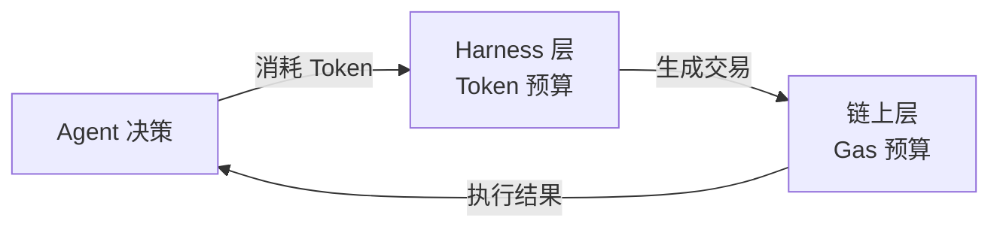

## 研究问题

本文以已有的三标签 synthesis [加密资产链上交易的三层闭环：从协议基底到量化策略的信号传导、风险传染与价值捕获路径](syntheses/加密资产链上交易的三层闭环：从协议基底到量化策略的信号传导、风险传染与价值捕获路径.md)（加密资产 × 量化交易 × 链上协议）为锚点，引入远距离标签 **Harness 工程**。

Harness 工程与三个锚点标签的交集均为 0（远距离条件≤ 3 ✅），但 Harness 工程自身拥有 71 个 concept/entity 条目（≥ 5 ✅）。

本文试图回答：**链上协议的治理机制（Gas 计量、智能合约验证、协议升级）与 Agent Harness 的运行时治理（Token 预算、执行护栏、热插拔组件）之间是否存在可迁移的结构同构？这种同构能否为两个看似无关的领域提供设计灯塔？**

## 综合分析

### 一、为什么引入 Harness 工程：远距离标签的方法论

加密资产 × 量化交易 × 链上协议的三角已在锚点 synthesis 中被充分分析：信号自下而上流动（协议→信号→资产定价），风险自上而下传染（资产崩盘→策略失效→协议拥堵）。但这个三角内部缺乏一个视角：**「执行前验证」和「资源计量」的架构模式**。这恰恰是 Harness 工程的核心关切。

两个领域的交集为 0，但它们独立解决了相同的结构性问题：如何在不可信环境中确保执行的安全性、可预测性和资源有界性。

### 二、三组结构同构

| **同构维度** | **链上协议侧** | **Harness 工程侧** | **共享的设计压力** |

| --- | --- | --- | --- |

| **同构一：资源计量** | Gas 机制：每个操作消耗可量化的 Gas，上限由 Gas Limit 约束 | Token 预算：每次 LLM 调用消耗可量化的 Token，上限由上下文窗口约束 | 如何在有限资源下最大化执行效果 |

| **同构二：执行前验证** | 智能合约验证：签名、权限、状态校验在执行前完成 | 执行护栏：[Untitled](concepts/Agent OS.md) 的沙箱、[Untitled](concepts/Hands 机制.md)的安全设计层 | 如何在执行前确保操作的合法性和安全性 |

| **同构三：可升级性** | 代理合约模式：通过代理层实现协议升级，保持向后兼容 | 热插拔组件：Skill 系统、插件架构实现能力热更新 | 如何在不停机的情况下演进系统能力 |

### 三、同构一详解：Gas 计量 ↔ Token 预算——资源有界性的物理学

链上协议和 Agent Harness 都面临同一个核心约束：**每个操作都有可量化的成本，而总资源有上限**。

- **Gas 机制**：每个 EVM 操作码有确定性的 Gas 成本（SSTORE=20000, ADD=3），交易发起者设定 Gas Limit。超过限额，交易回滚但 Gas 不退。

- **Token 预算**：每次 LLM 调用消耗 Token（输入+输出），受上下文窗口约束。超过窗口，信息被截断或压缩。

> **⚡** **结构同构的深层含义**：两个系统都将「执行资源」抽象为可量化、可交易的单位（Gas/Token），这不是巧合而是必然——任何需要在不可信环境中操作的系统，都必须把资源计量制度化，否则无法防止恶意消耗。Gas 机制防止无限循环攻击链上节点；Token 预算防止 Agent 无限自我对话消耗算力。两者的「成本不可退」特性（Gas 不退、Token 已耗不可回收）也完全一致。

从量化交易视角看，这个同构有直接的实践含义：当量化交易 Agent 在链上执行时，它同时受到两套资源计量系统的约束（Gas + Token）。优化其中一个而忽略另一个会导致系统性失败。

### 四、同构二详解：智能合约验证 ↔ 执行护栏——「先验后执」的通用范式

两个领域都将「验证」作为执行的前置条件：

- **链上协议**：交易执行前验证签名、nonce、余额、状态条件。不满足则拒绝执行。

- **Harness 工程**：Agent 执行前验证权限、输入格式、安全边界。[Hands 机制](concepts/Hands 机制.md) 强调「安全性必须在设计层面构建，因为自主运行时没有人工 last check」。

[Agent OS](concepts/Agent OS.md) 的核心设计理念——Agent 作为进程，拥有独立的调度、资源计量、沙箱隔离，可随时终止——与链上智能合约的设计哲学有深层共鸣。两者都在回答同一个问题：如何让代码（无论是智能合约还是 AI Agent）在无人监督下安全地自主运行」？

从加密资产视角看，链上自主交易 Agent 正在将这两套验证系统**叠加**使用：Harness 层验证 Agent 的意图合法性，协议层验证交易的技术合法性。任何一层的验证失败都会阻止执行。

### 五、同构三详解：代理合约 ↔ 热插拔组件——不停机演进

两个领域都面临「系统运行中如何升级」的挑战：

- **链上协议**：智能合约一旦部署不可修改，因此发明了「代理合约模式」——通过抽象层将逻辑合约与存储合约分离，实现逻辑升级而状态不变。

- **Harness 工程**：Skill 系统、插件架构实现能力热更新。[Hands 机制](concepts/Hands 机制.md) 把每个 Hand 的内容（系统 Prompt、Skill、配置）在编译时打进二进制文件，与代理合约「部署时确定」的哲学如出一辙。

关键差异：链上升级需要治理投票（DAO），Harness 升级通常只需开发者决定。但随着 Agent 自主性增强，Harness 升级也可能需要类似治理投票的机制——这是同构指向的未来。

### 六、三角视角下的涌现模式

涌现 1：「双层资源计量」困境

当量化交易 Agent 在链上执行时，它同时受到两套资源计量系统的约束：

优化 Token 效率（让 Agent 用更少的 LLM 调用做更好的决策）和优化 Gas 效率（让交易用更少的 Gas 执行）是两个独立的优化目标，但它们之间存在耦合：更复杂的策略需要更多 Token 但可能生成更优化的交易（更低 Gas）。这种**双层资源平衡**是只有在四标签视角才能看到的问题。

涌现 2：「双层验证」与「单点失败」

Harness 层验证 Agent 意图的合法性，协议层验证交易的技术合法性。两层验证都通过才能执行。但这也意味着**任何一层的失败都会导致整体失败**——而且失败模式不同：

- Harness 层失败：Agent 被拦截，不产生链上成本（类似“交易未发送”）

- 协议层失败：交易回滚，Gas 不退（产生实际损失）

因此，**Harness 层验证的质量直接决定了链上执行的成本效率**——越好的 Harness 护栏，就能过滤越多会在链上失败的交易，避免不必要的 Gas 損失。

涌现 3：MEV 与上下文操纵的同构

MEV（最大可提取价值）是链上协议层的核心对抗性问题——矿工/验证者可以通过重排序交易来提取价值。Harness 工程中也存在类似的对抗性问题：恶意输入可以通过操纵 Agent 的上下文来「提取」不当行为（prompt injection）。两者都是「信息不对称环境下的排序攻击」。

## 关键发现

> **💡** **发现 1：链上 Gas 计量与 Agent Token 预算的结构同构不是巧合而是必然——任何需要在不可信环境中操作的系统，都必须把资源计量制度化。** Gas 防止无限循环攻击链上节点，Token 预算防止 Agent 无限自我对话消耗算力。两者的「成本不可退」特性是安全设计的核心。

> **💡** **发现 2：链上量化交易 Agent 同时受到 Gas 和 Token 两套资源计量系统的约束，但当前几乎没有系统在做「双层资源联合优化」。** 更复杂的策略需要更多 Token 但可能生成更优化的交易（更低 Gas），这种权衡是四标签视角才能看到的独特问题。

> **💡** **发现 3：Harness 层验证的质量直接决定链上执行的成本效率——越好的 Harness 护栏，就能过滤越多会在链上失败的交易，避免不必要的 Gas 损失。** 这意味着对于链上交易 Agent，Harness 护栏不仅仅是安全措施，更是直接的成本优化工具。

> **💡** **发现 4：MEV（交易排序攻击）与 prompt injection（上下文操纵）是同一种攻击范式的不同表现——两者都是「信息不对称环境下的排序攻击」。** 链上生态 20 年的 MEV 防御经验（PBS、Flashbots、时间锁等）可以为 Harness 工程的对抗性设计提供灯塔。

> **💡** **发现 5：代理合约模式与 Skill 热插拔的同构暗示，随着 Agent 自主性增强，Harness 升级可能也需要类似 DAO 的治理投票机制。** 当 Agent 的 Skill 升级会影响财务后果（如交易策略变更）时，升级决策不能只由开发者单方做出。

## 来源列表

### 锚点三标签 synthesis

- [加密资产链上交易的三层闭环：从协议基底到量化策略的信号传导、风险传染与价值捕获路径](syntheses/加密资产链上交易的三层闭环：从协议基底到量化策略的信号传导、风险传染与价值捕获路径.md)

### 链上协议与量化交易的交叉概念

- [AI Wallet Matcher](concepts/AI Wallet Matcher.md)、[MVRV Z-Score](concepts/MVRV Z-Score.md)、[鲸鱼跟单](concepts/鲸鱼跟单.md)、[链上选币](concepts/链上选币.md)、[延迟优势](concepts/延迟优势.md)

### Harness 工程核心概念

- [Agent OS](concepts/Agent OS.md)、[Hands 机制](concepts/Hands 机制.md)、[Mini-OpenClaw](entities/Mini-OpenClaw.md)、[cc-harness](entities/cc-harness.md)

### 加密资产系统性风险

- [反身性风险](concepts/反身性风险.md)、[宏观流动性](concepts/宏观流动性.md)、[交易频率成本侵蚀](concepts/交易频率成本侵蚀.md)

### 链上执行产品

- [Nunchi](entities/Nunchi.md)、[OKX Agent Trade Kit](entities/OKX Agent Trade Kit.md)、[agent-cli](entities/agent-cli.md)、[链上自主交易 Agent](concepts/链上自主交易 Agent.md)、[智能钱包追踪](concepts/智能钱包追踪.md)

### 已有相关 synthesis 参考

- [Order Routing 与 Token Routing 的结构同构：量化交易基础设施如何映射 Agent 运行时的资源调度范式](syntheses/Order Routing 与 Token Routing 的结构同构：量化交易基础设施如何映射 Agent 运行时的资源调度范式.md)（Harness 工程×Agent 协作模式×推理优化×量化交易）

## 行动建议

1. **为链上交易 Agent 构建「Gas+Token 联合预算器」**：当前量化交易 Agent 分别优化 LLM Token 消耗和链上 Gas 消耗，但不考虑两者的耦合。建议设计一个联合优化器：当 Gas 价格高时允许 Agent 花更多 Token 做更精细的策略计算以生成更优化的交易；当 Gas 价格低时降低策略复杂度以节省 Token。

1. **借鉴 MEV 防御经验设计 Agent Harness 的对抗性测试**：链上生态已经发展出成熟的 MEV 防御工具链（Flashbots、PBS 等）。这些工具的核心思想（交易保密提交、公平排序、时间锁）可以迁移到 Harness 工程的对抗性设计中，作为 prompt injection 的防御参考。

1. **探索「Harness 升级治理」机制**：当 Agent 的 Skill 升级直接影响交易策略和财务后果时，升级决策不应只由开发者单方做出。借鉴 DAO 的治理投票机制，可以设计一套「策略升级提案 → 回测验证 → 审批投票 → 渐进部署」的治理流程。
