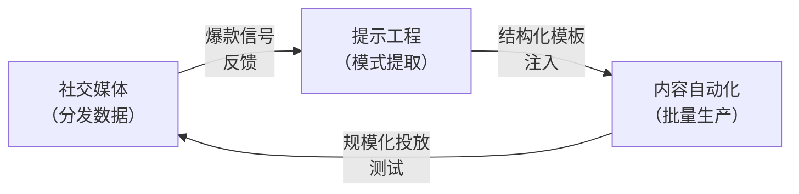

## 研究问题

当社交媒体内容自动化从「用 AI 写一篇文章」演进到「用 AI 运营一个账号」，提示工程在这条路径上扮演了什么结构性角色？具体而言：平台算法约束如何反向塑造提示词设计范式？内容自动化的规模化需求如何将零散 prompt 推向工作流化？而社交媒体的分发反馈又如何构成提示词迭代的信号源？

本综合分析聚焦 **内容自动化 × 社交媒体 × 提示工程** 三条边的交叉地带，试图揭示只有同时观察三个维度才能浮现的架构模式与演进动力。

## 综合分析

### 一、三条边的基本张力

三个标签各自代表一种驱动力：

| **维度** | **核心关切** | **典型约束** |

| --- | --- | --- |

| 提示工程 | 如何让模型输出精准、可控、可复用 | Token 预算、指令遵循精度、风格一致性 |

| 内容自动化 | 如何将单次生成扩展为可重复的生产管线 | 颗粒度设计、质量一致性、成本控制 |

| 社交媒体 | 如何在算法驱动的分发环境中获取注意力 | 平台规则、受众偏好、反检测机制 |

当三者交汇时，出现了一种独特的工程模式：**提示词不再是「写给模型的指令」，而是「编码了平台分发规则的可执行知识资产」**。

### 二、从通用 Prompt 到平台原生表达系统的三层迁移

第一层：Hook 工程化 —— 提示词吸收分发信号

社交平台的核心筛选机制发生在首屏（前 3 秒 / 前 2 行）。这意味着内容的「开头」不是文学问题，而是分发工程问题。Wiki 中的三个三交叉概念精确地反映了这一现象：

- [Hook 提取工作流](concepts/Hook 提取工作流.md) 将爆款内容的首屏结构抽象为可迁移模式，再让模型批量生成同构变体 —— 这是「分发验证 → 模式提取 → 提示词模板化」的闭环

- [Hook Factory](concepts/Hook Factory.md) 围绕同一主题批量生成多个钩子版本，强调「数字+命名实体+直接陈述句」的结构约束 —— 这些约束本质上是平台算法偏好的提示词编码

- [标题公式](concepts/标题公式.md) 将标题写作拆解为可复用的句式模板 —— 这是提示工程从「开放生成」向「约束填充」的范式转变

**关键洞察**：Hook 工程化的本质是将社交平台的隐性分发规则（什么样的开头能通过算法初筛）显式编码进提示词模板。这不是简单的「写好标题」，而是一种**逆向工程分发算法 → 编码为结构化约束 → 注入提示词**的系统工程。

第二层：风格校准 —— 提示词承载人格一致性

规模化社交内容面临的第二个挑战是「像不像真人」。平台算法和受众都对 AI 腔敏感，这催生了一类新的提示工程范式：

- [Voice Calibration](concepts/Voice Calibration.md) 用 5 条高表现历史样本校准模型的句式、用词与语气 —— 这是 few-shot 学习在社交内容场景的专精化应用

- [khazix-writer](concepts/khazix-writer.md) 将写作人格定义为「有见识的普通人在认真聊一件打动他的事」，配套五类文章原型与四层自检体系 —— 这是将人格约束编码为可执行 Skill 的完整方案

- [四层自检体系](concepts/四层自检体系.md) 从硬规则扫描到「人味」终审的分层质检 —— 本质上是提示工程中 Harness 思想在内容质量控制中的迁移应用

**关键洞察**：Voice Calibration 和四层自检共同构成了一个「风格约束 ↔ 风格验证」的双向闭环。前者用历史样本注入风格信号，后者用分层审查确保输出不偏离。这个闭环只有在社交媒体场景下才有存在的必要 —— 因为只有持续运营的账号才需要跨内容的风格一致性。

第三层：工作流封装 —— 提示词升级为可编排的能力单元

当 Hook 模板和风格校准稳定后，下一步自然是将它们封装为可调用的工作流节点：

- [提示词工作流化](concepts/提示词工作流化.md) 将零散 prompt 变成稳定可复用的操作单元，是 AI 从「问答工具」走向「任务工具」的关键产品化路径

- [Skill 颗粒度设计](concepts/Skill 颗粒度设计.md) 解决了工作流封装中最关键的边界问题：多细才是最优？答案是「高频且边界明确」

- [SKILL.md](concepts/SKILL.md.md) 是提示工程与上下文管理的交叉：将 Skill 的能力描述、调用协议与上下文依赖固化为文件级配置

**关键洞察**：Skill 颗粒度设计在社交内容场景中呈现出独特的最优解 —— 以「单平台单内容类型」为原子单元（如 tweet-skills、khazix-writer），而非以「写作」这样的通用能力为单元。这是因为不同平台的分发规则、格式约束和受众预期差异太大，强行合并反而增加提示词复杂度和输出不确定性。

### 三、三边交互的涌现结构：反馈驱动的提示词进化

只有同时看三条边，才能发现一个隐藏的反馈回路：

这个回路意味着：

1. **社交媒体的分发数据是提示词进化的选择压力**：哪些 Hook 版本获得了更高播放量，直接反馈为下一轮 Hook 模板的优化方向

1. **提示工程是内容自动化的质量瓶颈**：模板的精度决定了批量生产的上限 —— 模板太宽则输出同质化，太窄则覆盖面不足

1. **内容自动化的规模是社交媒体信号的放大器**：只有足够的投放量级，才能产生统计上有意义的分发反馈，反过来驱动模板迭代

### 四、与已有双标签 Synthesis 的关系

| **已有 Synthesis** | **覆盖边** | **本文补充视角** |

| --- | --- | --- |

| [Untitled](syntheses/社交平台内容自动化的三层管线：当浏览器自动化成为 AI 内容分发的隐性基础设施.md) | 内容自动化 × 社交媒体 × 浏览器自动化 | 该文聚焦「如何发布」（浏览器接管），本文聚焦「如何写出值得发布的内容」（提示工程约束） |

| [Untitled](syntheses/AI 设计语言的提示工程化：从自然语言创意描述到结构化设计约束的范式迁移与同质化陷阱.md) | AI 设计 × 提示工程 × 内容自动化 | 该文从设计语言角度看提示词结构化，本文从平台分发约束角度看提示词专精化 |

| [Untitled](syntheses/AI 内容质量工程方法论：从受控实验到反馈闭环的迭代模式与质量控制基础设施.md) | 内容自动化 × 提示工程 × 身份准入 | 该文关注质量控制基础设施，本文关注质量标准如何由平台算法反向定义 |

## 关键发现

1. **提示词正在成为「平台算法的本地缓存」**：Hook Factory 和 Voice Calibration 等实践表明，高效的社交内容提示词不是凭空设计的，而是从平台分发数据中蒸馏出来的。提示词模板本质上是对平台隐性规则的显式编码 —— 这与 RAG 中将外部知识编码为检索上下文的逻辑同构。

1. **四层自检体系揭示了「AI 腔」的工程定义**：在社交媒体场景下，「质量」不是文学标准，而是「像不像目标人格在说话」。khazix-writer 的四层自检（硬规则 → 风格一致 → 内容质量 → 人味终审）实质上将「像真人」这个模糊需求拆解为可自动化检查的工程标准。

1. **Skill 颗粒度在社交场景下收敛于「平台×内容类型」原子**：通用写作 Skill 在社交内容自动化中效果不佳，因为不同平台（微信公众号 vs. Twitter vs. TikTok）的分发规则差异构成了不可忽略的上下文切换成本。这意味着 Skill 生态在内容创作领域的增长路径是「宽度优先」（覆盖更多平台×类型组合），而非「深度优先」（单个 Skill 变得更通用）。

1. **「样本研究 + 模式复用」正在取代「创意构思 + 原创生成」**：Hook 提取工作流的核心方法论是「先看什么跑通了，再抽象可迁移模式」。这种从归纳到演绎的路径，与传统内容创作「先想好要说什么，再找最好的表达」的路径恰好相反。提示工程在这里充当的是「模式编译器」而非「创意引擎」。

1. **反馈闭环的存在使提示词具备了自进化潜力**：社交分发数据 → 模式提取 → 模板化 → 批量投放 → 分发数据 的闭环意味着，理论上可以构建一个自动化的提示词优化系统，类似于广告投放中的 A/B 测试自动化。当前这个闭环仍主要由人工完成，但技术上已具备全自动化的条件。

## 来源列表

### 三交叉核心概念

- [Hook 提取工作流](concepts/Hook 提取工作流.md)

- [Hook Factory](concepts/Hook Factory.md)

- [khazix-writer](concepts/khazix-writer.md)

### 内容自动化 × 提示工程 边

- [Voice Calibration](concepts/Voice Calibration.md)

- [标题公式](concepts/标题公式.md)

- [提示词工作流化](concepts/提示词工作流化.md)

- [Skill 颗粒度设计](concepts/Skill 颗粒度设计.md)

- [四层自检体系](concepts/四层自检体系.md)

- [SKILL.md](concepts/SKILL.md.md)

- [SCQA 写作框架](concepts/SCQA 写作框架.md)

- [Generator 模式](concepts/Generator 模式.md)

- [GEO 提示词](concepts/GEO 提示词.md)

### 内容自动化 × 社交媒体 边

- [Content Multiplication](concepts/Content Multiplication.md)

- [Feedback Loop](concepts/Feedback Loop.md)

- [内容创作工程化](concepts/内容创作工程化.md)

- [tweet-skills](entities/tweet-skills.md)

- [数据驱动内容选题](concepts/数据驱动内容选题.md)

- [AI爆款工厂](entities/AI爆款工厂.md)

- [Nova](entities/Nova.md)

- [Sage](entities/Sage.md)

### 已有相关 Synthesis

- [社交平台内容自动化的三层管线：当浏览器自动化成为 AI 内容分发的隐性基础设施](syntheses/社交平台内容自动化的三层管线：当浏览器自动化成为 AI 内容分发的隐性基础设施.md)

- [AI 设计语言的提示工程化：从自然语言创意描述到结构化设计约束的范式迁移与同质化陷阱](syntheses/AI 设计语言的提示工程化：从自然语言创意描述到结构化设计约束的范式迁移与同质化陷阱.md)

- [AI 内容质量工程方法论：从受控实验到反馈闭环的迭代模式与质量控制基础设施](syntheses/AI 内容质量工程方法论：从受控实验到反馈闭环的迭代模式与质量控制基础设施.md)

## 行动建议

1. **构建「分发信号 → 提示词模板」的自动化管线**：Tizer 可在 OpenClaw 中配置一个定期任务，从社交平台 API 拉取高表现内容 → 用 LLM 提取 Hook 模式 → 自动更新 Skill 模板库。这将把当前手动的「Hook 提取工作流」升级为持续运行的模板进化系统。

1. **为每个目标平台沉淀独立的 Voice Profile**：基于 Voice Calibration 的方法论，为微信公众号、Twitter/X、小红书等平台各维护一份风格校准文件，作为对应 Skill 的前置上下文。这些 Profile 应纳入知识 Wiki 的管理范围，定期更新。

1. **在 HITL 工作流中引入 A/B 测试反馈节点**：在内容发布前增加一个「多版本生成 + 人工快速筛选」环节，发布后收集分发数据并回写到 Skill 配置中，形成「生成 → 筛选 → 发布 → 反馈 → 模板更新」的完整闭环。
