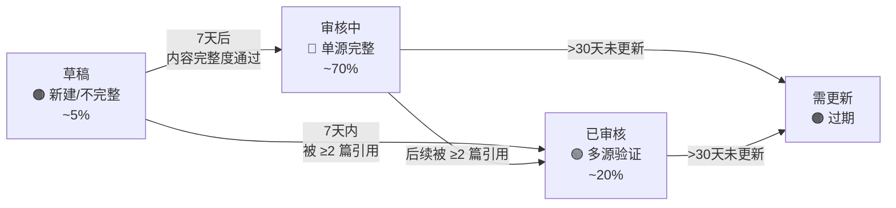
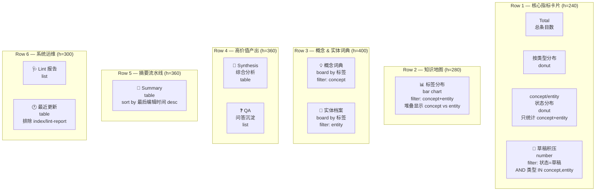

## 📍 背景

2026-04-12 晚的深度审查发现，知识 Wiki 的状态体系和 Dashboard 存在系统性设计缺陷。本页是重设计方案（V2，经复盘优化），供下次对话执行。

---

## 🚨 当前问题诊断

### 问题 1：「草稿」是常态，不是积压

~80% 的 concept/entity 只被 1 篇 summary 引用（单源），永远无法满足「≥ 2 篇引用」的晋升条件。但「草稿」这个词暗示「需要完善」，实际上它们内容已经完整——只是来源就是 1 篇。

### 问题 2：「审核中 → 已审核」没有定义

Lint/Fixer 只定义了「草稿 → 审核中」的晋升条件，但「审核中 → 已审核」是死胡同。审核中现在有 125 个 concept/entity，永远不会动。

### 问题 3：14 天过期检查产生大量假阳性

Lint 的「完整性检查」报告草稿超 14 天未审核，但 ~80% 的单源草稿永远不会晋升，14 天后会产生几百个「过期草稿」警报，全是噁声。

### 问题 4：状态不影响任何 Agent 行为

草稿、审核中、已审核在 QA Agent 检索、Synthesizer 选材、Compiler 查重时完全无差别。状态是纯装饰性元数据。

### 问题 5：Dashboard 状态饼图混合所有类型

当前饼图把 summary（全部已审核）、synthesis、lint-report 等混在一起，让「已审核 754」看起来很健康，实际上 concept/entity 的已审核数是 **0**。

### 问题 6（复盘新增）：原方案「已审核」会变成 87% 的默认状态

如果单源完整的条目全部晋升为「已审核」，该状态将覆盖 87% 的条目，失去区分度。Dashboard 饼图会变成全绿——和现在全灰（草稿）的问题本质一样，只是颜色不同。

---

## 🎯 重设计方案（优化版）

### 核心思路：让每个状态代表真正不同的信息可靠性层级

### 一、新状态体系（仅针对 concept + entity）

### 四种状态重新定义

| 状态 | 含义 | 进入条件 | 预估占比 | Agent 行为差异 |

| --- | --- | --- | --- | --- |

| **草稿** | 新建或内容不完整 | Compiler 默认；前 7 天 | ~5% | QA 标注「仅供参考」 |

| **审核中** | 内容完整，单源验证，基础可信 | 7 天后内容完整度检查通过（自动） | **~70%** | QA 正常引用 |

| **已审核** | 多源交叉验证，高可信 | ≥2 篇 summary 引用（自动） | **~20%** | QA **优先引用**，Synthesizer 核心论据 |

| **需更新** | 过期内容 | 最后编译时间 >30 天 | ~5% | QA 提示可能过时 |

### 与原方案的核心差异

| 维度 | 原方案（V1） | 优化方案（V2） |

| --- | --- | --- |

| 「已审核」含义 | 内容完整即达标（单源也算） | **多源验证才达标**（≥2 篇引用） |

| 「审核中」含义 | 被 ≥2 篇引用的过渡态 | **单源完整的常态**（大多数条目） |

| 状态分布 | 已审核 87%（失去区分度） | **三档均衡分布**（5% / 70% / 20%） |

| Dashboard 饼图 | 全绿（无信息量） | **三色有意义** |

| Synthesizer 选材 | 优先已审核 = 优先所有 | **优先已审核 = 优先 ~200 个核心条目** |

| 过期门槛 | 90 天 | **30 天**（AI 领域变化快） |

| 草稿窗口 | 14 天 | **7 天**（一周编译窗口已足够） |

### Notion 状态属性分组匹配

当前状态属性的 group 结构天然匹配新语义：

- `to_do`（草稿）→ 需要等待的新条目

- `in_progress`（审核中）→ 系统的主体内容（单源完整）

- `complete`（已审核 / 需更新）→ 确认高质量 / 需要维护

### 关于 summary 和其他类型

**summary** 的状态逻辑不变：Compiler 创建时直接设为「已审核」，不参与晋升流程。但 **Dashboard 状态统计必须只看 concept + entity**，不要混入 summary。

### 关于 synthesis 的独立状态规则（V3 补充，2026-04-17）

synthesis 是跨资料综合分析，质量对上下文敏感，**不套用 concept/entity 的自动时间门槛**，采用独立规则：

| 状态迁移 | 触发条件 | 执行方 |

| --- | --- | --- |

| **草稿 → 审核中** | 人工触发（synthesis 必须过一次人工眼） | 人工 |

| **审核中 → 已审核** | 进入「审核中」后 **3 天** 内无人改动，自动晋升 | Fixer |

| **已审核 → 需更新** | 每 90 天复检一次；若期间被引用的 summary/concept 有 ≥3 条新引用指向同一主题，打回「需更新」 | Lint + Fixer |

> Lint Agent 扫描 synthesis 时，只检查内容完整度和 90 天复检门槛，不报 7 天/30 天过期警报。

### 关于系统 Agent 页的豁免白名单（V3 补充，2026-04-17）

以下 Wiki 元系统页永久豁免孤岛检测、NULL 编译时间检测、草稿状态晋升三类规则：

- [Gap Agent](concepts/Gap Agent.md)

- [Wiki Lint Agent](concepts/Wiki Lint Agent.md)

- [Wiki Fixer](concepts/Wiki Fixer.md)

- [Wiki Compiler](concepts/Wiki Compiler.md)

- [Wiki QA Agent](concepts/Wiki QA Agent.md)

- [Wiki Synthesizer](concepts/Wiki Synthesizer.md)

- [Notion AI（Wiki 协调者）](concepts/Notion AI（Wiki 协调者）.md)

判定方式：这些页都将 `源文章URL` 指向本页或 [知识 Wiki 双轨系统方案：从 Notion 编译引擎到本地 Markdown 分发层](syntheses/知识 Wiki 双轨系统方案：从 Notion 编译引擎到本地 Markdown 分发层.md)，Lint Agent 扫描时若检测到 `源文章URL` 为这两个页，跳过上述三类规则。

---

### 二、各 Agent 指令调整

Lint Agent 调整

| 检查项 | 当前逻辑 | 新逻辑 |

| --- | --- | --- |

| 完整性检查 | 草稿超 14 天 → 报警 | 草稿超 **7 天**  • 内容完整 → **建议晋升为审核中**；草稿超 7 天 + 内容不完整 → 报警 |

| 状态晋升评估 | 只有草稿 → 审核中（≥2 引用） | 草稿 → 审核中（7 天 + 内容完整）；草稿/审核中 → **已审核**（≥2 篇 summary 引用） |

| 时效性检查 | 最后编译时间 >90 天 | 最后编译时间 >**30 天** |

**内容完整度判断标准**：

- 有「定义」段（非空）

- 有「关键要点」或「核心要点」段（非空）

- 有「来源引用」段且含至少 1 个 `<mention-page>` 链接

Fixer 调整

A. 状态修复新增：

- **草稿 → 审核中**：按 Lint 报告中「7 天内容完整」建议执行

- **草稿/审核中 → 已审核**：按 Lint 报告中「≥2 引用」建议执行

- **审核中/已审核 → 需更新**：最后编译时间 >30 天

QA Agent 调整

回答时根据来源条目状态差异化处理：

- **已审核**：优先引用，作为核心论据

- **审核中**：正常引用

- **草稿**：标注「此概念为新建条目，内容可能不完整」

- **需更新**：标注「此内容可能已过时，建议交叉验证」

Synthesizer 调整

选材优先级：

1. **已审核**（~200 个核心条目）— 核心论据，优先使用

1. **审核中**（~700 个主体条目）— 正常材料

1. **草稿**（~50 个新条目）— 补充材料，不作为核心论据

1. **需更新** — 避免使用，除非无替代来源

---

### 三、Dashboard V2 布局

### Row 1 关键调整

| Widget | 当前 | 新设计 |

| --- | --- | --- |

| 状态分布饼图 | 混合所有类型 | **只统计 concept + entity** |

| 草稿积压数字卡 | filter: 状态=草稿（所有类型） | **filter: 状态=草稿 AND 类型 IN (concept, entity)** |

### Row 2 关键调整

| Widget | 当前 | 新设计 |

| --- | --- | --- |

| 标签分布条形图 | 只统计 concept | **concept + entity，用堆叠柱状图区分两者** |

### Row 3 关键调整

| Widget | 当前 | 新设计 |

| --- | --- | --- |

| 概念词典 Board | 独占一行 | **左侧 50%：concept board** |

| Entity 档案 Board | 不存在 | **右侧 50%：entity board** 🆕 |

### Row 5、6 关键调整

| Widget | 当前 | 新设计 |

| --- | --- | --- |

| 系统页面 list | 2 个 index 页，几乎空置 | **删除**，用 mention 链接替代 |

| 最近更新 table | 和 lint/系统页平分 | **扩大占比** |

---

## 📝 执行清单

### Phase 1：状态体系重定义（改 Agent 指令）

- [x] 更新 Wiki Schema — 重写状态定义和晋升规则（7 天窗口、30 天过期） ✅ 2026-04-13

- [x] 更新 Lint Agent 指令 — 完整性检查改为 7 天；晋升目标改为「审核中」；新增「审核中 → 已审核」（≥2 引用）；时效性检查 90 天 → 30 天 ✅ 2026-04-13

- [x] 更新 Fixer 指令 — A. 状态修复新增三条晋升路径 ✅ 2026-04-13

- [x] 更新 QA Agent 指令 — 状态差异化处理已写入 Wiki Schema 和系统工作流程图（QA Agent 尚未作为独立 Custom Agent 存在） ✅ 2026-04-13

- [x] 更新 Synthesizer 指令 — 选材优先级（四级） ✅ 2026-04-13

- [x] 同步 Wiki Schema + 系统工作流程图 ✅ 2026-04-13

### Phase 2：Dashboard V2（改视图）

- [x] Row 1：状态饼图加 filter（只统计 concept+entity） ✅ 2026-04-13

- [x] Row 1：草稿积压加 filter（只统计 concept+entity） ✅ 2026-04-13

- [x] Row 2：标签分布图改为 concept+entity 堆叠 ✅ 2026-04-13

- [x] Row 3：新增 Entity 档案 Board ✅ 2026-04-13

- [x] Row 4：Synthesis 独立 + QA 独立 ✅ 2026-04-13

- [x] Row 5：Summary 独占一行 ✅ 2026-04-13

- [x] Row 6：删除系统页面 widget，扩大最近更新 ✅ 2026-04-13

### Phase 3：存量迁移（批量状态更新）

- [ ] 将所有内容完整的单源草稿 concept/entity 批量晋升为「**审核中**」 — 已手动晋升 40 个，剩余 ~835 个待下一轮 Lint→Fixer 自动完成

- [ ] 将当前审核中且 ≥2 引用的晋升为「**已审核**」 — 待 Lint Agent 评估引用计数后由 Fixer 执行

- [x] Mem0 存储变更摘要 ✅ 2026-04-13

---

## 📊 预期效果

执行后状态分布预估（仅 concept + entity）：

| 状态 | 当前 | 执行后预估 | 含义 |

| --- | --- | --- | --- |

| 草稿 | ~875 | **~50**（仅创建不足 7 天的新条目） | 新建/不完整 |

| 审核中 | ~125 | **~700**（单源完整的主体内容） | 内容完整，基础可信 |

| 已审核 | 0 | **~200**（多源交叉验证的高价值条目） | 多源验证，高可信 |

| 需更新 | 0 | 0（所有条目创建不超 30 天） | 过期内容 |
